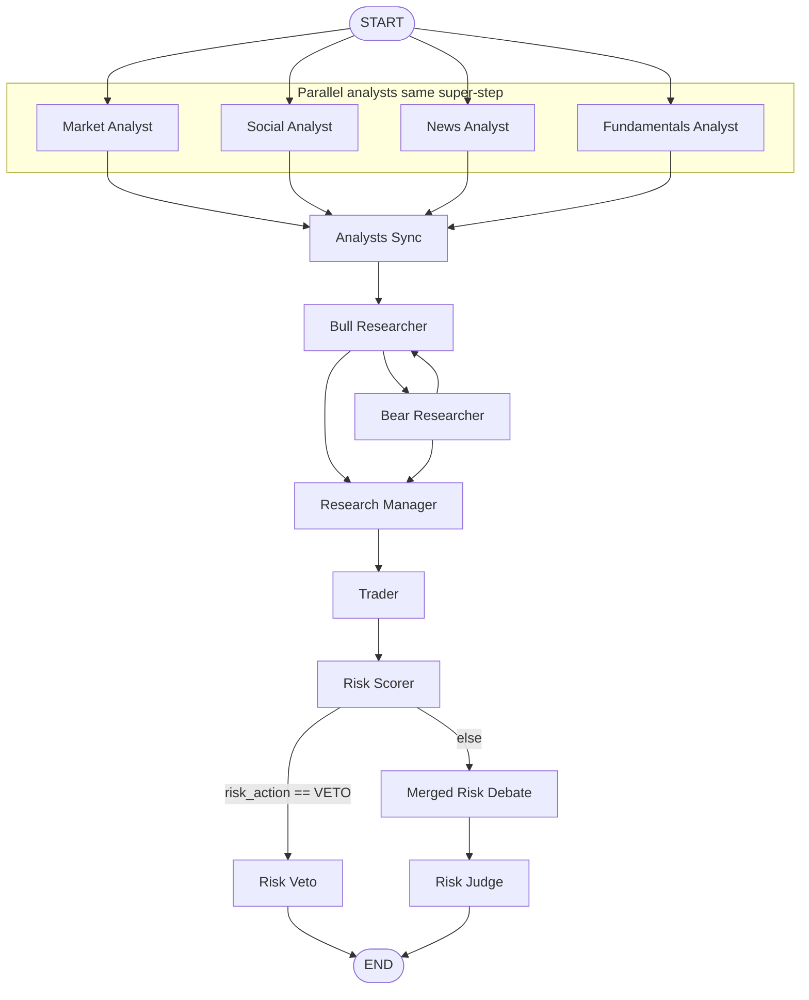
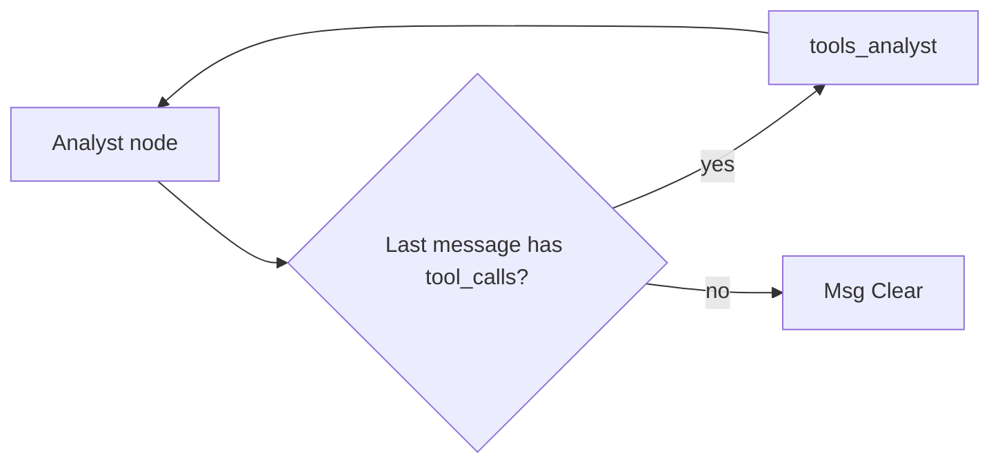
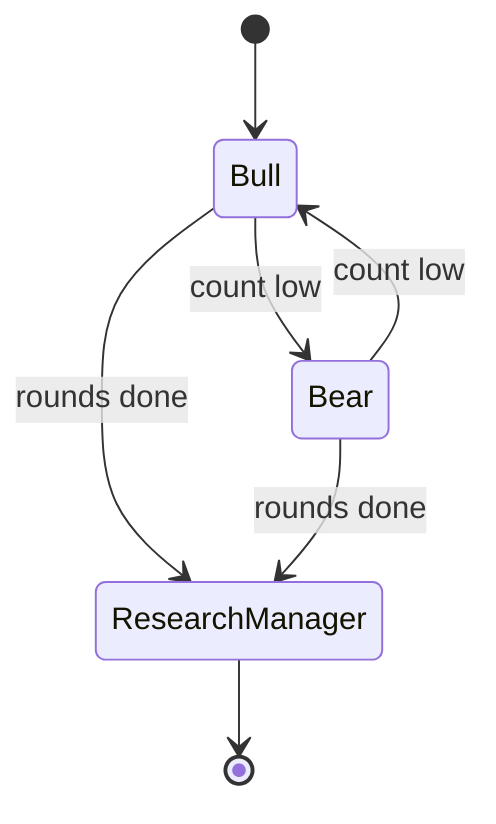

# LangGraph Zero → Hero — For This EGX TradingAgents Project

> **Who this is for:** You are new to LangGraph *and* new to stock-market vocabulary. This guide explains both in friendly language and shows **exactly** how this repository wires a LangGraph workflow.
>
> **Companion files:** [`CLAUDE.md`](../CLAUDE.md) (architecture map), [`MEMORY.md`](../MEMORY.md) (known issues), [`PROMPTS.md`](../PROMPTS.md) (where LLM prompts live).

---

## Table of contents

1. [Finance in plain English (no jargon wall)](#1-finance-in-plain-english-no-jargon-wall)
2. [What problem LangGraph solves](#2-what-problem-langgraph-solves)
3. [LangGraph building blocks](#3-langgraph-building-blocks)
4. [How this project uses each block](#4-how-this-project-uses-each-block)
5. [The full workflow (big picture)](#5-the-full-workflow-big-picture)
6. [Parallel analysts and the tool loop](#6-parallel-analysts-and-the-tool-loop)
7. [Research team: Bull, Bear, Manager](#7-research-team-bull-bear-manager)
8. [Trader and risk pipeline](#8-trader-and-risk-pipeline)
9. [State: the shared notebook](#9-state-the-shared-notebook)
10. [Following one run in code](#10-following-one-run-in-code)
11. [Glossary](#11-glossary)
12. [Official docs to go deeper](#12-official-docs-to-go-deeper)

---

## 1. Finance in plain English (no jargon wall)

Think of this project as a **committee of specialists** that reads data about **one company’s stock** and writes a **recommendation**: buy, hold, or sell — for **research only** (not automatic trading).

### 1.1 Words you will see everywhere

| Term | Plain meaning |
|------|----------------|
| **Stock / share** | A tiny slice of ownership in a company. If the company does well, people may pay more for that slice later. |
| **Ticker / symbol** | A short code for the company on an exchange, e.g. `COMI.CA` (Commercial International Bank on the Egyptian Exchange, using Yahoo’s `.CA` suffix). |
| **Exchange (EGX)** | The **Egyptian Exchange** — the regulated marketplace where those stocks trade in **Egyptian Pounds (EGP)**. |
| **Price** | What one share costs right now (simplified). |
| **Volume** | How many shares changed hands in a day. **Low volume** = harder to buy/sell large amounts without moving the price. |
| **OHLCV** | Open, High, Low, Close, Volume — the standard **daily bar** of price action technicians use. |
| **Fundamentals** | “Is the company healthy?” — sales, profit, debt, ratios from financial statements (often from CSV files in this project for EGX). |
| **News** | Headlines and articles that can move opinion or reveal events. |
| **Sentiment / social** | What people **say** online (often Arabic + English here) — noisy, but sometimes informative. |
| **BUY / HOLD / SELL** | **BUY** = optimistic; **SELL** = reduce or exit; **HOLD** = wait / no strong change. This app outputs these as **advice to review**, not as executed trades. |
| **Risk** | Rules so the plan does not ignore reality: e.g. “don’t bet the whole portfolio on one stock,” “respect liquidity,” “no short selling on EGX.” |

### 1.2 Egypt-specific ideas (why the code mentions them)

- **Long-only:** On EGX, retail-style flow is **buy cash shares**; the system **blocks** language about short selling or leverage.
- **Daily price limit (~±10% for many listings):** In one day, price can only move so far from a reference — a **circuit breaker** style rule. The risk code uses this so suggestions are not fantasy prices.
- **T+2 settlement (concept):** Trade date vs when money/shares fully settle — mentioned in docs; position sizing cares more about **liquidity** and **risk caps** day to day.

You do **not** need to memorize regulations to read the LangGraph code. Just know: **numbers and rules in `risk_scorer.py` exist to keep recommendations inside sensible EGX-aware guardrails.**

---

## 2. What problem LangGraph solves

**Without LangGraph:** You might chain a bunch of `if` statements and async calls: “call analyst A, then B, then merge…” It becomes spaghetti.

**With LangGraph:** You draw a **workflow** (a **directed graph**):

- **Nodes** = steps (functions), e.g. “Market Analyst,” “Risk Scorer.”
- **Edges** = “after this step, go to that step.”
- **State** = one shared **dictionary** (typed as `AgentState` here) that every step reads and updates.

LangGraph runs the graph, merges state updates, and supports **branching** (“if veto, stop; else continue”). It integrates well with **LangChain** messages and **tool calling** (LLM asks to run a Python function → graph routes to a tool node → result goes back to the LLM).

**Mental model:** A **recipe** where each **chef** (node) reads the same **kitchen whiteboard** (state), adds their notes, and the **head chef** (graph runner) decides who works next.

---

## 3. LangGraph building blocks

### 3.1 `StateGraph`

You create `workflow = StateGraph(AgentState)`. That means: “Every node receives `AgentState` and returns a **partial update** (only the keys it changed).”

### 3.2 `START` and `END`

Special nodes: execution begins at `START` and finishes at `END`.

### 3.3 Nodes

`workflow.add_node("Name", callable)` — `callable(state)` → dict of updates.

### 3.4 Edges

- **Fixed edge:** “Always go from A to B.”
- **Conditional edge:** “Run a small Python function that **returns the name of the next node**.” Example: if the last message has `tool_calls`, go to `tools_market`; else go to message clear.

### 3.5 Reducers (important in this repo)

Some state keys are **lists** that **append** across steps (e.g. chat messages). In LangGraph you declare that with a **reducer** like `add_messages`. This repo also uses a custom reducer `_keep_last` for nested debate dicts — meaning “latest write wins.”

### 3.6 `compile()`

`graph = workflow.compile()` builds an executable object you can `.invoke(initial_state)`.

### 3.7 `ToolNode`

A prebuilt node that runs **tool functions** the LLM asked for. This project wraps it in `PerAnalystToolNode` so parallel analysts don’t share one `messages` list (see below).

---

## 4. How this project uses each block

| LangGraph idea | Where in this repo |
|----------------|-------------------|
| Graph class + compile | [`tradingagents/graph/setup.py`](../tradingagents/graph/setup.py) — `GraphSetup.setup_graph()` |
| State schema | [`tradingagents/agents/utils/agent_states.py`](../tradingagents/agents/utils/agent_states.py) — `AgentState` |
| Conditional routing (tools vs done) | [`tradingagents/graph/conditional_logic.py`](../tradingagents/graph/conditional_logic.py) — `should_continue_*` |
| Tool list for each analyst | [`tradingagents/graph/trading_graph.py`](../tradingagents/graph/trading_graph.py) — `_create_tool_nodes()` |
| High-level wrapper | [`tradingagents/graph/trading_graph.py`](../tradingagents/graph/trading_graph.py) — `TradingAgentsGraph` |
| Initial state + confidence | [`tradingagents/graph/propagation.py`](../tradingagents/graph/propagation.py) — `Propagator` |
| BUY/SELL/HOLD extraction | [`tradingagents/graph/signal_processing.py`](../tradingagents/graph/signal_processing.py) |

---

## 5. The full workflow (big picture)

This diagram matches **EGX** defaults: four analysts in parallel, then debate → trader → risk.

**Reading it:**

- **Four analysts** all start from `START` **in parallel** (LangGraph can run same-step nodes together).
- They all drain into **Analysts Sync** (an empty node that just **waits** until all incoming edges have completed — a **barrier**).
- Then the **research line** runs: Bull ↔ Bear (limited rounds), then **Research Manager**, then **Trader**, then **Risk Scorer**.
- If the scorer says **VETO**, you skip the LLM risk debate and go straight to **Risk Veto** → `END`. Otherwise: **Merged Risk Debate** → **Risk Judge** → `END`.

---

## 6. Parallel analysts and the tool loop

Each analyst (market, social, news, fundamentals) follows the **same pattern**:

1. **Analyst node** (LLM or deterministic code) may emit a message with **tool calls** (“please run `get_stock_data`”).
2. **Conditional function** looks at the last message in **that analyst’s channel**.
3. If there are tool calls → go to **`tools_*`** node → results appended → back to **analyst**.
4. If not → go to **Msg Clear * ** (trim messages) → **Analysts Sync**.

### 6.1 Why `PerAnalystToolNode` exists (technical detail)

LangChain’s default `ToolNode` expects everything in `state["messages"]`. If two LLMs ran in parallel in the same step, they could **overwrite** each other’s tool calls.

This repo gives each analyst its **own** list: `market_messages`, `social_messages`, etc. `PerAnalystToolNode` **temporarily** swaps `messages` to only that list, runs tools, then writes results back — see [`setup.py`](../tradingagents/graph/setup.py) class `PerAnalystToolNode`.

### 6.2 EGX shortcuts (finance + tech)

- **Market (EGX):** Can use a **deterministic** path (no LLM) — tools are replaced with a no-op; the conditional never routes to tools. Faster, cheaper.
- **Fundamentals (EGX):** Default is **deterministic** from local data; optional **hybrid** path uses LLM stages (see `CLAUDE.md`).

So “LangGraph setup” is the same **shape**; only **which callables** are plugged into nodes changes.

---

## 7. Research team: Bull, Bear, Manager

**Non-technical:** One voice argues **optimistic**, one **pessimistic**, and a **judge** summarizes. That mimics how investment committees stress-test a idea.

**Technical:** `ConditionalLogic.should_continue_debate` alternates Bull/Bear until a round count cap, then routes to **Research Manager**. The debate sub-state lives in `investment_debate_state` on `AgentState`.

---

## 8. Trader and risk pipeline

**Trader node:** Turns prose + scores into a structured **execution plan** (JSON-style dict in state): how many shares, over how many days, stops, etc. (Still **not** placing real orders.)

**Risk Scorer:** Deterministic Python checks — position vs portfolio, liquidity vs average daily volume, forbidden words (short, margin), price bands, etc.

**Merged Risk Debate + Risk Judge:** One LLM pass synthesizes risk perspectives, then the **Risk Manager** applies final judgment and may set `risk_veto`.

**Finance intuition:** First “**can we do this without breaking rules or blowing up the portfolio?**” (scorer), then “**what could still go wrong?**” (debate + judge).

---

## 9. State: the shared notebook

`AgentState` is the **notebook**. Important groups of fields:

| Group | Examples | Role |
|-------|-----------|------|
| Identity | `company_of_interest`, `trade_date` | Which stock, which “as of” date |
| Per-analyst chats | `market_messages`, … | Isolated tool loops |
| Reports | `market_report`, `fundamentals_report`, … | Human-readable outputs for downstream LLMs |
| Debate | `investment_debate_state` | Bull/Bear progress |
| Plans & risk | `execution_plan`, `risk_assessment`, `risk_veto` | Structured machine-readable decisions |
| EGX / backtest | `portfolio_value`, `avg_daily_volume`, … | Context for sizing and risk |

If you are lost in code, **grep the field name** on `AgentState` — that tells you **who reads and who writes** it.

---

## 10. Following one run in code

Suggested reading order for your first trace:

1. [`trading_graph.py`](../tradingagents/graph/trading_graph.py) — `TradingAgentsGraph.__init__`: `set_config`, build LLMs, memories, `GraphSetup(...).setup_graph(...)`.
2. [`setup.py`](../tradingagents/graph/setup.py) — `setup_graph`: all `add_node` / `add_edge` / `add_conditional_edges`.
3. [`conditional_logic.py`](../tradingagents/graph/conditional_logic.py) — `should_continue_*` functions.
4. Pick **one** analyst file under `tradingagents/agents/analysts/` and see how it updates state.
5. [`propagation.py`](../tradingagents/graph/propagation.py) — how `create_initial_state` fills defaults before `invoke`.

When you run the app, LangGraph’s runner repeatedly: **pick next node(s) → run → merge state → pick again** until `END`.

---

## 11. Glossary

| Term | Short definition |
|------|------------------|
| **LangChain** | Library for LLMs, prompts, tools, messages. |
| **LangGraph** | Library for **stateful multi-step** LLM workflows (graphs). |
| **Node** | One step in the graph. |
| **Edge** | Transition between nodes. |
| **Conditional edge** | Function picks next node name. |
| **State** | Shared data structure for the run. |
| **Tool** | Python function the LLM can request. |
| **Reducer** | How to merge updates to one state key. |
| **ADV** | Average daily volume — liquidity proxy. |
| **ATR** | Average True Range — volatility proxy for stops. |

---

## 12. Official docs to go deeper

- LangGraph concepts: [LangGraph documentation](https://langchain-ai.github.io/langgraph/) — start with **StateGraph**, **Messages**, and **Human-in-the-loop** tutorials.
- Tool calling: LangChain “Tools” guides — this project uses `bind_tools` inside analyst constructors (see files under `tradingagents/agents/analysts/`).

---

## Closing reassurance

You do not need to understand **every** finance term on day one. Learn LangGraph as: **nodes + edges + state + conditional routing**. Then map finance words to **which node** uses them (market = prices, fundamentals = accounts, risk = limits). That decomposition is exactly how this codebase is structured.

When you change behavior, ask: **Which node? Which state key? Which edge?** If you can answer those three, you are already past “beginner” for this project.
