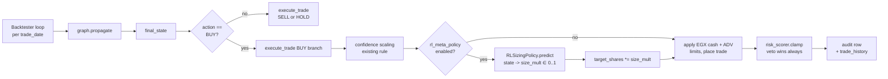

# RL Meta-Policy — Architecture & Operator Guide

> **Companion files.** [CLAUDE.md](../CLAUDE.md) is the operational reference; [MEMORY.md](../MEMORY.md) tracks open issues; this file is the standalone guide for the RL meta-policy added in PRs A–D. It is intended to be readable end-to-end without prior context on the rest of the codebase.

---

## 1. What this is, in one paragraph

A small offline-trained Conservative Q-Learning (CQL) policy that watches the existing EGX multi-agent LangGraph make a BUY/SELL/HOLD call, then decides — based on similar past situations and their realized 20-day returns — what fraction of the trader's suggested size to actually take. It can dial size **down** (including all the way to zero, meaning "skip this trade") but never **up**. The directional decision is unchanged. The deterministic risk veto still wins. The flag is off by default; the system behaves bit-for-bit like pre-RL `main` until you opt in.

Why introduce it at all? Two limitations in the pre-RL system motivated this work:

1. **Sentiment-blend multipliers are hand-tuned.** Market-regime / macro-direction / sector-tilt multipliers in [tradingagents/sentiment/blender.py](../tradingagents/sentiment/blender.py) were chosen by hand and never fit to realized outcomes.
2. **Position sizing is rule-based, not return-aware.** `target_shares × clip(confidence, 0.20, 1.0)` in [scripts/backtester.py:444-452](../scripts/backtester.py#L444-L452) treats confidence as a sizing dial without learning whether high-confidence EGX trades actually pay off proportionally.

The intended outcome is a learned `size_multiplier ∈ [0, 1]` that improves Sharpe / Calmar on walk-forward EGX backtests **without changing direction** and **without bypassing the deterministic risk veto**.

---

## 2. Where it fits in the pipeline



The seam is precisely one call inside `execute_trade`, guarded by a feature flag. Risk Scorer's veto checks ([tradingagents/agents/risk_mgmt/risk_scorer.py](../tradingagents/agents/risk_mgmt/risk_scorer.py)) run after the RL multiplier is applied, so the deterministic safety net is preserved end-to-end.

---

## 3. State / action / reward

### State (observation space)

49 features extracted from the LangGraph's `final_state` by [tradingagents/rl/feature_extractor.py](../tradingagents/rl/feature_extractor.py). All numeric; no raw text. Five categorical one-hots + 23 numeric features + 2 portfolio-context features:

| Group | Examples | Source |
|---|---|---|
| Action (one-hot 3) | BUY / SELL / HOLD | `SignalProcessor.process_signal` on `final_state["final_trade_decision"]` |
| Market regime (one-hot 6) | EUPHORIA / GREED / NEUTRAL / FEAR / PANIC / NO_SIGNAL | `social_sentiment_analysis.market.regime` |
| Volatility mood (one-hot 4) | CALM / ELEVATED / STRESSED / NO_SIGNAL | `social_sentiment_analysis.market.volatility_mood` |
| Macro direction (one-hot 4) | RISK_ON / NEUTRAL / RISK_OFF / NO_SIGNAL | `social_sentiment_analysis.macro.composite_regime` |
| Sector (one-hot 7) | banks / real_estate / industry / telecom_tech / financial_services / food_bev / unknown | `taxonomy.ticker_to_sector(ticker)` |
| Confidence breakdown | overall / technical / fundamental / sentiment / position_size_multiplier | `final_state["confidence_scores"]` |
| Stock sentiment | score, confidence, contradicts_market | `social_sentiment_analysis.stock` |
| Sector / market sentiment | scores + confidences + log(n_posts) | `social_sentiment_analysis.{sector, market}` |
| Quality flags | NO_SIGNAL layer count, data_completeness | sentiment layers + `data_quality` |
| Liquidity | low_liquidity bool, log(avg_daily_volume), volume_missing bool | `final_state` direct |
| Risk-scorer metrics | throttle flag, ADV participation, stop distance | `risk_metrics` |
| Portfolio | position % of portfolio, drawdown-so-far %, settled cash % | backtester injects |

The order is fixed by `FEATURE_NAMES` (also exported from the package). Training and inference use the same function — there's no chance of feature drift between train and serve.

**Crucially missing from the feature set, by design:** any forward return, any future date column, any "Hit Rate (fwd)" style field. The plan §4 risk table treats look-ahead leakage as a critical failure mode; the test `tests/test_rl_feature_extractor.py::test_no_feature_named_forward_return` enforces this lexically.

### Action space

Five discrete tiers: `{0.0, 0.25, 0.50, 0.75, 1.0}`. The greedy argmax over the Q-network's 5 logits picks the size multiplier. Tier `0.0` means "the RL policy recommends skipping this BUY"; tier `1.0` means "take the trader's full suggested size unchanged".

Why discrete? Three reasons:

- Sample size. Realistic EGX walk-forward yields ~1.5k–2.5k usable training samples. Continuous actions need TD3-BC / BCQ — heavier to defend.
- The 5 tiers cover every practical sizing decision a human PM would consider.
- The "skip this trade" capability (tier 0) is high-leverage and naturally falls out of the discretization.

### Reward (single-step, post-hoc)

Each (ticker, trade_date) is treated as a one-step bandit. There's no `γ`-discounted multi-step return because EGX trades at 5–20-day horizons are nearly independent given the portfolio state is already in the observation.

```
r =  log(1 + size_mult * sign(action) * forward_return_20d)
   - λ_dd * max(0, drawdown_during_holding - 0.05)
   - tx_cost_pct                              (if action != HOLD)

HOLD always gets r = 0.
All rewards clipped to [-0.5, +0.5].
```

- `forward_return_20d` is computed in [tradingagents/rl/dataset.py](../tradingagents/rl/dataset.py) using only price data that became available **after** `trade_date` plus the 20-trading-day horizon. Rows whose horizon hasn't elapsed yet are flagged `trade_result="PENDING"` and `reward=None`; they are filtered out of the training set.
- Transaction cost ≈ `0.189% × 2 + slippage`, matching the EGX cost stack in `scripts/backtester.py:49-55`.
- Risk-free rate, when it enters the eval Sharpe, defaults to `default_risk_free_rate() = 0.24` (CBE policy rate). This closes [MEMORY.md §C3](../MEMORY.md) for the RL evaluation path even though the rest of the codebase still uses 0.05.

### Worked example (COMI.CA)

Imagine the graph returns final_state with:
- action = BUY
- overall confidence = 0.65
- market regime = FEAR (post EGP devaluation)
- stock sentiment score = +0.15, contradicts_market = True
- low_liquidity = False
- sector = banks

The feature extractor produces a 49-dim vector. The Q-network (trained on historical FEAR-regime BUYs that mostly mean-reverted up) outputs the highest Q-value on tier index `2` (size = 0.50). The trader had asked for 1000 shares × 0.65 confidence = 650 shares. RL applies × 0.50 = 325 shares. Risk Scorer's ADV check then says "you can take at most 200 in one day, throttle to 200." Order = 200 shares.

If the same setup but with stock sentiment score = -0.30 (bearish on the name even though market is FEAR), the Q-network likely picks tier 0 (skip). Trader's 650-share BUY becomes 0 shares. No trade is recorded. The audit row still notes `rl_size_multiplier=0.0` so we know why.

---

## 4. Training pipeline

### Files

| File | Role |
|---|---|
| [tradingagents/rl/config.py](../tradingagents/rl/config.py) | Hyperparameters + seeds; single source of truth |
| [tradingagents/rl/feature_extractor.py](../tradingagents/rl/feature_extractor.py) | State → numeric vector |
| [tradingagents/rl/dataset.py](../tradingagents/rl/dataset.py) | Loads `analysis_sessions.full_state` + `backtest_trades` / JSON reports → `(state, action, reward)` parquet |
| [tradingagents/rl/train.py](../tradingagents/rl/train.py) | Single-step CQL training loop |
| [tradingagents/rl/policy.py](../tradingagents/rl/policy.py) | `QNetwork` + `RLSizingPolicy` (save/load/predict, fingerprint, identity fallback) |
| [tradingagents/rl/eval.py](../tradingagents/rl/eval.py) | Off-policy evaluation (FQE direct method + SNIPS + behavior baseline) |
| [tradingagents/rl/walkforward.py](../tradingagents/rl/walkforward.py) | Stage D arm comparison: Sharpe / Calmar / Wilson CI / bootstrap CI |
| [scripts/generate_rl_training_data.py](../scripts/generate_rl_training_data.py) | CLI: parquet from existing audit + JSON reports |
| [scripts/train_rl_policy.py](../scripts/train_rl_policy.py) | CLI: parquet → trained checkpoint + model card |
| [scripts/run_rl_evaluation.py](../scripts/run_rl_evaluation.py) | CLI: three JSON reports → comparison verdict |

### Training loop math

```
Q-network: MLP(49 → 64 → 64 → 5)  ReLU + dropout 0.1
                                  ~5k parameters

Per-batch loss (γ = 0, single-step):
  L_td   = MSE( Q(s, a_behavior), r )
  L_cql  = α · ( log Σ_a exp(Q(s, a) / τ) - Q(s, a_behavior) )
  L      = L_td + α · L_cql

  α = 1.0 default, τ = 1.0
  early-stop patience = 30 epochs (on validation TD loss)
  optimizer = Adam, lr = 3e-4, weight decay = 1e-4
  seed everything (numpy + torch + cudnn) for byte-identical re-runs
```

The conservative penalty `L_cql` pulls Q-values down on actions that were never observed in the dataset — the standard offline-RL trick that mitigates extrapolation error when EGX data is sparse. With `α = 0` the loss reduces to plain regression to rewards (useful sanity check; the test `test_cql_loss_reduces_to_td_when_alpha_zero` enforces this).

Hand-written rather than via `d3rlpy`? Yes — the plan §3.5 allowed `d3rlpy` but documented that on Windows + Python 3.13 + uv the install fails. The fallback is this ~200-LoC hand-rolled loop. It's easier to defend in a graduation context too (every line of the loss is readable).

### Operating procedure

```bash
# 1. Build the training parquet (Postgres preferred, JSON reports as backfill)
python scripts/generate_rl_training_data.py \
    --output data/rl/training_v1.parquet \
    --json-reports "backtest_results/report_*.json" \
    --horizon-days 20

# 2. Train. Deterministic for a given --seed.
python scripts/train_rl_policy.py \
    --dataset data/rl/training_v1.parquet \
    --output  models/rl_meta_v1.pt \
    --epochs 200 --seed 42 --cql-alpha 1.0

# 3. Verify the OPE summary in the model card before turning the flag on:
cat models/rl_meta_v1.pt.eval.json | jq .summary
```

The trainer writes three artifacts:
- `models/rl_meta_v1.pt`              — torch checkpoint
- `models/rl_meta_v1.pt.card.json`    — human-readable model card with config, fingerprint, training & validation history
- `models/rl_meta_v1.pt.eval.json`    — off-policy evaluation report (FQE direct value vs behavior baseline)

---

## 5. Inference & integration

### How to turn it on

```bash
export RL_META_POLICY_ENABLED=1
export RL_MODEL_PATH=models/rl_meta_v1.pt
python scripts/backtester.py --ticker COMI.CA --start 2023-10-01 --end 2024-01-01
```

The constructor in [scripts/backtester.py](../scripts/backtester.py) is fail-closed:

```
flag off (default)        → identity policy installed; size_multiplier always 1.0
flag on,  model path empty → identity policy + WARN log
flag on,  model file bad   → identity policy + WARN log
flag on,  model loads      → real predictions; fingerprint logged on every trade
predict() raises at runtime → identity policy + WARN log for that decision only
```

### Audit trail

Every trade gets four new fields in the trade-history record:
- `rl_meta_policy_enabled` (bool)
- `rl_size_multiplier` (float in [0, 1])
- `rl_action_index` (0..4)
- `rl_model_fingerprint` (16-char hex sha256 of the weights, stable across save/load)

In addition, [tradingagents/db/audit_writer.py:write_rl_meta_event](../tradingagents/db/audit_writer.py) writes one extra `agent_events` row per decision with `event_type='rl_meta_size_adjustment'` so the meta-policy decision is fully replayable from Postgres alongside the graph's own `agent_events`. The event includes the model fingerprint, action index, all 5 Q-values, and the feature_version string so reviewers can correlate a decision to the exact weights that produced it.

### Safety guarantees enforced by tests

| Guarantee | Enforcement | Test |
|---|---|---|
| RL never amplifies | `max(0.0, min(1.0, size_mult))` clamp in `execute_trade` + `TrainingConfig.size_multiplier_max=1.0` in `RLSizingPolicy` | `test_rl_does_not_amplify_when_tier_max_is_one`, `test_size_mult_clamped_when_config_caps_below_one` |
| Risk veto wins | BUY branch short-circuits on "VETO" in decision string before RL even runs | `test_decision_containing_veto_blocks_buy_even_under_rl` |
| SELL unaffected | RL multiplier only applies in BUY branch (SELLs always fully liquidate) | `test_sell_path_ignores_rl_size_multiplier` |
| Default off = unchanged | Constructor installs `identity_policy()` when flag is unset | `test_flag_off_yields_identity_multiplier` |
| Fail-closed on errors | try/except around constructor load AND predict; identity fallback on any error | `test_constructor_falls_back_to_identity_when_model_missing`, `test_predict_errors_silently_fall_back_to_one` |
| Feature-version mismatch refuses to load | `RLSizingPolicy.load` raises `ValueError` when saved fingerprint disagrees | `test_load_rejects_mismatched_feature_version` |

---

## 6. Evaluation (Stage D)

Three OPE estimators in [tradingagents/rl/eval.py](../tradingagents/rl/eval.py) are computed during training; one head-to-head walk-forward comparison in [tradingagents/rl/walkforward.py](../tradingagents/rl/walkforward.py) is computed after the backtests.

### Pre-registered PASS / FAIL

```
PASS if both:
  (a) Sharpe(rl_meta) - Sharpe(baseline) ≥ +0.20
  (b) 95% bootstrap CI on per-day mean return difference excludes 0
otherwise: FAIL → flag stays default OFF, negative result documented honestly.
```

The verdict is computed by `compare_arms` in `walkforward.py` and printed by `scripts/run_rl_evaluation.py`. The output JSON is the canonical record. The threshold and bootstrap parameters are CLI-overridable.

### Operating procedure

```bash
# Run the baseline arm (flag OFF)
python scripts/backtester.py --ticker COMI.CA --start 2023-10-01 --end 2024-01-01
# ... writes backtest_results/report_COMI.CA_<ts_baseline>.json

# Run the RL arm (flag ON, same dates)
RL_META_POLICY_ENABLED=1 RL_MODEL_PATH=models/rl_meta_v1.pt \
    python scripts/backtester.py --ticker COMI.CA --start 2023-10-01 --end 2024-01-01
# ... writes backtest_results/report_COMI.CA_<ts_rl>.json

# Run the classical baseline (optional)
python scripts/bt_benchmark.py --ticker COMI.CA --start 2023-10-01 --end 2024-01-01
# ... writes backtest_results/bt_report_COMI.CA_<ts>.json

# Compare and print the verdict
python scripts/run_rl_evaluation.py \
    --baseline  backtest_results/report_COMI.CA_<ts_baseline>.json \
    --rl-meta   backtest_results/report_COMI.CA_<ts_rl>.json \
    --classical backtest_results/bt_report_COMI.CA_<ts>.json \
    --output    eval_results/rl_vs_baseline_walkforward.json
```

For graduation-defensible numbers, repeat over EGX-30 with chronological walk-forward windows (one report per ticker × window × arm) and aggregate per the plan §3.7.

---

## 7. How to debug

| Symptom | Likely cause | Where to look |
|---|---|---|
| Flag on, no RL log line ever appears | model path unset / unreadable | `BacktestingEngine.__init__` logs the load attempt with the resolved path |
| `[RL] predict failed ...` warning | feature extractor crashed on a malformed state | check the failing date's `final_state["social_sentiment_analysis"]` — it's a JSON string and may be malformed; the extractor falls back to zeros and the policy returns 1.0 |
| Same trade made with very different sizes between runs | seed not pinned | the policy is deterministic at inference (`torch.no_grad` + eval mode); randomness can only come from non-pinned upstream LLM calls in the graph (MEMORY §B); RL itself is fully deterministic |
| Wilson CI shows 0%–80% on win rate | only a handful of closed SELLs | expected on short backtests; CI width comes from `n_closed`; expand the backtest window |
| `pre_registered_pass: false` with `n_paired_days=0` | the two backtests cover different date ranges | re-run baseline + rl arm on the **exact same** `--start --end` window |
| `feature_version` mismatch on load | someone bumped `FEATURE_VERSION` in `feature_extractor.py` without retraining | retrain with the new extractor, or pin to an older RL package version |

Useful audit queries (assuming the propagate-time audit writer is wired):

```sql
-- Which decisions did the RL policy actually shrink?
SELECT s.ticker, s.trade_date, s.final_decision,
       (e.structured_output->>'size_multiplier')::float AS rl_size,
       (e.structured_output->'model_fingerprint'->>'weights_sha256_16') AS rl_model
FROM analysis_sessions s
JOIN agent_events e USING (session_id)
WHERE e.event_type = 'rl_meta_size_adjustment'
  AND (e.structured_output->>'size_multiplier')::float < 1.0
ORDER BY s.trade_date DESC;
```

---

## 8. How to extend / retrain

- **New feature.** Add a `_FeatureSpec` to `_NUMERIC_FEATURES` (or a new categorical to the vocab tables), bump `FEATURE_VERSION`, regenerate the training parquet, retrain. Inference will refuse to load older models against the new extractor (fingerprint mismatch).
- **New algorithm.** Replace the body of `cql_loss` in [tradingagents/rl/train.py](../tradingagents/rl/train.py). Bump `TrainingConfig.algorithm_version`. Existing tests on shape / determinism / round-trip will catch most regressions.
- **Wider action space.** Edit `SIZE_TIERS` in [tradingagents/rl/config.py](../tradingagents/rl/config.py). Note that the safety story depends on `max(SIZE_TIERS) ≤ 1.0`; lifting the cap requires re-passing the safety tests in `tests/test_rl_policy_safety.py`.
- **Sentiment-blend learning instead of sizing.** Out of scope for v1 — the same `feature_extractor` + `dataset` plumbing supports it; what changes is the action space (the multipliers) and the reward (calibration-style rather than return-style).

---

## 9. Known limitations

- **Sample size.** Realistic EGX walk-forward yields ~1.5k–2.5k usable training samples after dropping PENDING (horizon not elapsed) and HOLD (zero reward by construction) rows. This is tight even for a 5k-parameter MLP; aggressive regularization + early stopping mitigate but don't eliminate the risk. The pre-registered PASS criterion is the disciplined response.
- **Look-ahead in the existing backtester.** MEMORY §C1, §C3, §C4 are still open in `scripts/backtester.py`. The RL eval pipeline computes its own forward returns from raw OHLCV and uses a configurable risk-free rate, so its numbers are independent of those bugs, but the LLM-graph **inputs** that feed the policy come from runs that still have the issues. Stage D's verdict is therefore only as good as the LLM-graph data underneath it.
- **Non-stationarity.** EGX experienced major regime changes during 2022–2024 (EGP devaluation, CBE policy tightening). Macro direction features partially capture this, but a policy trained on one regime may not generalize to another. Walk-forward windows + chronological splits respect this constraint by construction.
- **No live data feed.** The trained policy targets end-of-day decisions on yfinance-level data; using it for intraday or live order placement would require an entirely separate execution engine.

---

## 10. File index

```
tradingagents/rl/
    __init__.py
    config.py             # hyperparameters + SIZE_TIERS
    feature_extractor.py  # state -> numeric vector
    dataset.py            # build training parquet
    policy.py             # QNetwork + RLSizingPolicy
    train.py              # CQL training loop
    eval.py               # off-policy evaluation
    walkforward.py        # Stage D arm comparison

scripts/
    generate_rl_training_data.py   # parquet builder CLI
    train_rl_policy.py             # training CLI
    run_rl_evaluation.py           # arm-comparison CLI

tests/
    test_rl_feature_extractor.py   # 26 tests
    test_rl_dataset_integrity.py   # 22 tests
    test_rl_policy.py              # 16 tests
    test_rl_train.py               # 14 tests
    test_rl_eval.py                # 7 tests
    test_rl_policy_safety.py       # 16 tests
    test_rl_walkforward.py         # 22 tests
                                   # total: 123 RL tests
```

---

## 11. Decision history

- **PR A (Stage A — Data infrastructure, 2026-05-14).** Feature extractor (`FEATURE_VERSION=rl_state_v1`, 49 columns), offline dataset builder (Postgres + JSON paths), parquet CLI. 48 new tests. No existing file modified.
- **PR B (Stage B — Training + offline eval, 2026-05-14).** Single-step CQL training loop, 5k-param Q-network, policy save/load with fingerprint, FQE + SNIPS evaluation, training CLI. 37 new tests. Smoke-trained `models/rl_meta_v1.pt` on Stage A parquet (6 usable samples after filtering — far below the threshold for a useful model; produced for pipeline verification only).
- **PR C (Stage C — Backtester integration, 2026-05-14).** Three additive edits: `rl_meta_policy_enabled` flag + `rl_model_path` env (`default_config.py`); `write_rl_meta_event` helper in `audit_writer.py`; constructor load + `execute_trade` integration + per-trade audit fields in `scripts/backtester.py`. 16 new safety tests. Default-off behavior is bit-for-bit identical to pre-RL `main` (verified by tests + smoke).
- **PR D (Stage D — Walk-forward comparison + docs, 2026-05-14).** Arm-comparison module with C3-corrected risk-free rate, Wilson CIs on win rate, bootstrap CI on per-day return difference, pre-registered PASS/FAIL criterion; evaluation CLI; this documentation file; MEMORY.md entry. 22 new tests. Default-off + flag-off path still bit-identical to pre-RL main.

The flag is shipping **default OFF** until a walk-forward evaluation with adequate sample size (EGX-30 × multiple windows) clears the pre-registered PASS criterion.
