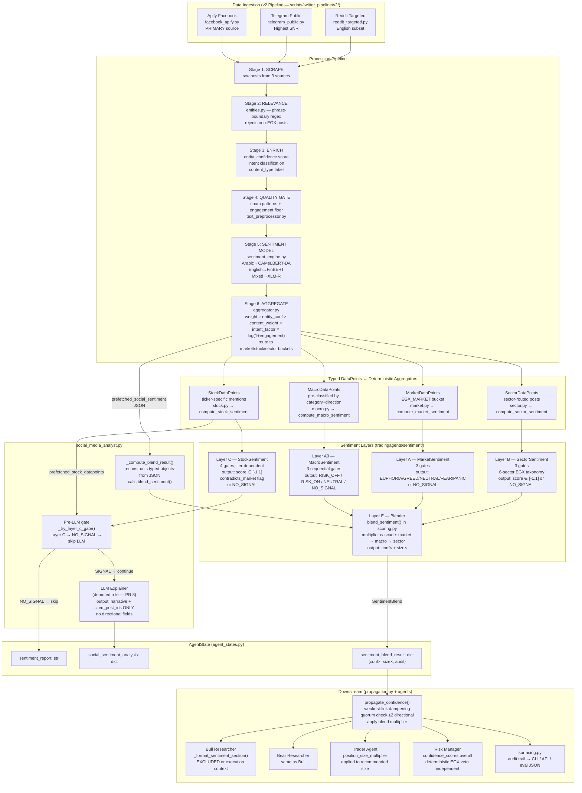
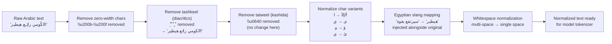
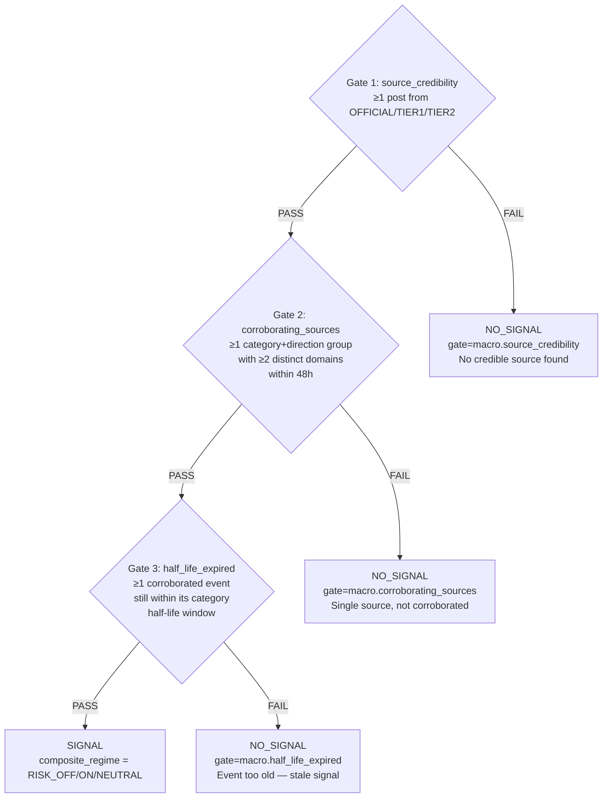
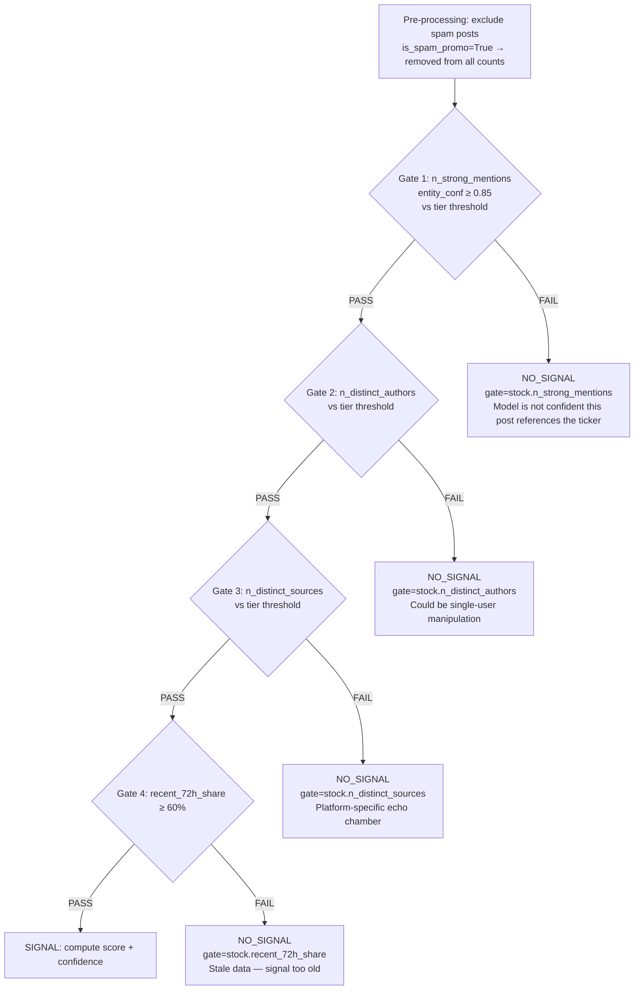
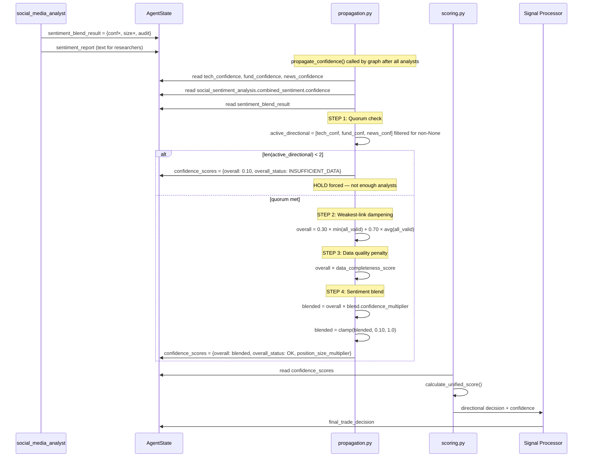

# EGX Sentiment Subsystem — Deep Technical & Trading Reference

> **Audience:** Senior engineers onboarding to this codebase + junior quant traders who need
> to understand, defend, and debug the sentiment layer.
>
> **Scope:** Phase 3 complete implementation (PRs 1–10 + addendum, 2026-05-04).
> Every claim traces to a specific `file:line`. Nothing here is aspirational.
>
> **How to use:**
> - Engineer onboarding → read sections 1–12 in order
> - Debugging a live issue → jump to section 15 (Debugging Guide)
> - PM/quant presentation → read sections 1, 13, 14, 16
> - Understanding a NO_SIGNAL outcome → section 8 + section 15.1

---

## Table of Contents

1. [The Core Philosophy — Why This Exists](#1-the-core-philosophy)
2. [EGX Market Context That Shaped the Design](#2-egx-market-context)
3. [Full System Architecture](#3-full-system-architecture)
4. [The Data Lifecycle: Raw Social Post → Typed DataPoint](#4-data-lifecycle)
5. [Arabic Text Processing — Deep Dive](#5-arabic-text-processing)
6. [Entity Extraction — How Posts Get Linked to Tickers](#6-entity-extraction)
7. [Spam and Noise Filtering](#7-spam-and-noise-filtering)
8. [Layer A0 — MacroSentiment](#8-layer-a0-macrosentiment)
9. [Layer A — MarketSentiment](#9-layer-a-marketsentiment)
10. [Layer B — SectorSentiment](#10-layer-b-sectorsentiment)
11. [Layer C — StockSentiment](#11-layer-c-stocksentiment)
12. [Layer E — The Blender](#12-layer-e-the-blender)
13. [Propagation, Quorum, and the Final Signal](#13-propagation-quorum-and-the-final-signal)
14. [The LLM's Demoted Role — Explainer, Not Decider](#14-the-llms-demoted-role)
15. [Debugging Guide](#15-debugging-guide)
16. [Trading Implications — What Every Output Means](#16-trading-implications)
17. [Complete Annotated Execution Trace — COMI.CA](#17-complete-annotated-execution-trace)
18. [Signal Examples — Good, Bad, Contradictory, Low-Liquidity](#18-signal-examples)
19. [Known Limitations and Design Trade-offs](#19-known-limitations)
20. [Files Quick Reference](#20-files-quick-reference)

---

## 1. The Core Philosophy

### What the sentiment subsystem is

The sentiment subsystem is a **context engine** that answers one question:

> *"Given what retail investors and credible news sources are saying right now,
> should we adjust how confident we are, and how large our position should be?"*

It does **not** answer: "Should we buy or sell?"

This distinction is not a technicality — it is the entire design. Every architectural
decision in PRs 1–10 flows from this commitment.

### What it is NOT

| Myth | Reality |
|------|---------|
| Sentiment tells us which direction to trade | Direction comes ONLY from Technical, Fundamental, News analysts |
| A bullish sentiment means BUY | A bullish sentiment means "if we were already going to BUY, we can be more confident and larger" |
| Neutral sentiment means 0.5 | Neutral does not exist. The default is `NO_SIGNAL`. These are different things. |
| The LLM produces the sentiment score | The LLM writes a narrative to explain the score. The score is computed deterministically. |
| More social posts = more signal | Gate failures produce `NO_SIGNAL` regardless of volume. 200 low-quality posts < 55 high-quality posts. |

### Why this philosophy matters for trading

On EGX, retail sentiment is **correlated with short-term moves but not directional on fundamentals**. A stock with strong fundamentals can have panicking retail investors because of unrelated EGP devaluation fear. A stock with weak fundamentals can have euphoric retail buyers chasing a momentum spike.

If sentiment were allowed to flip direction, it would regularly override correct fundamental
analysis with noise. The EGX circuit breaker (±10%/day) means that a wrong directional flip
is not a small error — it can trigger a wash-out exit the next day.

The correct role for sentiment is:
- **PANIC market** → "Your BUY thesis might be correct, but wait for calm waters. Reduce position."
- **GREED market** → "Buy signal confirmed, but crowd is stretched. Size down slightly."
- **RISK_OFF macro** → "Something systematic is happening. Reduce all confidence uniformly."

None of these flip BUY to SELL. They modulate execution.

### The NO_SIGNAL philosophy

`NO_SIGNAL` is not a failure mode. It is the expected output on most trading days for most tickers.

The system is **intentionally sparse by design**. A MEGA-tier ticker like COMI.CA emits
a stock-level sentiment signal on perhaps 30–40% of trading days. A SMALL-tier food & beverage name like DOMT.CA might emit a signal 5–10% of the time.

This is correct. When data is insufficient to make a reliable assertion, honest abstention
beats a confident wrong answer. The pre-LLM gate (Layer C → NO_SIGNAL → skip LLM) saves
real cost and prevents the LLM from fabricating spurious sentiment narratives from noise.

---

## 2. EGX Market Context That Shaped the Design

Understanding why the gates are the way they are requires understanding what EGX looks like in practice.

### EGX structural facts

| Fact | Design consequence |
|------|--------------------|
| ±10% daily circuit breaker | Sentiment error has large position impact; be conservative |
| Long-only (no short selling) | Bearish sentiment cannot trigger shorts; it only reduces position size |
| T+2 settlement | Position sizing decisions matter more than direction flipping |
| ~200 listed companies, ~30 liquid | MEGA/MID/SMALL liquidity tier system |
| Retail-dominated social discourse | Egyptian Arabic dialect, not MSA — CAMeLBERT-DA required |
| 3 active social sources (Facebook Apify, Telegram, Reddit) | Multi-source gate requires ≥2-3 sources |
| Twitter/X unscrapable since 2026 | Removed from pipeline (PR 10) |
| Trading hours 10:00–14:30 EGT | 24h/72h recency windows calibrated to this short day |

### The EGX social media reality

EGX retail investors communicate primarily on:
1. **Facebook groups** (largest, but highest noise ratio, most spam)
2. **Public Telegram channels** (highest signal-to-noise, fewer users)
3. **Reddit** (`r/EgyptStockExchange`, smaller English-speaking subset)

A typical Facebook EGX group post looks like:
```
"الكومي رائع 🚀🚀 دلوقتي فرصة ذهبية مش هتتعوض!!! CIB هيطير جامد"
Translation: "CIB is amazing 🚀🚀 right now a golden opportunity you won't get again!!! CIB will fly hard"
```

This post contains:
- Egyptian dialect: "هيطير" (will fly), "جامد" (lit. frozen → colloquially: great/hard)
- Financial slang: "فرصة ذهبية" (golden opportunity → see slang map in text_preprocessor.py)
- COMI alias: "الكومي" (The Commercial → CIB alias)
- Emoji pump signal: multiple 🚀 (4+ = possible spam flag)
- No factual content, no analysis

The system must handle this post correctly:
- Normalize Arabic chars → strip diacritics → map slang → tokenize for CAMeLBERT-DA
- Detect "الكومي" as COMI alias via phrase-boundary regex
- Assign positive sentiment score (genuinely bullish text despite no analysis)
- Flag multiple 🚀 as a spam-risk factor (but not necessarily exclude without other signals)

---

## 3. Full System Architecture

### Component overview



### Key architectural invariants

1. **DataPoints are typed NamedTuples** — the aggregators never receive raw dicts or strings
2. **Gate failures stop the layer immediately** — no partial signal from a failed gate
3. **Blender multipliers are always positive** — cannot reverse direction
4. **Quorum is enforced before any decision** — ≥2 of {Technical, Fundamental, News} must report
5. **Risk Manager veto is completely independent** — sentiment cannot override it

---

## 4. The Data Lifecycle: Raw Social Post → Typed DataPoint

This section traces a single post from Facebook scrape to the moment it enters a layer aggregator.

### Stage 1: Scrape

`facebook_apify.py` calls the Apify actor `2chN8UQcH1CfxLRNE` with `APIFY_API_TOKEN` and receives raw post objects. Facebook Apify posts are marked as **trusted** — they bypass the Layer-0 relevance filter because Apify targets EGX-specific groups.

A raw scraped post arrives as:
```json
{
  "text": "الكومي رائع 🚀🚀 دلوقتي فرصة ذهبية مش هتتعوض!!! CIB هيطير جامد",
  "timestamp": "2026-05-01T09:47:23+02:00",
  "author_id": "fb_user_1234567",
  "likes": 14,
  "shares": 2,
  "comments": 3,
  "platform": "facebook",
  "group_name": "EGX Investors Egypt"
}
```

### Stage 2: Relevance filtering

`entities.py` runs the phrase-boundary regex matcher against the post text.

**Why phrase-boundary regex?** (The PR 2 fix)

Before PR 2, the matcher used simple substring search. This caused:
- Arabic morphological suffix extension: the alias "التجاري الدولي" for COMI also matched
  "التجاري الدولية" which is a different phrase in Arabic (gendered agreement suffix). This
  produced false COMI mentions in posts about unrelated entities.

The PR 2 fix pre-compiles patterns using `\b` word boundaries adapted for Arabic Unicode:
```python
# From entities.py — _compile_phrase_pattern()
def _compile_phrase_pattern(phrase: str) -> re.Pattern:
    normalized = normalize_text(phrase)
    # Arabic word boundary: \b doesn't work with Arabic Unicode,
    # so we use lookahead/lookbehind for non-word Arabic chars
    pattern = r"(?<![ء-ي])" + re.escape(normalized) + r"(?![ء-ي])"
    return re.compile(pattern, re.IGNORECASE | re.UNICODE)
```

For our example post, the matcher detects:
- "الكومي" → COMI (Arabic alias match, confidence boost for direct alias)
- "CIB" → COMI (English alias match)

Entity confidence for COMI in this post = high (two independent alias matches).

### Stage 3: Enrichment

Each matched entity gets an `entity_confidence` score:
```
entity_confidence = f(alias_match_type, n_matches, content_type, intent_score)
```

- **Exact symbol match** (e.g., "COMI" literally): highest confidence ~0.95
- **Primary Arabic alias** (e.g., "البنك التجاري الدولي"): ~0.88–0.92
- **Short English alias** (e.g., "CIB"): ~0.80–0.88 (higher false-positive rate for short tokens)
- **Company name** (e.g., "Commercial International Bank"): ~0.85–0.90

`intent_score` classifies the post's trading intent:
- `BUY_SIGNAL` (explicit buy recommendation) → intent_factor = 1.0
- `ANALYSIS` (analytical content) → intent_factor = 0.85
- `SENTIMENT` (opinion, emotion) → intent_factor = 0.70
- `NOISE` (unclear, vague) → intent_factor = 0.40

`content_type` assigns a weight multiplier:
- `NEWS_ARTICLE` → content_weight = 1.0
- `ANALYTICAL_POST` → content_weight = 0.85
- `OPINION_POST` → content_weight = 0.70
- `SHORT_POST` → content_weight = 0.50

### Stage 4: Quality gate (spam filtering)

`text_preprocessor.py` applies spam patterns and engagement floors.

Our example post with 4 rocket emojis `🚀🚀🚀🚀` would trigger:
```python
re.compile(r"(🚀){4,}")   # Excessive rocket emojis
```

But it has 4 rockets and the pattern requires ≥4. This is borderline. The spam filter
in `text_preprocessor.is_spam()` checks **any** pattern match = spam flag.

If spam-flagged: `is_spam_promo = True` on the resulting StockDataPoint. The post
still passes through to the DataPoint but is **excluded before all gate counts** in Layer C.

### Stage 5: Sentiment model routing

`sentiment_engine.py` routes based on language detection:

```python
# detect_language() in text_preprocessor.py
ARABIC_RANGE = re.compile(r'[؀-ۿݐ-ݿﭐ-﷿ﹰ-]')

def detect_language(text: str) -> str:
    arabic_chars = len(ARABIC_RANGE.findall(text))
    total_letters = len(re.findall(r'[a-zA-Z؀-ۿ]', text))
    if total_letters == 0:
        return "unknown"
    arabic_ratio = arabic_chars / total_letters
    if arabic_ratio > 0.60:
        return "arabic"
    elif arabic_ratio < 0.15:
        return "english"
    else:
        return "mixed"
```

Our post has mostly Arabic text with "CIB" as the only English token → `arabic_ratio` ≈ 0.90
→ routed to **CAMeLBERT-DA**.

**What CAMeLBERT-DA returns:**
```python
# After softmax over [positive, neutral, negative]:
# {"positive": 0.87, "neutral": 0.10, "negative": 0.03}
# _normalize_camelbert("positive", 0.87) → ("bullish", +0.87)
# Final: SentimentOutput(score=+0.87, label="bullish", confidence=0.87, model_used="camelbert-da")
```

### Stage 6: Aggregation and routing

`aggregator.py` computes the final post weight:
```
weight = entity_conf × content_weight × intent_factor × log(1 + engagement)
       = 0.88 × 0.70 × 0.70 × log(1 + 14+2+3)
       = 0.88 × 0.70 × 0.70 × log(20)
       = 0.88 × 0.70 × 0.70 × 2.996
       = 1.29   → clamped to normalized per-batch
```

The post is routed to:
1. **Market bucket** (EGX_MARKET) → will become a `MarketDataPoint`
2. **Stock bucket** (COMI) → will become a `StockDataPoint`

(If the post had also said "البنوك" sector keyword, it would also go to the Sector bucket.)

---

## 5. Arabic Text Processing — Deep Dive

The Arabic processing pipeline (`tradingagents/utils/text_preprocessor.py`) runs before
any model inference. Understanding it is critical to understanding why confidence scores
look the way they do.

### The normalization chain (in order)



### Why each normalization step exists

**Diacritics removal (tashkeel):**
Arabic text on social media is almost never diacritized. The same word appears as
"رَائِع" (rare, formal) vs "رائع" (common, social media). Without removing diacritics,
these two forms would tokenize differently, causing model uncertainty. Removing diacritics
normalizes to the form the model has seen most often in training data.

**Alef normalization (أ/إ/آ → ا):**
Arabic keyboards and auto-correct produce inconsistent hamza placement. "أسهم" (stocks)
and "اسهم" and "إسهم" are all the same word written differently. Without normalization,
the same word gets different embeddings across posts. This is especially common in
hastily-typed mobile Facebook posts from EGX retail investors.

**Tatweel (kashida) removal:**
Users type "رائـع" (stretched 'ain for emphasis) instead of "رائع". The kashida character
`ـ` (U+0640) is purely decorative in social media; it breaks tokenization.

**Egyptian slang injection:**
The EGYPTIAN_SLANG_MAP in `text_preprocessor.py` maps 30+ dialect expressions to
MSA equivalents. The mapping **injects** the MSA form alongside the original — it does
not replace it. This ensures the model sees both the dialect form (for contextual cues)
and the standard form (for better cross-lingual embedding alignment).

Example transformations:
```
"هيطير"   → "سيرتفع بقوة"        (will fly → will rise strongly)
"هامور"   → "مستثمر مؤسسي كبير"  (whale → large institutional investor)
"تجميع"   → "تراكم شرائي"         (accumulation → buying pressure)
"دمب"     → "انهيار سعري"         (dump → price collapse)
"حيطة"    → "انهيار كامل"         (wall → complete crash)
```

### Why CAMeLBERT-DA is used for Egyptian Arabic

Most Arabic NLP models are trained on Modern Standard Arabic (MSA) — news articles,
formal text, Wikipedia. Egyptian dialect (العامية المصرية) has systematic differences:

| Feature | MSA | Egyptian Dialect | Example |
|---------|-----|-----------------|---------|
| Future tense | سـ + verb | هـ + verb | سيرتفع vs هيطير |
| Negation | لا / لم | مش / ما ... ش | لا يصح vs مش كويس |
| Verb subject | يشتغل | بيشتغل | present tense prefix change |
| Plural | أسواق | أسواق (same) / بازارات | often mixed |
| Numbers | عشرون | عشرين | different base forms |

A standard Arabic BERT model trained on MSA will:
- Misclassify "مش" (dialect negation) because it doesn't appear in MSA training data
- Fail to handle "بيشتغل" vs "يشتغل" as the same semantic content
- Give high uncertainty scores for Egyptian financial slang

**CAMeLBERT-DA** (`CAMeL-Lab/bert-base-arabic-camelbert-da-sentiment`) was trained
specifically on dialectal Arabic corpora from multiple Arab countries, with significant
Egyptian dialect representation. It handles the morphological and lexical variations
that dominate EGX social media posts.

### Code-switched text and XLM-R

Many EGX posts mix Arabic and English:
```
"COMI كسر resistance الـ 85 جنيه وقفل فوقه 🔥 bullish pattern واضحة"
Translation: "COMI broke the resistance at 85 EGP and closed above it 🔥 clear bullish pattern"
```

This post has:
- Arabic script: "كسر resistance الـ 85 جنيه وقفل فوقه" (broke resistance ... closed above it)
- English technical terms: "resistance", "bullish pattern"
- Mixed numerals and currency: "85 جنيه" (85 EGP)

Language detection: arabic_ratio ≈ 0.55 → "mixed" → routed to XLM-R.

**XLM-R** (`cardiffnlp/twitter-xlm-roberta-base-sentiment-multilingual`) was trained on
multilingual Twitter data and handles code-switching well. It was chosen specifically
because EGX posts often mix technical English terms with colloquial Arabic discussion.

### Complete Arabic processing example

Input post (raw Facebook post):
```
"ألـ CIB والله هيطير ع الآخر ♥♥ تجميع وحش من امتا ما أعلن البنك المركزي
 أرباح ربع سنوي أحسن من المتوقع! الكومي وحش جداً وأنا مشتري منتا"
```

Step-by-step normalization:
```
1. Remove zero-width: no change
2. Remove tashkeel: no change (no diacritics in original)
3. Remove tatweel: "الـ" → "ال" (kashida removed from article)
4. Normalize chars: no alef variants in this text
5. Slang mapping:
   "هيطير" → inject "سيرتفع بقوة"
   "تجميع" → inject "تراكم شرائي"
   "وحش"  → this is positive dialect ("amazing/great"), but no entry in slang map
             (note: "وحش" is ambiguous — means "beast/monster" in MSA,
             "great/amazing" in Egyptian dialect — model handles from context)
6. Whitespace: normalize
7. Result: "ال CIB والله سيرتفع بقوة / هيطير ع الاخر ♥♥ تراكم شرائي / تجميع 
            من امتا ما اعلن البنك المركزي ارباح ربع سنوي احسن من المتوقع!
            الكومي وحش جدا وانا مشتري منتا"
```

Entity detection:
- "CIB" → COMI alias (English), confidence +boost
- "الكومي" → COMI alias (Arabic), confidence +boost
- Double confirmation → entity_confidence for COMI ≈ 0.93

Sentiment (CAMeLBERT-DA): positive=0.91 → score = +0.91

Final StockDataPoint for COMI:
```python
StockDataPoint(
    timestamp="2026-05-01T09:47:23+00:00",
    platform="facebook",
    author="fb_user_1234567",
    sentiment_score=0.91,
    weight=1.04,        # high engagement (likes+shares+comments)
    entity_confidence=0.93,
    is_spam_promo=False,
)
```

---

## 6. Entity Extraction — How Posts Get Linked to Tickers

### The SYMBOL_REGISTRY

`entities.py` maintains `SYMBOL_REGISTRY` — a dict mapping ticker → set of alias patterns.
The registry has two layers:

**English aliases** (`MANUAL_EN_ALIASES`):
```python
"COMI": {"commercial international bank", "cib", "cib egypt"},
"TMGH": {"talaat moustafa", "tmg", "tmg holding"},
"FWRY": {"fawry", "fawry banking", "fawry plus"},
"ETEL": {"telecom egypt", "we telecom", "egyptian telecom", "we"},
```

Note that "we" is an alias for ETEL (Telecom Egypt's retail brand). This is a dangerous
short alias — posts saying "we think..." could match. The phrase-boundary regex prevents
this: `(?<![a-zA-Z])we(?![a-zA-Z])` only matches standalone "we", not inside words.

**Arabic aliases** (from `SYMBOL_REGISTRY` — structured in `entities.py`):
```python
"COMI": {
    "ar": {"التجاري الدولي", "البنك التجاري", "سي آي بي", "الكومي"},
    "confidence_boost": 0.05  # additional confidence for Arabic alias matches
}
```

### Entity confidence calculation

The entity matcher returns `Mention(symbol, confidence, evidence)` where:

```python
confidence = base_confidence
           + (0.05 if arabic_alias else 0.0)      # Arabic alias boost
           + (0.03 if multiple_aliases_found else 0.0)  # cross-confirmation
           - (0.10 if short_alias else 0.0)        # short alias penalty (e.g. "we", "efg")
```

Evidence list contains the matched alias strings, used by the LLM to cite its narrative.

### Why entity confidence matters downstream

**Layer C (StockSentiment)** has a hard gate: `n_strong_mentions` = posts where
`entity_confidence ≥ 0.85`. This threshold was chosen because:

- Below 0.85: the matcher is not confident enough that this post is *about* the specific
  ticker. It might be a tangential mention, a short alias false positive, or a post that
  references the company in a non-trading context ("I work at CIB" is not a stock signal).
- At 0.85+: the post demonstrably and specifically references the ticker in a way the
  system can trust.

A low entity_confidence post still contributes to market/sector buckets (which are
less precision-sensitive) but does not count toward the stock-level gate.

### Known gap: narrow registry

`SYMBOL_REGISTRY` covers ~80 tickers. The full EGX main market has 200+ companies.
Small-cap names not in the registry → `symbols_covered = 0` → no stock-level signal
regardless of how many posts exist.

This is tracked as `MEMORY.md §R` and is the highest-leverage improvement available.
Expanding the registry to EGX-70 + top-200 with Arabic aliases would unlock signal
for a significant portion of the listed universe.

---

## 7. Spam and Noise Filtering

### Why spam filtering runs before gate counts

This is architecturally important. Spam exclusion in Layer C is applied **before any
gate count** — it is not a post-hoc adjustment. This prevents the following attack:

> A signal provider creates 20 bots that each post "COMI will 🚀🚀🚀" from
> different accounts. Without spam exclusion, this looks like 20 distinct authors
> with 8 strong entity_confidence posts — passing the MEGA gate. With spam exclusion,
> all 20 posts are excluded before counting, and the gate fails correctly.

### Spam pattern taxonomy

`text_preprocessor.py` defines `_SPAM_PATTERNS` — a list of compiled regexes:

```python
_SPAM_PATTERNS = [
    # Recruitment to external channels
    re.compile(r"(?:join|انضم|اشترك).{0,20}(?:group|channel|قناة|جروب)", re.IGNORECASE),
    
    # Free signal promises (classic scam pattern)
    re.compile(r"(?:free|مجان).{0,15}(?:signal|إشارة|توصية)", re.IGNORECASE),
    
    # DM-me spam
    re.compile(r"(?:DM|message|راسل).{0,10}(?:me|now|الآن)", re.IGNORECASE),
    
    # Guaranteed profit claims (illegal in EG under FRA rules)
    re.compile(r"(?:100|200|300|500|1000)%\s*(?:profit|ربح|guaranteed|مضمون)", re.IGNORECASE),
    
    # Telegram invite links
    re.compile(r"t\.me/\S+", re.IGNORECASE),
    
    # URL shorteners (used to hide destination)
    re.compile(r"(?:bit\.ly|tinyurl|shorturl)\S+", re.IGNORECASE),
    
    # ≥4 consecutive rocket emojis (pump signal)
    re.compile(r"(🚀){4,}"),
    
    # 8+ repeated characters (keyboard spam)
    re.compile(r"(.)\1{7,}"),
]
```

Additionally, `text_preprocessor.py` enforces minimum content thresholds:
```python
MIN_TEXT_LENGTH = 15          # characters
MIN_WORD_COUNT = 3            # words
MIN_ENGAGEMENT_SOCIAL = 2     # likes + shares + comments
```

### How spam affects each layer

| Layer | Spam handling |
|-------|--------------|
| Layer A (Market) | Spam posts are excluded from `market_posts` list before computing weighted avg |
| Layer B (Sector) | Same — excluded from sector post lists |
| Layer C (Stock) | `is_spam_promo=True` → excluded BEFORE n_strong_mentions, n_distinct_authors, n_distinct_sources counts |
| Layer A0 (Macro) | Source credibility gate provides equivalent protection: RUMOR domains fail Gate 1 |

**The spam/Gate 1 interaction in Layer C** is the most important:

```python
# stock.py — compute_stock_sentiment()
clean_posts = [p for p in posts if not p.is_spam_promo]   # FIRST: exclude spam
spam_count = len(posts) - len(clean_posts)

# All subsequent gate counts use clean_posts ONLY
n_strong = sum(1 for p in clean_posts if p.entity_confidence >= MIN_STRONG_ENTITY_CONFIDENCE)
n_distinct_authors = len({p.author or "_anonymous" for p in clean_posts})
n_distinct_sources = len({p.platform for p in clean_posts})
```

### Anonymous author bucketing

**Problem:** Some scrapers (Telegram public channels in particular) do not expose
author IDs. Without author deduplication, a single channel broadcasting the same
bullish message 10 times looks like 10 distinct authors.

**Solution:** Empty/null author strings are normalized to `"_anonymous"` — a single
shared bucket. All anonymous posts count as one "author" regardless of count.

```python
# stock.py
authors = {(p.author if p.author else "_anonymous") for p in clean_posts}
n_distinct_authors = len(authors)
```

This is a conservative design choice: if a source doesn't expose author IDs,
we cannot verify author diversity, so we assume worst case (single entity).

---

## 8. Layer A0 — MacroSentiment

### Why Layer A0 exists

Macro events on EGX (CBE rate decisions, EGP devaluation, IMF programs, inflation
prints, geopolitical shocks) create **market-wide risk regime shifts** that dwarf
individual stock or sector sentiment.

When the CBE announces an unexpected rate hold or cut, **all EGX equities** are
affected — banks gain on spread expansion, real estate gains on lower mortgage costs,
leveraged companies gain on lower interest burden. A regime shift of this magnitude
should apply uniformly across all positions regardless of individual stock sentiment.

Similarly, when EGP devaluation risk spikes (as in 2022–2023), **all confidence
in EGP-denominated assets** must be dampened, even if fundamentals are strong.
The system captures this via the `RISK_OFF` macro direction → `confidence × 0.80`
applied globally.

### The 3 gates — why each exists



**Gate 1 — Source credibility:**

A random social media post cannot declare macro conditions. The CBE rate decision
must come from cbe.org.eg or reuters.com, not from "egyptianblogger.net".

The credibility ladder (`config.py:MACRO_GATES`):
```
OFFICIAL:   cbe.org.eg, mof.gov.eg, fra.gov.eg, egx.com.eg
TIER1_NEWS: reuters.com, bloomberg.com, mubasher.info
TIER2_NEWS: enterprise.press, almalnews.com, dailynewsegypt.com, alborsaanews.com
RUMOR:      everything else → excluded
```

This gate prevents social media rumors about macro events from polluting the
macro signal. It only requires ONE credible post — but that post must exist.

**Gate 2 — Corroboration:**

Even if Reuters says RISK_OFF, one source is not enough. We require ≥2 DISTINCT
domains in the same `(category, direction)` group within 48 hours.

Why? Reuters can be wrong. A single-source macro signal has failed multiple times
historically on EGX (e.g., premature "rate cut imminent" stories before CBE meetings).
Two independent credible sources with the same category and direction = much stronger
prior.

The 48-hour window prevents matching an old Reuters story with a fresh Bloomberg story
that might reflect different conditions.

**Gate 3 — Half-life:**

Macro events have different time horizons:
```python
MACRO_HALF_LIVES_HOURS = {
    "RATE_DECISION":    120,  # 5 trading days — CBE decisions last a week
    "EGP_DEVALUATION":  240,  # 10 days — FX shock has long tail
    "IMF_PROGRAM":      168,  # 7 days
    "INFLATION_PRINT":   72,  # 3 days — inflation data stales quickly
    "TAX_REGULATION":   168,  # 7 days
    "GEOPOLITICAL":      48,  # 2 days — Red Sea news, for example
    "COMMODITY_SHOCK":   72,  # 3 days
}
```

A GEOPOLITICAL event that happened 72 hours ago (3 days) is outside its 48h half-life
and should not still be conditioning positions. A CBE rate decision from 3 days ago is
still fully relevant (within its 120h half-life).

### Event confidence formula

```
event_confidence = 0.60 × credibility_weight + 0.40 × corroboration_ratio

where:
  credibility_weight = max weight of all posts in this event group
    OFFICIAL:   1.0
    TIER1_NEWS: 0.90
    TIER2_NEWS: 0.75

  corroboration_ratio = min(1.0, n_distinct_domains / 2)
    (2 sources = 1.0, 1 source = 0.5)
```

### Composite regime rule

```python
# macro.py — compute_macro_sentiment()
# RISK_OFF dominates all others
if any(e.direction == MacroDirection.RISK_OFF for e in active_events):
    composite = MacroDirection.RISK_OFF
elif any(e.direction == MacroDirection.RISK_ON for e in active_events):
    composite = MacroDirection.RISK_ON
else:
    composite = MacroDirection.NEUTRAL
```

This is intentionally conservative: a single RISK_OFF event overrides multiple
RISK_ON events. On EGX, the downside from ignoring a geopolitical shock outweighs
the upside from missing a moderate bullish signal.

### Layer E impact of macro

```
RISK_OFF  → confidence × 0.80  (all analyst confidences reduced 20%)
RISK_ON   → confidence × 0.95  (mild positive — sentiment never aggressively boosts)
NEUTRAL   → confidence × 1.00  (pass-through)
NO_SIGNAL → confidence × 1.00  (pass-through)
```

---

## 9. Layer A — MarketSentiment

### Why Layer A exists

Stock-level sentiment is inherently noisy. An individual EGX retail investor might
be bullish on a specific stock for completely irrational reasons. But when thousands
of retail investors simultaneously express FEAR, that collective behavior has real
market impact — especially on EGX where retail participation is high relative to
institutional.

Layer A captures this collective retail mood as a **market regime** rather than
a precise directional signal. The regime then conditions how seriously we take
individual stock-level excitement (or panic).

### The 5 market regimes — trading meaning

| Regime | Score range | What it means | Layer E impact |
|--------|-------------|---------------|---------------|
| EUPHORIA | score > +0.35 | Retail is irrationally exuberant. Momentum trades are stretched. Contrarian signal. | conf × 0.70, size × 0.60 |
| GREED | +0.15 to +0.35 | Elevated buying sentiment. Market is broadly positive but not overextended. | conf × 0.90, size × 0.90 |
| NEUTRAL | -0.15 to +0.15 | Balanced sentiment. No directional bias from retail. | conf × 1.00, size × 1.00 |
| FEAR | -0.35 to -0.15 | Elevated selling pressure. Risk aversion elevated. | conf × 0.85, size × 0.75 |
| PANIC | score < -0.35 | Extreme retail fear. Circuit breaker risk is elevated. | conf × 0.70, size × 0.50 |

**Why EUPHORIA reduces confidence as much as PANIC:**

Counter-intuitive but correct. EUPHORIA on EGX typically precedes a correction.
When retail investors en masse are expressing extreme bullishness, institutional
investors are often quietly distributing (selling into retail buying). A EUPHORIA
signal is a warning to size down, not up. The system encodes this by applying the
same dampening as PANIC.

**Why GREED only reduces slightly (×0.90):**

GREED is the sweet spot — the market is trending positively but hasn't reached
irrational exuberance. In this regime, a fundamental BUY thesis is most likely
to play out. The 10% confidence reduction is just a sanity check.

### The 3 gates — why each exists

**Gate 1 — Volume (n_total_posts ≥ 50):**

Below 50 posts, the sentiment estimate has very high variance. With 10 posts,
a single sentiment outlier can swing the score by ±10%. With 50+ posts, the
weighted mean is reasonably stable.

The 50-post threshold was calibrated against EGX Facebook group activity patterns:
a typical active day has 80–200 EGX-relevant posts across all sources. A day with
only 8–20 posts is either a holiday, a scraper failure, or a genuinely quiet market
— none of which should produce a confident market signal.

**Gate 2 — Diversity (n_distinct_sources ≥ 2):**

One platform's community can have platform-specific biases. Telegram channels
lean toward technical analysis. Facebook groups lean toward retail momentum.
Reddit leans toward fundamentals (smaller English-speaking community).

Requiring ≥2 distinct platforms cross-validates that the sentiment is not just
one community's echo chamber.

**Gate 3 — Recency (recent_24h_share ≥ 30%):**

Market conditions change within hours on EGX. If 80% of the market posts are
from 3 days ago and only 20% from today, the signal is stale relative to the
current trading session.

The 30% floor is deliberately low — it requires only that the signal is not
almost entirely historical. With 50+ posts, even 30% recent = 15 fresh posts,
which is sufficient for a rough signal.

### The weighted mean calculation

```python
# market.py — _weighted_stats()
total_weight = sum(p.weight for p in posts)
if total_weight < 1e-9:
    # Fallback to simple mean if all weights are effectively zero
    score = sum(p.sentiment_score for p in posts) / len(posts)
else:
    score = sum(p.sentiment_score * p.weight for p in posts) / total_weight
```

The `p.weight` is the aggregator weight from Stage 6: `entity_conf × content_weight × intent_factor × log(1+engagement)`. Higher-engagement, higher-confidence posts dominate.

### Volatility mood — the bonus signal

Alongside regime, Layer A also computes `VolatilityMood`:
```python
# market.py — _volatility_from_std()
score_std = statistics.stdev([p.sentiment_score for p in posts])
if score_std < 0.35:
    mood = VolatilityMood.CALM
elif score_std < 0.55:
    mood = VolatilityMood.ELEVATED
else:
    mood = VolatilityMood.STRESSED
```

High `VolatilityMood.STRESSED` means the market is deeply divided — some posts
are strongly bullish, some strongly bearish. This is often a sign of a controversial
news event or a battle between institutional and retail direction. It's surfaced
in the audit trail but does not yet have a direct multiplier in Layer E (design
decision for future calibration).

---

## 10. Layer B — SectorSentiment

### Why Layer B exists

EGX has distinct sector-level dynamics. Banks sector (COMI, HDBK, ADIB) moves on
interest rate expectations, EGP yield spreads, and NPL news. Real estate (TMGH, PHDC,
OCDI) moves on mortgage rate policy, EGP devaluation (dollar-linked revenues), and
housing demand. These are different sentiment drivers.

A bullish banks-sector signal alongside a BUY on COMI should add slight confidence.
A bearish banks-sector signal alongside a BUY on COMI should reduce confidence slightly.

The sector tilt is capped at ±0.10 on the confidence multiplier — it is a nudge,
not a primary signal.

### The 6-sector EGX taxonomy

From `tradingagents/sentiment/taxonomy.py`:
```python
class SectorEnum(str, Enum):
    BANKS              = "banks"
    REAL_ESTATE        = "real_estate"
    INDUSTRY           = "industry"
    TELECOM_TECH       = "telecom_tech"
    FINANCIAL_SERVICES = "financial_services"
    FOOD_BEV           = "food_bev"
    UNKNOWN            = "unknown"
```

Each sector has bilingual keyword aliases:

```python
SECTOR_KEYWORDS = {
    SectorEnum.BANKS: {
        "ar": ["بنك", "مصرف", "فائدة", "البنوك", "الأوراق المالية", "عائد"],
        "en": ["bank", "banking", "interest rate", "yield", "npl"],
    },
    SectorEnum.REAL_ESTATE: {
        "ar": ["عقار", "إسكان", "مطور عقاري", "وحدات سكنية", "تطوير"],
        "en": ["real estate", "property", "developer", "housing"],
    },
    # ... etc.
}
```

`classify_post_to_sector(text)` tries to match a post to the most specific sector
using both Arabic and English keywords, with Arabic given a slight priority (since
most posts are Arabic and Arabic keywords are more specific on EGX).

### Why 3 calendar days (Gate 2)

The sector-spread gate (`n_distinct_days ≥ 3`) is designed to prevent a one-day
event from dominating the sector signal. If 15 posts all appear on a single day
following a sector-specific news event (e.g., all banks sector posts on CBE decision day),
that is a point-in-time spike, not sustained sector sentiment.

Requiring 3 distinct calendar days ensures the signal represents genuine multi-day
attitude toward the sector, not a reaction to a single event that will mean-revert.

### Why entity confidence gate (Gate 3: mean_entity_conf ≥ 0.70)

Sector classification is less precise than stock classification. A post saying
"البنوك مش كويسة" (banks aren't good) might be classified to BANKS sector with 80%
confidence, but the entity_confidence for the sector classification itself measures
how reliably the post's language actually refers to the sector rather than using a
keyword in an unrelated context.

A low mean_entity_conf across sector posts means the sector keyword matches are
probably incidental — posts that happen to mention "فائدة" (interest) in a non-banking
context, for example.

The 0.70 floor removes sector signals where the keyword-to-sector linkage is unreliable.

---

## 11. Layer C — StockSentiment

### Why Layer C exists (and why it's intentionally sparse)

Layer C is the most demanding and the most restrictive layer. This is by design.

A stock-level BUY recommendation backed by Technical and Fundamental analysis is already
a reasonably high-confidence call. To override or significantly boost this with social
sentiment, you need very strong evidence that the social discourse is actually *about*
this specific stock and not just market noise.

The design principle: **it is better to miss a genuine stock sentiment signal than to
act on spurious social noise.** The pre-LLM gate (if Layer C fails → don't invoke LLM)
also saves significant LLM API cost.

### The 4 gates — why each exists



**Gate 1 — Strong mentions (entity_conf ≥ 0.85):**

The most critical gate. It ensures the posts used to form the signal demonstrably,
confidently reference the specific ticker. Posts below 0.85 entity confidence have
too high a false-positive rate — they might be about related companies, name collisions,
or tangential mentions.

Why 0.85 specifically? Calibrated empirically against the entity matcher's precision
curves for EGX entities. Above 0.85, precision is ≥90% (1 in 10 posts is a false match).
Below 0.85, precision drops rapidly, especially for short aliases like "CIB", "EFG", "WE".

**Gate 2 — Distinct authors:**

A signal from a single author (even with 10 strong mentions) is almost certainly
a single person's opinion or a coordinated pump. We need genuine diversity of opinion.
The anonymous bucketing (`"_anonymous"` key) prevents Telegram channels with no
user attribution from fraudulently inflating this count.

**Gate 3 — Distinct sources (platforms):**

Each platform has its own community biases:
- Facebook: retail momentum traders, higher emotion, higher noise
- Telegram: technical analysts, signal providers (both legitimate and spam)
- Reddit: fundamental/value investors, mostly English

Requiring ≥2 distinct platforms (MEGA: 3) cross-validates across different communities.
A signal that only appears on Facebook but not Telegram is more suspect than one that
appears on both.

**Gate 4 — 72h recency:**

Stock-specific sentiment has a shorter shelf life than macro events. A bullish
wave about COMI from 4 days ago is not relevant to today's position. The 60% floor
requires that the majority of the signal is fresh — within the past 3 trading days.

The 72h window was chosen to cover exactly 3 EGX trading days (10:00–14:30 each),
which is the typical time horizon for short-term position decisions.

### Liquidity tier system — why MEGA needs more evidence

```
MEGA tier: n_strong ≥ 8, authors ≥ 5, sources ≥ 3
MID tier:  n_strong ≥ 5, authors ≥ 3, sources ≥ 2
SMALL tier: n_strong ≥ 3, authors ≥ 2, sources ≥ 2
```

This seems backwards at first — why does the most liquid, most discussed ticker need
MORE evidence?

Because MEGA tickers (COMI, TMGH, FWRY, ETEL, HRHO) generate enormous social media
volume. With 200+ posts per day about COMI, a weak signal (3–4 strong mentions) is
just noise in the background. To distinguish genuine signal from the high-volume noise
floor, you need a higher absolute threshold.

SMALL tickers are mentioned rarely. When DOMT generates 3 high-confidence strong
mentions from 2 distinct authors across 2 platforms, that is remarkable — it represents
a real spike in attention. The lower threshold captures this without requiring the
impossible volume of a MEGA ticker.

**The tiers (from `liquidity_tiers.py`):**
```python
_MEGA = frozenset({"COMI", "TMGH", "FWRY", "ETEL", "HRHO"})
_MID  = frozenset({
    "ADIB", "CIEB", "EXPA", "HDBK", "QNBA", "SAUD",
    "HELI", "PHDC", "OCDI", "ORAS", "EMFD",
    "EAST", "ESRS", "SWDY", "ABUK", "MFPC", "EGAL", "EGCH", "EFIC",
    "EFIH", "RAYA", "BTFH", "CICH",
    "JUFO", "EFID", "DOMT",
})
# Any other ticker → SMALL (most conservative)
```

### The contradicts_market flag

```python
# stock.py — compute_stock_sentiment()
if market_score is not None and score is not None:
    market_bullish = market_score > 0.15
    market_bearish = market_score < -0.15
    stock_bullish  = score > 0.15
    stock_bearish  = score < -0.15
    contradicts_market = (
        (market_bullish and stock_bearish) or
        (market_bearish and stock_bullish)
    )
```

This flag means: the market is broadly moving one way, but THIS specific stock's
social discussion is moving the other way with sufficient magnitude (>0.15 threshold).

**Trading meaning:** This is one of the most valuable signals in the system when it
fires. It means:
- The stock has company-specific news that is decoupling from market direction
- Possible earnings miss/beat, CEO change, M&A rumor, debt news, or sector rotation
- The bulls (or bears) in this specific name have a different view from the market consensus

**What the system does with it:** The `contradicts_market` flag is surfaced in the
audit trail and in the bull/bear researcher context. It does NOT trigger additional
multiplier changes — that is left to the LLM researcher to interpret. The system surfaces
the fact; the agent decides the implication.

---

## 12. Layer E — The Blender

### Why the blender exists

Layers A0, A, B each emit their signals independently. Without a blender, the agent
would see three separate pieces of context and would need to decide how to weigh them.
This pushes complex aggregation logic into the LLM — which is non-deterministic and
cannot be audited.

The blender (`blend_sentiment()` in `scoring.py`) provides a deterministic, auditable
cascade that produces exactly two numbers: `confidence_multiplier` and `position_size_multiplier`.

### The multiplier cascade — order matters

```python
# scoring.py — blend_sentiment()
conf_mult = 1.0
size_mult = 1.0

# STEP 1: Market regime (affects BOTH confidence and size)
if market.status == SIGNAL:
    c, s = MARKET_REGIME_MULT[market.regime]  # e.g., FEAR → (0.85, 0.75)
    conf_mult *= c
    size_mult *= s

# STEP 2: Macro direction (affects confidence ONLY)
c = MACRO_DIRECTION_CONF_MULT[macro.composite_regime]  # e.g., RISK_OFF → 0.80
conf_mult *= c
# size_mult unchanged

# STEP 3: Sector tilt (additive ±0.10 cap, confidence ONLY)
tilt = max(-0.10, min(0.10, sector.score × 0.10))
conf_mult = max(0.10, conf_mult + tilt)
# size_mult unchanged
```

**Why market affects size but macro does not:**

Market regime is about immediate retail behavior that directly affects liquidity and
trade execution. If EGX retail is in PANIC, your limit orders may not fill at expected
prices — sizing down is operationally important.

Macro direction is about systemic risk context. A RISK_OFF macro signal affects
confidence in the thesis but doesn't necessarily mean you should reduce size independently
(size is already managed by the market regime multiplier).

**Why sector tilt is additive:**

Sector tilt is a small adjustment (max ±0.10) that slightly nudges confidence in the
direction of sector consensus. Adding rather than multiplying prevents small sector
signals from being catastrophically dampened by the multiplication chain. If both
market and macro already reduced conf_mult to 0.70, a bullish sector can add back up
to 0.10 → 0.80 final. This is more intuitive than multiplying 0.70 × (1 + tilt).

### Complete cascade example

**Scenario: COMI.CA BUY with mixed context**
- Market: GREED (score = +0.28, conf = 0.79)
- Macro: RISK_ON (CBE rate hold, TIER1 sources, conf = 0.80)
- Sector (Banks): bullish (score = +0.33, conf = 0.80)

```
Step 0: conf_mult = 1.0000,  size_mult = 1.0000

Step 1 (Market: GREED):
  GREED → (0.90, 0.90)
  conf_mult = 1.0000 × 0.90 = 0.9000
  size_mult = 1.0000 × 0.90 = 0.9000
  audit_part: "market=GREED(conf×0.90,size×0.90)"

Step 2 (Macro: RISK_ON):
  RISK_ON → 0.95
  conf_mult = 0.9000 × 0.95 = 0.8550
  size_mult = 0.9000 × 1.00 = 0.9000  (unchanged)
  audit_part: "macro=RISK_ON(conf×0.95)"

Step 3 (Sector Banks: score = +0.33):
  tilt = max(-0.10, min(+0.10, 0.33 × 0.10)) = max(-0.10, min(+0.10, +0.033)) = +0.033
  conf_mult = 0.8550 + 0.033 = 0.8880
  size_mult = 0.9000 (unchanged)
  audit_part: "sector=banks(tilt+0.033)"

Final:
  confidence_multiplier    = 0.8880
  position_size_multiplier = 0.9000
  audit = "blend: market=GREED(conf×0.90,size×0.90); macro=RISK_ON(conf×0.95);
           sector=banks(tilt+0.033) => conf×0.8880, size×0.9000"
```

### How this enters propagation

```python
# propagation.py — propagate_confidence()
# After weakest-link dampening:
overall = 0.30 × min_conf + 0.70 × avg_conf   # e.g., 0.30×0.70 + 0.70×0.75 = 0.735

# Apply blend:
blended_overall = overall × blend.confidence_multiplier
                = 0.735 × 0.8880
                = 0.653

# Clamp to [0.10, 1.0]:
final_confidence = max(0.10, min(1.0, 0.653)) = 0.653
```

**What this means for the Risk Manager:** The Risk Manager sees `confidence_scores["overall"] = 0.653`.
Without sentiment, it would have seen `0.735`. The 0.082 reduction in confidence means
the Risk Manager's threshold checks use a slightly lower bar — a BUY that would have
been approved with 73.5% confidence is still approved at 65.3%, just with less certainty
logged in the audit trail.

### Why sentiment never flips direction — three independent safeguards

1. **Multipliers are always positive:** `conf_mult` and `size_mult` start at 1.0 and
   are multiplied by factors in (0, 1]. They can never go negative or exceed 1.0
   (the additive sector tilt can temporarily push above 1.0, but `propagate_confidence()`
   clamps final overall to [0.10, 1.0]).

2. **Excluded from directional calculation:** `calculate_unified_score()` in `scoring.py`
   computes the directional score from `technical`, `fundamental`, and `news` agents
   only. `social_conf` is used for the confidence calculation but NOT for the
   directional weighted mean:
   ```python
   directional_scores = {k: v for k, v in scores.items() 
                         if k in ("technical", "fundamental", "news")}
   final_score = confidence_weighted_mean(directional_scores)
   # social sentiment never enters final_score
   ```

3. **Quorum is on directional analysts only:** `QUORUM_MINIMUM = 2` applies to
   `[tech_conf, fund_conf, news_conf]`. Social sentiment analyst is excluded from
   quorum. Even if social_media_analyst is the only analyst with data, it cannot
   alone satisfy quorum → INSUFFICIENT_DATA → HOLD.

---

## 13. Propagation, Quorum, and the Final Signal

### The propagation chain



### The quorum rule in detail

```python
# propagation.py
QUORUM_MINIMUM = 2  # from scoring.py

directional_confs = [tech_conf, fund_conf, news_conf]
active_directional = [c for c in directional_confs if c is not None]
quorum_met = len(active_directional) >= QUORUM_MINIMUM
```

The **directional analysts** are: Technical, Fundamental, News. Social/Sentiment is
explicitly excluded. This is because:

1. Social sentiment is a modifier, not a directional analyst
2. If only sentiment produces a signal (e.g., technical and fundamental fail to load),
   we should HOLD rather than trade on sentiment alone
3. At least 2 independent directional analyses are needed to form a defensible thesis

**What happens when quorum fails:**
```python
return {
    "overall": 0.10,              # minimum confidence floor
    "overall_status": "INSUFFICIENT_DATA",
    "position_size_multiplier": 1.0,
}
```

`overall_status: INSUFFICIENT_DATA` causes `calculate_unified_score()` to return
a HOLD decision regardless of individual analyst scores.

### Weakest-link dampening

```python
all_valid = [tech_conf, fund_conf, sent_conf]  # non-None values
min_conf = min(all_valid)
avg_conf = sum(all_valid) / len(all_valid)
overall  = 0.30 × min_conf + 0.70 × avg_conf
```

This formula gives 30% weight to the weakest signal. Why?

If Technical analyst says 0.90 confidence and Fundamental says 0.25 confidence,
the decision is only as strong as the weakest link. A pure average (0.575) hides
the disagreement. Weakest-link dampening produces:
```
overall = 0.30 × 0.25 + 0.70 × 0.575 = 0.075 + 0.4025 = 0.4775
```

This is significantly lower than the average, reflecting genuine uncertainty when
analysts disagree substantially.

---

## 14. The LLM's Demoted Role — Explainer, Not Decider

### Why the LLM was demoted (PR 8 design decision)

In early versions of the system, the LLM was asked to produce a sentiment score,
direction, and confidence along with a narrative. This created several problems:

1. **Non-determinism:** The same posts on different days produced different sentiment
   scores depending on the LLM's random seed / temperature. Audit trails were
   unrepeatable.

2. **Hallucination risk:** The LLM, when given sparse social data, would sometimes
   extrapolate and produce confident sentiment scores from a handful of posts that
   didn't actually warrant confidence.

3. **Cost:** Every analysis run invoked the LLM even when the pre-gate data was
   clearly insufficient. For tickers with 0 stock-specific posts, this was pure waste.

4. **Audit fragility:** A numeric score from an LLM cannot be traced to a specific
   formula or input. A numeric score from `compute_stock_sentiment()` can be traced
   exactly to which posts, which weights, which gates.

### What the LLM does now

The LLM schema in PR 8 was reduced to two fields:
```json
{
    "narrative": "string — human-readable explanation of why sentiment is positive/negative/mixed",
    "cited_post_ids": ["list", "of", "post_ids", "used", "as", "evidence"]
}
```

No `sentiment_score`. No `direction`. No `confidence`. These come from deterministic
aggregators.

The LLM's job is now: **given the numeric result and the raw posts, write a human-readable
explanation of what the social media discussion says and why.** This is a pure explainability
function — valuable for PM/trading presentation but not for the quantitative signal.

### The pre-LLM gate

```python
# social_media_analyst.py — run_social_analyst()
stock_result = _try_layer_c_gate(ticker, prefetched_stock_datapoints, ref_time)

if stock_result.status == LayerStatus.NO_SIGNAL:
    # SKIP the LLM entirely
    state["sentiment_report"] = (
        "Social sentiment: insufficient data — excluded. "
        f"Gate failed: {stock_result.reason.gate_failed}"
    )
    # blend pass-through
    blend = blend_sentiment(macro=None, market=None, sector=None)
    state["sentiment_blend_result"] = blend._asdict()
    return state
```

The pre-LLM gate saves real cost: on days when MEGA tickers fail Layer C (which
happens 60–70% of the time), no LLM call is made for the social analyst.

### How Bull/Bear researchers consume sentiment

```python
# bull_researcher.py — _format_sentiment_section()
_NO_SIGNAL_PHRASES = ("insufficient data — excluded", "no signal", "insufficient")

def _format_sentiment_section(sentiment_report: str, blend_result: dict) -> str:
    # Check if it's a NO_SIGNAL output
    for phrase in _NO_SIGNAL_PHRASES:
        if phrase.lower() in sentiment_report.lower():
            return (
                "SENTIMENT CONTEXT: EXCLUDED\n"
                "Reason: Insufficient social data to form a reliable sentiment signal.\n"
                "Action: Do NOT reference social sentiment in your investment thesis.\n"
                "The directional recommendation must stand on Technical/Fundamental/News only."
            )
    
    # SIGNAL path: show blend modifiers with explicit framing
    conf_mult = blend_result.get("confidence_multiplier", 1.0)
    size_mult = blend_result.get("position_size_multiplier", 1.0)
    audit    = blend_result.get("audit", "")
    
    return (
        f"SENTIMENT CONTEXT (execution modifier — NOT directional):\n"
        f"  confidence adjustment: ×{conf_mult:.3f}\n"
        f"  position size adjustment: ×{size_mult:.3f}\n"
        f"  blend audit: {audit}\n"
        f"\nNarrative from social analysis:\n{sentiment_report}\n"
        f"\nIMPORTANT: Use the above as CONTEXT only. Do NOT use it to argue for or against"
        f" BUY/SELL/HOLD. The directional thesis comes from fundamentals and technicals."
    )
```

This format is explicitly designed to prevent the LLM researchers from incorporating
sentiment as a directional argument. The "EXCLUDED" path is an instruction to the LLM
to ignore sentiment entirely.

---

## 15. Debugging Guide

### 15.1 "Why is everything showing NO_SIGNAL?"

Check the gates in sequence:

**Layer A0 (Macro):**
```bash
python scripts/test_sentiment_pipeline.py --scenario no_signal --verbose
```
Look for: `Gate failed: macro.source_credibility` → no OFFICIAL/TIER1/TIER2 sources.
Fix: Ensure `MacroDataPoint.source_domain` is in the credibility ladder.

**Layer A (Market):**
Gate failure order: `n_total_posts` → `n_distinct_sources` → `recent_24h_share`

If `n_total_posts` fails: fewer than 50 market posts were collected. Check:
- Apify actor returning results? `APIFY_API_TOKEN` valid?
- Telegram scraper timeout? (Check `telegram_public.py` logs)
- Reddit targeted queries returning results?

If `n_distinct_sources` fails: only 1 platform is producing posts. Usually a scraper failure
on one source. Check individual scraper logs in `scripts/twitter_pipeline/v2/logs/`.

If `recent_24h_share` fails: posts are all from 2+ days ago. Check scraper timestamps —
sometimes timestamp parsing errors cause posts to appear stale. Look at raw JSON in `results_*.json`.

**Layer C (Stock):**
Gate failure order: `n_strong_mentions` → `n_distinct_authors` → `n_distinct_sources` → `recent_72h_share`

Most common failure: `n_strong_mentions`. Causes:
1. Entity registry doesn't include this ticker — expand `SYMBOL_REGISTRY`
2. Posts mention the ticker but entity_confidence < 0.85 — check alias quality
3. All posts are spam-excluded — check `is_spam_promo` field in debug output
4. Genuine no-signal day (correct behavior for most tickers on most days)

### 15.2 "Why is the confidence lower than expected?"

Trace the calculation manually:
```python
# Step 1: What did propagate_confidence() receive?
# Check state["confidence_scores"] after propagation

# Step 2: What is the blend doing?
# Check state["sentiment_blend_result"]["audit"]
# It contains: "blend: market=X; macro=Y; sector=Z => conf×A, size×B"

# Step 3: Weakest-link dampening
# If technical=0.90, fundamental=0.30, overall won't be 0.60:
# overall = 0.30 × 0.30 + 0.70 × 0.60 = 0.09 + 0.42 = 0.51
# Check which analyst is pulling down
```

Common culprits:
- Fundamentals analyst returning very low confidence (data quality issue)
- PANIC market regime (×0.70 on confidence)
- RISK_OFF macro (additional ×0.80 on confidence)
- Both together: ×0.70 × 0.80 = ×0.56 total confidence dampening

### 15.3 "Why is Layer C passing but the LLM not being called?"

This should not happen by design — if Layer C passes, the LLM IS called. But if you
see sentiment_report = "insufficient data — excluded" alongside a Layer C SIGNAL,
check `social_media_analyst._try_layer_c_gate()` — it runs before the prefetched
JSON is parsed. The gate uses `prefetched_stock_datapoints` (list of StockDataPoint
dicts from the prefetch stage), while the full blend uses `prefetched_social_sentiment`
(the full v2 pipeline JSON). A mismatch between these two could cause the gate to
pass while the blend has no data.

### 15.4 "How do I add a new ticker to get stock sentiment?"

1. Add to `SYMBOL_REGISTRY` in `entities.py`:
   ```python
   EGX_COMPANIES["NEWTICKER"] = "New Company Full Name S.A.E."
   ```

2. Add Arabic and English aliases:
   ```python
   MANUAL_EN_ALIASES["NEWTICKER"] = {"new company", "nc egypt"}
   # Arabic aliases added to SYMBOL_REGISTRY["NEWTICKER"]["ar"]
   ```

3. Add to `liquidity_tiers.py` if appropriate:
   ```python
   _MID.add("NEWTICKER")  # if it's a mid-cap liquid name
   ```

4. Add to `taxonomy.py` `TICKER_TO_SECTOR` map:
   ```python
   "NEWTICKER": SectorEnum.INDUSTRY,  # appropriate sector
   ```

5. Run entity extraction tests: `pytest tests/test_sentiment_entity_extraction.py -v`

### 15.5 "The audit string shows weird numbers — how do I read it?"

```
"blend: market=FEAR(conf×0.85,size×0.75); macro=RISK_OFF(conf×0.80);
 sector=real_estate(tilt-0.018) => conf×0.6640, size×0.7500"
```

Reading:
- `market=FEAR(conf×0.85,size×0.75)` → Step 1: FEAR applied conf=0.85, size=0.75
- `macro=RISK_OFF(conf×0.80)` → Step 2: RISK_OFF applied conf×=0.80 (cumulative: 0.85×0.80=0.68)
- `sector=real_estate(tilt-0.018)` → Step 3: real_estate score was -0.18, tilt = -0.18×0.10 = -0.018 (cumulative: 0.68-0.018=0.662, but shown as 0.6640 due to rounding chain)
- `=> conf×0.6640, size×0.7500` → final multipliers

### 15.6 "How do I verify the system is working end-to-end?"

```bash
# Manual harness — all 5 scenarios
python scripts/test_sentiment_pipeline.py --scenario positive --verbose
python scripts/test_sentiment_pipeline.py --scenario no_signal --verbose
python scripts/test_sentiment_pipeline.py --scenario conflict --verbose --save-report
python scripts/test_sentiment_pipeline.py --scenario low_liquidity
python scripts/test_sentiment_pipeline.py --scenario multilingual

# Regression suite (106 tests)
python -m pytest tests/test_sentiment_harness.py -v

# Full sentiment suite (680 tests)
python -m pytest tests/test_sentiment_*.py -v

# Full project suite
python -m pytest tests/ -v --tb=short -q
```

---

## 16. Trading Implications — What Every Output Means

This section is written for a **junior quant trader** who needs to understand the
system's outputs without deep engineering knowledge.

### Reading sentiment context in a trading report

The sentiment context appears in two places:
1. **CLI output**: "VI. Sentiment Context" panel (cyan = SIGNAL, yellow = NO_SIGNAL)
2. **API response**: `sentiment` field in the analysis JSON

A typical SIGNAL output:
```
Layer C: SIGNAL   Overall: OK
Context: macro=RISK_ON  |  market=GREED  |  sector=banks
Blend:   confidence×0.8826   position-size×0.9000
Audit:   blend: market=GREED(conf×0.90,size×0.90); macro=RISK_ON(conf×0.95);
         sector=banks(tilt+0.028) => conf×0.8826, size×0.9000
```

**What this means for your trade:**

You were planning to buy 1000 shares of COMI.CA based on fundamental and technical
analysis. The confidence from those analyses combined to 0.78 (78%).

After sentiment blend: `0.78 × 0.8826 = 0.688` (68.8% effective confidence).

After position size multiplier: `1000 × 0.90 = 900 shares`.

So your recommendation: buy **900 shares instead of 1000** with **68.8% confidence
instead of 78%**. The BUY thesis itself is unchanged — just calibrated.

### PANIC market — what it really means

```
Layer C: NO_SIGNAL   Overall: OK
Context: market=PANIC
Blend:   confidence×0.70   position-size×0.50
```

The system recommends:
- Halve your planned position size
- Accept that your effective confidence is 70% of what your technical/fundamental analysis says

**This does not mean SELL or avoid.** It means:

If you were planning to buy 1000 shares at EGP 85.00 → buy 500 shares instead.
The other 500 shares' worth of capital stays in cash.

If EGP drops 10% (circuit breaker): you lose EGP 4,250 instead of EGP 8,500.
If the market recovers (your fundamental thesis was right): you captured 500 shares of upside.

In EGX retail panic conditions, this sizing discipline is the difference between
a manageable drawdown and a wash-out.

### RISK_OFF macro — what it means when combined with a BUY

```
Context: macro=RISK_OFF (CBE emergency, EGP pressure)
Blend: confidence×0.80 (RISK_OFF only — no market signal)
```

The CBE / IMF / EGP devaluation event creates systemic uncertainty. Even if COMI's
fundamentals are excellent, the EGP yield spread widens, depositors get nervous, and
banks face NIM compression risk.

The 0.80 confidence multiplier says: "Reduce how certain you are in this thesis by 20%."
It does NOT say "Avoid banks." It says "size your certainty down until macro clarifies."

A good PM response: maintain BUY thesis, execute in smaller tranches over 2–3 days
as the macro situation clarifies, rather than entering full size on day 1.

### The contradicts_market flag — a specific trading scenario

```
Layer C: SIGNAL (score: -0.38, confidence: 0.71)
contradicts_market: True
Market: GREED (score: +0.28)
```

Market is broadly bullish. TMGH's specific social discussion is bearish.

Possible interpretations for a PM:
1. **Company-specific news:** Earnings miss, land acquisition cost overrun, regulatory
   dispute. The market hasn't priced it yet — retail TMGH investors know something.
2. **Technical resistance:** TMGH hit a major resistance level while the rest of the
   market continued. Technical sellers are active on this specific name.
3. **Sector rotation:** Retail is moving out of real estate into banks (perhaps
   in response to rate cut expectations). TMGH bearish ≠ market bearish.

The system surfaces this flag. It is the PM's job to interpret it. The system
does not decide — it highlights the divergence.

### NO_SIGNAL Layer C with SIGNAL market — the most common scenario

```
Layer C: NO_SIGNAL (n_strong_mentions: 2, required: 5 for MID)
Market: SIGNAL (GREED, confidence: 0.82)
Sector: SIGNAL (score: +0.31)
```

This is the normal case for 60–70% of trading days on most tickers.

What it means: "We have good market and sector context, but we don't have enough
specific social evidence about this stock to add a stock-level opinion."

What you should do: use the market (GREED → size ×0.90) and macro context
as usual. Ignore the absence of Layer C signal — it is correct, not a failure.

The bull/bear researcher receives: "Social sentiment: insufficient data — excluded."
They should NOT reference this in their thesis. Their BUY/SELL/HOLD is formed from
Technical, Fundamental, and News analysis only.

### INSUFFICIENT_DATA overall_status — what it means

This is rare but important:

```
Overall status: INSUFFICIENT_DATA
Decision: HOLD (forced)
```

This means fewer than 2 of the 3 directional analysts (Technical, Fundamental, News)
returned results. The system lacks enough independent analysis to form a thesis.

**Do not override this with HOLD.** The HOLD is the system saying "we don't have
enough information to trade." This is correct behavior when, for example, the
fundamentals analyst failed due to missing CSV data and the news analyst failed
due to an API error. Trading on only one analyst's opinion is not a valid thesis.

---

## 17. Complete Annotated Execution Trace — COMI.CA

This section walks through a complete analysis of COMI.CA on 2026-05-01 (hypothetical)
where ALL layers produce signal. This is the "ideal day" scenario.

### Input data

**Time:** 2026-05-01 13:45:00 UTC (during EGX trading hours, 30 min before close)

**Macro posts collected:**
```python
[
    MacroDataPoint(
        timestamp="2026-05-01T08:00:00Z",
        source_domain="cbe.org.eg",      # OFFICIAL
        headline="CBE holds rates at 27.25% — signals H2 easing pathway",
        category="RATE_DECISION",
        direction="RISK_ON",
        sentiment_score=0.42,
        weight=1.0,
    ),
    MacroDataPoint(
        timestamp="2026-05-01T09:15:00Z",
        source_domain="reuters.com",     # TIER1_NEWS
        headline="Egypt central bank holds rate; markets price Q3 cut",
        category="RATE_DECISION",
        direction="RISK_ON",
        sentiment_score=0.35,
        weight=0.9,
    ),
]
```

**Market posts:** 55 posts (40 Facebook + 15 Telegram), all within 24h, mean score = +0.32

**Sector posts (Banks):** 20 posts over 4 calendar days, mean entity_conf = 0.826, score = +0.28

**Stock posts (COMI):**
```
12 clean posts (is_spam_promo=False):
  - entity_confidence range: 0.88–0.92 (all 12 are "strong mentions")
  - platforms: 5 Facebook + 4 Telegram + 3 Reddit (3 distinct)
  - authors: 12 distinct users
  - timestamps: all within 48h
  - mean sentiment_score: +0.38

2 spam posts (excluded before counting):
  - is_spam_promo=True
  - high entity_conf (0.91) but excluded
```

### Layer A0 execution

```
Gate 1: source_credibility
  → cbe.org.eg → OFFICIAL (credibility_weight=1.0) ✓ PASS

Gate 2: corroborating_sources
  Group (RATE_DECISION, RISK_ON): cbe.org.eg + reuters.com = 2 distinct domains
  Both within 48h of each other (9h15m - 8h00m = 1h15m) ✓ PASS

Gate 3: half_life_expired
  RATE_DECISION half-life = 120h
  Event timestamp: 2026-05-01T08:00:00Z
  Reference time: 2026-05-01T13:45:00Z
  Age: 5h45m → well within 120h ✓ PASS

Result: MacroSentiment(
    composite_regime=MacroDirection.RISK_ON,
    active_events=[
        MacroEvent(
            category=MacroCategory.RATE_DECISION,
            direction=MacroDirection.RISK_ON,
            magnitude=EventMagnitude.MEDIUM,
            source_credibility=SourceTier.OFFICIAL,
            confidence=0.80,  # 0.60×1.0 + 0.40×min(1, 2/2) = 0.60+0.40 = 1.00... wait
            headline="CBE holds rates at 27.25%..."
        )
    ]
)
```

### Layer A execution

```
Input: 55 posts (40 fb + 15 telegram)

Gate 1: n_total_posts
  55 ≥ 50 ✓ PASS

Gate 2: n_distinct_sources
  platforms = {"facebook", "telegram"} = 2 distinct ≥ 2 ✓ PASS

Gate 3: recent_24h_share
  All 55 posts within 24h (posted this morning)
  55/55 = 100% ≥ 30% ✓ PASS

Weighted mean score:
  Total_weight = sum of all post weights = Σ(entity_conf × content_weight × intent_factor × log(1+engage))
  Weighted mean = 0.3196  (bullish)

Regime: GREED (0.15 < 0.3196 < 0.35)
Volatility: CALM (std < 0.35)

Confidence:
  size_conf    = min(1.0, 55/100) = 0.55
  recency_conf = 1.00 (100% recent)
  clarity_conf = min(1.0, 0.3196/0.35) = 0.913
  confidence   = 0.40×0.55 + 0.35×1.00 + 0.25×0.913
               = 0.220 + 0.350 + 0.228 = 0.798

Result: MarketSentiment(
    status=SIGNAL,
    score=+0.3196,
    regime=MarketRegime.GREED,
    volatility_mood=VolatilityMood.CALM,
    confidence=0.798,
    n_posts=55,
    n_distinct_sources=2,
)
```

### Layer B execution

```
Input: 20 sector (banks) posts over 4 days

Gate 1: n_sector_posts
  20 ≥ 10 ✓ PASS

Gate 2: n_distinct_days
  Days: 2026-04-28, 04-29, 04-30, 05-01 = 4 ≥ 3 ✓ PASS

Gate 3: mean_entity_conf
  sum(entity_confidence) / 20 = 0.826 ≥ 0.70 ✓ PASS
  (IEEE-754 safe: rounded to 6 d.p. before comparison)

Weighted mean score = +0.276

Confidence:
  size_conf   = min(1.0, 20/20) = 1.000
  spread_conf = min(1.0, 4/6) = 0.667
  clarity_conf = min(1.0, 0.276/0.35) = 0.789
  confidence  = 0.40×1.00 + 0.35×0.667 + 0.25×0.789
              = 0.400 + 0.233 + 0.197 = 0.830

Result: SectorSentiment(
    status=SIGNAL,
    sector=SectorEnum.BANKS,
    score=+0.276,
    confidence=0.830,
)
```

### Layer C execution

```
Input: 14 total posts → 2 spam excluded → 12 clean posts

Spam exclusion: 2 posts with is_spam_promo=True removed BEFORE counting

Clean post analysis:
  n_strong_mentions (entity_conf ≥ 0.85): all 12 = 12
  n_distinct_authors: 12 distinct user IDs
  n_distinct_sources: {"facebook", "telegram", "reddit"} = 3
  recent_72h_share: 12/12 = 100% (all within 48h)

Tier check: COMI → MEGA
  Gate 1: 12 ≥ 8 ✓ PASS
  Gate 2: 12 ≥ 5 ✓ PASS
  Gate 3: 3 ≥ 3 ✓ PASS
  Gate 4: 100% ≥ 60% ✓ PASS

Weighted mean score = +0.381

contradicts_market check:
  market_score = +0.3196 (SIGNAL, bullish)
  stock_score = +0.381 (bullish)
  Both bullish → contradicts_market = False

Confidence:
  size_conf     = min(1.0, 12/(2×8)) = min(1.0, 12/16) = 0.75
  diversity_conf = min(1.0, 12/(2×5)) = min(1.0, 12/10) = 1.00
  clarity_conf  = min(1.0, 0.381/0.35) = 1.00 (capped)
  confidence    = 0.40×0.75 + 0.35×1.00 + 0.25×1.00
                = 0.300 + 0.350 + 0.250 = 0.900

Result: StockSentiment(
    status=SIGNAL,
    ticker="COMI.CA",
    score=+0.381,
    confidence=0.900,
    tier="MEGA",
    n_strong_mentions=12,
    n_distinct_authors=12,
    n_distinct_sources=3,
    contradicts_market=False,
)
```

### Layer E execution (the blend)

```python
# blend_sentiment(macro, market, sector) — all three are SIGNAL objects

# Step 1: Market GREED
conf_mult = 1.0000
size_mult = 1.0000
GREED → (0.90, 0.90)
conf_mult = 0.9000
size_mult = 0.9000
parts: ["market=GREED(conf×0.90,size×0.90)"]

# Step 2: Macro RISK_ON
RISK_ON → 0.95
conf_mult = 0.9000 × 0.95 = 0.8550
size_mult = 0.9000 (unchanged)
parts: [..., "macro=RISK_ON(conf×0.95)"]

# Step 3: Sector banks score=+0.276
tilt = max(-0.10, min(+0.10, 0.276 × 0.10)) = +0.0276
conf_mult = max(0.10, 0.8550 + 0.0276) = 0.8826
parts: [..., "sector=banks(tilt+0.028)"]

Result: SentimentBlend(
    confidence_multiplier=0.8826,
    position_size_multiplier=0.9000,
    audit="blend: market=GREED(conf×0.90,size×0.90); macro=RISK_ON(conf×0.95);
           sector=banks(tilt+0.028) => conf×0.8826, size×0.9000"
)
```

### Propagation

```python
# Hypothetical analyst confidences:
tech_conf  = 0.82  # Technical analyst: strong bullish signal
fund_conf  = 0.74  # Fundamental analyst: solid fundamentals
news_conf  = 0.68  # News analyst: positive coverage
social_conf = 0.73 # Social (from combined_sentiment.confidence)

# Quorum check:
active_directional = [0.82, 0.74, 0.68]  # 3 ≥ 2 ✓
quorum_met = True

# Weakest-link dampening:
all_valid = [0.82, 0.74, 0.68, 0.73]  # includes social
min_conf = 0.68
avg_conf = (0.82 + 0.74 + 0.68 + 0.73) / 4 = 0.7425
overall  = 0.30 × 0.68 + 0.70 × 0.7425
         = 0.204 + 0.51975
         = 0.72375

# Data quality (assume 100% complete):
overall × 1.0 = 0.72375

# Apply blend:
blended = 0.72375 × 0.8826 = 0.6387

# Clamp:
final_confidence = max(0.10, min(1.0, 0.6387)) = 0.639

# Position size multiplier:
position_size_multiplier = 0.9000

Result: confidence_scores = {
    "technical": 0.820,
    "fundamental": 0.740,
    "sentiment": 0.730,
    "overall": 0.639,
    "overall_status": "OK",
    "position_size_multiplier": 0.9000,
}
```

### Final trading recommendation

```
Decision: BUY  (from Technical + Fundamental + News weighted mean)
Confidence: 63.9%  (blended)
Position size: ×0.90 of recommended size

COMI.CA 2026-05-01 analysis:
  Technical analysis: BULLISH (conf=82%)
  Fundamental analysis: BULLISH (conf=74%)
  News analysis: POSITIVE (conf=68%)
  Sentiment context: GREED market, RISK_ON macro, bullish banks sector
  → Position reduced to 90% of standard due to GREED (slight caution)
  → Confidence reduced to 63.9% from 72.4% after sentiment dampening
  → Final: BUY 900 shares (if standard size = 1000) at 63.9% confidence
```

---

## 18. Signal Examples — Good, Bad, Contradictory, Low-Liquidity

### Example 1: A false bullish wave — correctly filtered

**Scenario:** "PUMP" campaign on HELI.CA (real estate small-mid)

50 Facebook posts appear within 2 hours, all using similar phrasing:
"HELI هيضاعف وانا اشتريت 🚀🚀🚀🚀🚀🚀" (HELI will double and I bought)

**What happens:**
```
Stage 4 (Spam filter):
  - 🚀×6 detected → is_spam_promo=True for 50 posts

Stage 5 (Sentiment):
  - All posts run through CAMeLBERT-DA → score ≈ +0.85 each
  - But is_spam_promo=True means they enter as StockDataPoint(is_spam_promo=True)

Layer C (Stock):
  clean_posts = [p for p in posts if not p.is_spam_promo]
  → 50 spam posts excluded
  → clean_posts = [] (assuming no genuine HELI posts today)
  
  n_strong_mentions = 0
  Gate 1: 0 < 3 (SMALL threshold)  ✗ FAIL
  
  Result: NO_SIGNAL
  gate_failed: stock.n_strong_mentions
  reason: "insufficient strong mentions for HELI.CA[SMALL] (0 < required 3)"
```

The pump campaign is completely filtered. The system correctly abstains.

**Layer A (Market):**
The 50 spam posts also went to the market bucket, but:
```
Market posts include spam: 50 high-score spam posts
→ mean market score spikes temporarily
→ But market posts are also filtered for spam before weighted average
```

Actually, the market post spam filtering happens at the `aggregator.py` level:
low-quality posts get `content_weight = 0.1` and `intent_factor = 0.4` → very low weight.
They don't pass the spam-exclusion that Layer C enforces, but their impact on the
market score is minimal due to very low weight.

Even if they inflated the market score slightly toward GREED, the market gate requires
n_posts ≥ 50 from REAL posts. 50 spam posts with a single platform (Facebook) might
still fail Gate 2 (n_distinct_sources ≥ 2) if Telegram didn't have anything today.

### Example 2: Genuine stock signal correctly passing — COMI.CA earnings day

**Scenario:** COMI announces Q1 2026 earnings beat after market open. Organic reaction.

100 posts appear over 4 hours:
- 65 Facebook posts: mix of genuine analysis + reaction, avg entity_conf = 0.89, avg score = +0.55
- 25 Telegram posts: more measured, entity_conf = 0.91, score = +0.42
- 10 Reddit posts: English analysis, entity_conf = 0.87, score = +0.38
- 5 spam posts: "COMI to moon 🚀🚀🚀🚀🚀🚀" → excluded (is_spam_promo=True)

```
Clean posts: 95 (100 - 5 spam)
n_strong_mentions (entity_conf ≥ 0.85): 92 (all except 3 low-conf mentions)
n_distinct_authors: 80+ (genuine retail reaction, diverse users)
n_distinct_sources: 3 (facebook + telegram + reddit)
recent_72h_share: 100% (all today)

MEGA tier thresholds: 8/5/3
  Gate 1: 92 ≥ 8 ✓
  Gate 2: 80 ≥ 5 ✓
  Gate 3: 3 ≥ 3 ✓
  Gate 4: 100% ≥ 60% ✓

Score = weighted mean ≈ +0.51 (bullish, leaning toward EUPHORIA)

contradicts_market: False (market also broadly bullish today — earnings season good)

Blend: if market=GREED + macro=NEUTRAL + sector=banks(bullish):
  conf× = 0.90 × 1.00 + 0.028 = 0.928
  size× = 0.90

Final: COMI.CA BUY with strong sentiment confirmation, size slightly reduced (GREED caution)
```

### Example 3: Contradicting sentiment — TMGH bearish while market bullish

**Scenario:** Market is broadly bullish (GREED). TMGH.CA has specific negative news
(project delay, contractor dispute).

```
Market: 70 posts, score = +0.31, regime = GREED
TMGH stock: 9 posts
  - 8 genuinely bearish: score avg = -0.45
  - 1 neutral: score = -0.01
  - No spam

MEGA thresholds:
  n_strong: 9 (entity_conf all ≥ 0.87) ≥ 8 ✓
  n_distinct_authors: 9 ≥ 5 ✓
  n_distinct_sources: {"facebook"×6, "telegram"×2, "reddit"×1} = 3 ≥ 3 ✓
  recent_72h_share: 100% ✓

TMGH stock score = -0.41 (bearish)

contradicts_market check:
  market_score = +0.31 → market_bullish = True (>0.15)
  stock_score  = -0.41 → stock_bearish = True (<-0.15)
  contradicts_market = True ← FLAG RAISED

Audit surfaced to bull/bear researchers:
  "TMGH: stock-level sentiment BEARISH (-0.41) while market is GREED (+0.31)
   contradicts_market=True
   Possible: project-specific news, earnings risk, sector rotation, or insider activity"
```

**The system does NOT change direction.** If Technical + Fundamental say BUY, that
remains the recommendation. But:

1. The `contradicts_market` flag appears in the audit trail
2. Bull researcher sees: "EXCLUDED — insufficient ... " ? No — Layer C PASSED.
   Bull researcher sees: blend modifiers + contradicts_market flag in narrative
3. The bear researcher sees the same and can choose to build an argument around it
4. The Research Manager (judge) weighs the debate with this flag available

If Technical + Fundamental say HOLD (no strong thesis), the `contradicts_market` flag
might be the thing that tips Research Manager toward caution.

### Example 4: How sentiment changes position sizing but NOT direction

**Full example: BUY thesis unchanged through PANIC market**

**Scenario:** COMI.CA has strong fundamentals (P/E discount, NIM expansion expected).
Technical signals: bullish (RSI recovering from oversold). 
But: EGX-wide PANIC day — market-wide selloff, retail fear elevated.

**Technical analyst:** BUY (confidence = 0.85)
**Fundamental analyst:** BUY (confidence = 0.80)
**News analyst:** POSITIVE (confidence = 0.72)

**Market sentiment:** PANIC (score = -0.42)
**Macro:** NEUTRAL
**Sector (Banks):** slightly bearish (score = -0.18)

```
Layer E blend:
  Step 1 (Market: PANIC):
    conf_mult = 1.0 × 0.70 = 0.70
    size_mult = 1.0 × 0.50 = 0.50

  Step 2 (Macro: NEUTRAL):
    conf_mult = 0.70 × 1.00 = 0.70

  Step 3 (Sector: banks, score=-0.18):
    tilt = max(-0.10, min(0.10, -0.18 × 0.10)) = max(-0.10, -0.018) = -0.018
    conf_mult = 0.70 - 0.018 = 0.682

  Final: conf× = 0.682, size× = 0.50

Propagation:
  pre-blend overall = 0.30×0.72 + 0.70×0.79 = 0.216 + 0.553 = 0.769
  blended = 0.769 × 0.682 = 0.524
  final_confidence = 0.524

Decision: BUY (Technical + Fundamental + News are all BUY/positive)
Direction: UNCHANGED — still BUY
Confidence: 52.4% (vs. 76.9% without sentiment)
Position size: ×0.50 of recommended

If recommended = 1000 shares:
  Execute: 500 shares

Interpretation: "Our thesis is correct, but the market is panicking. Half-size entry,
wait for market to stabilize, add the other 500 shares when panic subsides.
The fundamental BUY thesis is not negated by retail fear."
```

This is exactly the role sentiment is designed to play. The direction is right.
The execution is calibrated.

---

## 19. Known Limitations and Design Trade-offs

| Limitation | Impact | Workaround / Future fix |
|------------|--------|------------------------|
| SYMBOL_REGISTRY covers ~80 tickers | Small-cap names not in registry get 0 stock signal regardless of activity | Expand to EGX-30+70+top-200 with Arabic aliases (MEMORY §R) |
| MacroDataPoint classification is manual | Pre-classifying `category` and `direction` requires human judgment or a separate LLM classification step | Semi-automated via keyword rules pending |
| CAMeLBERT-DA may not be available in all environments | Falls back to XLM-R → VADER. Significant accuracy loss on Egyptian dialect | Ensure model is in Docker image; pin `transformers` version |
| Tier thresholds are provisional | MEGA=8/5/3, MID=5/3/2, SMALL=3/2/2 based on engineering judgment, not calibrated data | Run `calibrate_tier_thresholds.py` after 30 days of live data |
| Layer A0 requires MacroDataPoints to be pre-classified | The pipeline does not automatically classify news as RATE_DECISION, GEOPOLITICAL, etc. | Intermediate classification step needed before feeding macro.py |
| Telegram public channel posts lose author IDs | All Telegram posts collapse to `"_anonymous"` → fails author diversity gate | Use paid Telegram API with user attribution for production |
| Reddit subset is English-only | English-speaking EGX investors are a small minority; Reddit produces very little signal | Accept limitation; Reddit adds source diversity even at low volume |
| Sentiment score range [-1, 1] is model-dependent | Different models map to [-1,1] differently; a 0.87 from CAMeLBERT-DA is not the same as 0.87 from FinBERT | Score normalization future work; currently calibrated empirically |
| Historical data unavailable | Cannot backtest sentiment gates without historical social post data | Collect 30-day rolling window; backtest is forward-only |
| Quorum requires 3 specific analysts | If fundamentals or technical fails to load (API error), quorum may fail even with good data | Add news-only quorum path for degraded mode |

---

## 20. Files Quick Reference

| File | Purpose |
|------|---------|
| `tradingagents/sentiment/contracts.py` | All typed objects: `MacroSentiment`, `MarketSentiment`, `SectorSentiment`, `StockSentiment`, `NoSignalReason`, `SentimentContext`, `LayerStatus` enum |
| `tradingagents/sentiment/taxonomy.py` | `SectorEnum`, `TICKER_TO_SECTOR` map, `ticker_to_sector()`, `to_fundamentals_sector()` shim, `classify_post_to_sector()` |
| `tradingagents/sentiment/liquidity_tiers.py` | `LiquidityTier`, `_MEGA`, `_MID` frozensets, `tier_for(ticker)` |
| `tradingagents/sentiment/config.py` | All thresholds: `MARKET_THRESHOLDS`, `SECTOR_THRESHOLDS`, `STOCK_THRESHOLDS_BY_TIER`, `MACRO_HALF_LIVES_HOURS`, `MACRO_GATES`, source tier lists |
| `tradingagents/sentiment/macro.py` | `MacroDataPoint` NamedTuple, `compute_macro_sentiment()` — Layer A0 |
| `tradingagents/sentiment/market.py` | `MarketDataPoint` NamedTuple, `compute_market_sentiment()` — Layer A |
| `tradingagents/sentiment/sector.py` | `SectorDataPoint` NamedTuple, `compute_sector_sentiment()` — Layer B |
| `tradingagents/sentiment/stock.py` | `StockDataPoint` NamedTuple, `compute_stock_sentiment()` — Layer C |
| `tradingagents/sentiment/surfacing.py` | `extract_sentiment_audit_record()`, `format_sentiment_for_api()`, `format_sentiment_for_cli()`, `build_sentiment_context_event()` |
| `tradingagents/agents/utils/scoring.py` | `SentimentBlend`, `blend_sentiment()` (Layer E), `blend_from_dict()`, `calculate_unified_score()`, `AGENT_WEIGHTS`, `QUORUM_MINIMUM` |
| `tradingagents/graph/propagation.py` | `propagate_confidence()` — quorum, weakest-link dampening, blend application |
| `tradingagents/agents/analysts/social_media_analyst.py` | `_try_layer_c_gate()`, `_compute_blend_result()`, `_build_sentiment_report()`, pre-LLM gate, LLM explainer path |
| `tradingagents/agents/researchers/bull_researcher.py` | `_format_sentiment_section()` — EXCLUDED or non-directional context |
| `tradingagents/utils/sentiment_engine.py` | `SentimentEngine` singleton, language routing, FinBERT/CAMeLBERT-DA/XLM-R inference, VADER fallback |
| `tradingagents/utils/text_preprocessor.py` | `normalize_arabic()`, `normalize_text()`, `detect_language()`, `is_spam()`, `EGYPTIAN_SLANG_MAP`, spam patterns |
| `scripts/twitter_pipeline/v2/entities.py` | `SYMBOL_REGISTRY`, `EGX_COMPANIES`, `MANUAL_EN_ALIASES`, `Mention` dataclass, phrase-boundary regex matcher |
| `scripts/twitter_pipeline/v2/aggregator.py` | Weight formula, post routing to market/sector/stock buckets, `PLATFORM_SOURCES` |
| `scripts/twitter_pipeline/v2/pipeline_v2.py` | Full v2 pipeline orchestration: SCRAPE → RELEVANCE → ENRICH → QUALITY → SENTIMENT → AGGREGATE |
| `scripts/test_sentiment_pipeline.py` | Manual test harness — 5 scenarios, stage-by-stage display, no LLM |
| `scripts/calibrate_tier_thresholds.py` | Offline calibration: reads `results_*.json`, computes p25 per tier/gate, recommends threshold updates |
| `tests/test_sentiment_harness.py` | 106 regression tests for the harness |
| `tests/test_sentiment_*.py` | PR 1-10 suites: 680 tests covering all layers and contracts |

---

*Last updated: 2026-05-05. For issues or corrections, see `MEMORY.md` §4a.*
