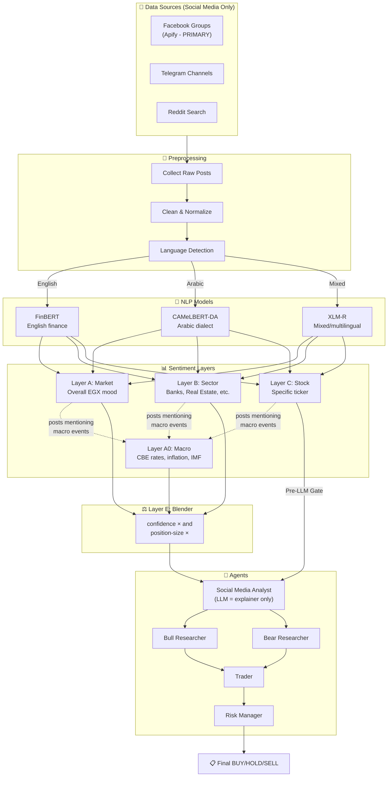
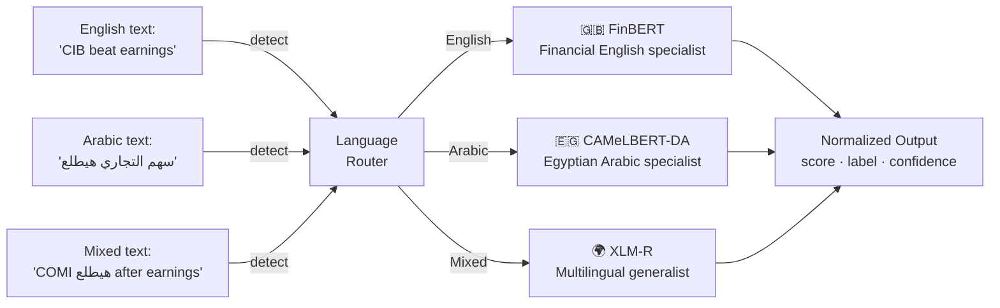
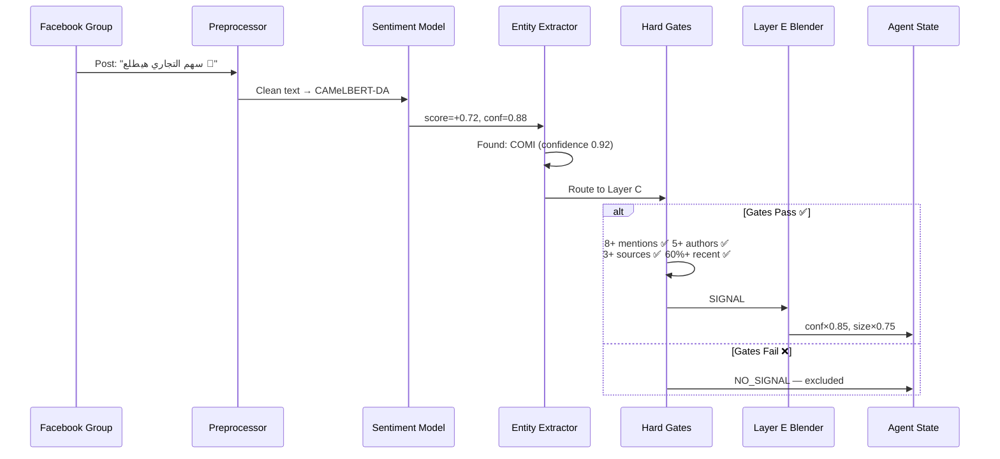
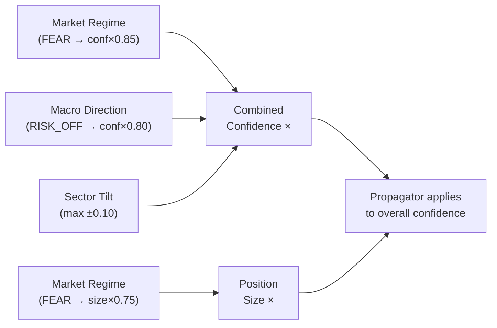
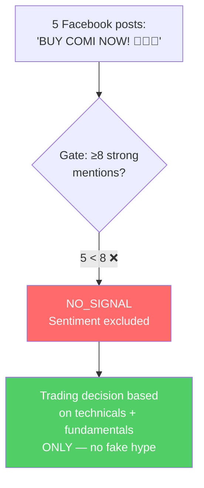
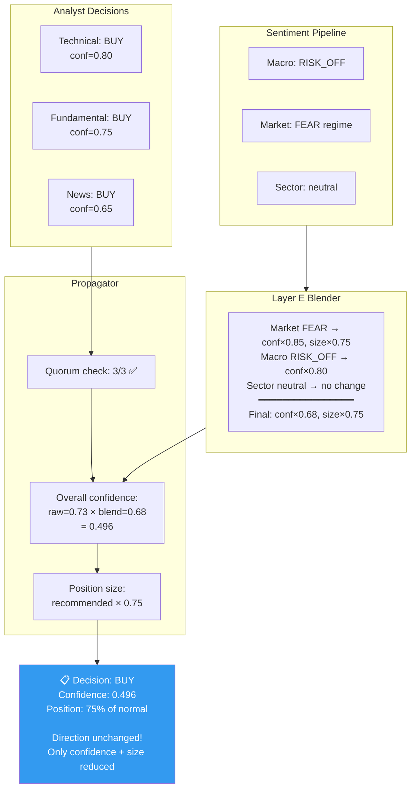
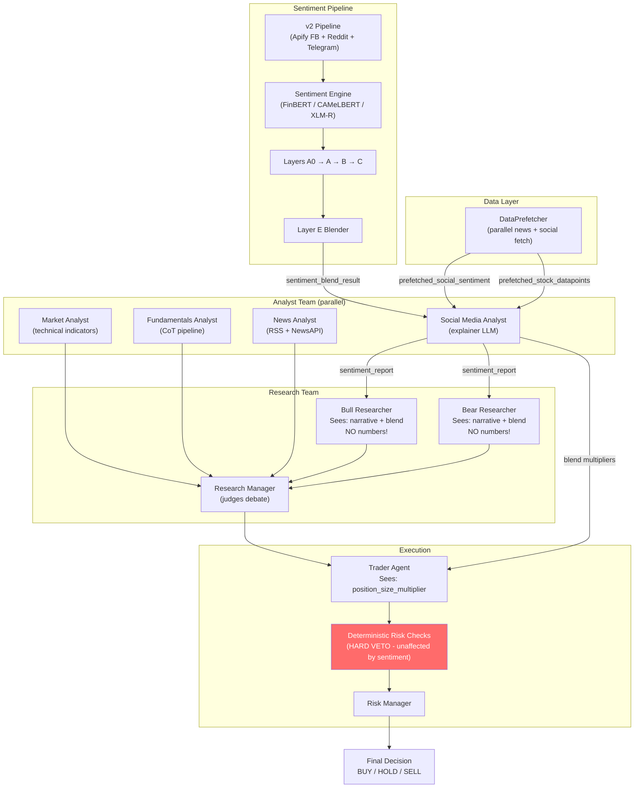
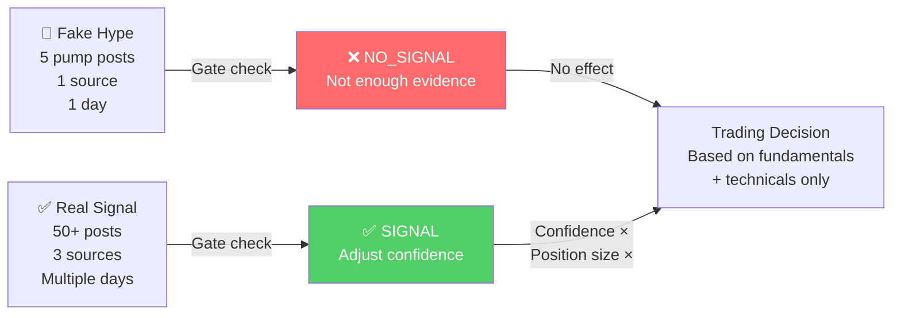

# 🎯 EGX Sentiment System — Visual Explainer

> **Audience:** Developers who understand basic programming but are NOT NLP experts.
> **Goal:** Understand how social media sentiment flows through the system and affects trading decisions.

---

## 1. High-Level Overview

### What Does the Sentiment System Do?

The sentiment system **listens to what people are saying** about Egyptian stocks on social media (Facebook, Telegram, Reddit) and news — then converts that chatter into a **confidence modifier** for trading decisions.

### Why Does It Exist?

Imagine you're analyzing COMI (Commercial International Bank). Charts say BUY and fundamentals look strong. But thousands of retail investors on Egyptian Facebook groups are panicking about a rumored CBE rate hike. The sentiment system captures that and says: *"Your BUY thesis may still be right, but reduce your position size because the market mood is fearful."*

### Why Is Social Media Sentiment Dangerous?

| Problem | Example |
|---------|---------|
| **Fake hype** | A pump group posts "🚀 BUY COMI NOW!!!" |
| **Too few posts** | Only 3 people mentioned a stock |
| **Stale data** | Posts from last month ≠ today's mood |
| **Single-source bias** | All posts from one group |
| **Language complexity** | Egyptian dialect "هيطلع" = "it will go up" needs special NLP |

### How This Architecture Fixes That

- **Default = NO_SIGNAL** — sentiment is ignored unless it passes strict gates
- **Hard gates** at every layer — not enough posts? rejected. One source? rejected
- **Sentiment NEVER flips a trade** — only adjusts confidence and position size
- **Bilingual NLP** — specialized Arabic models for Egyptian dialect

> **Key principle:** Better to have NO signal than a WRONG one.

---

## 2. Main Architecture Diagram



### Block-by-Block Explanation

| Block | What It Does | Analogy |
|-------|-------------|---------|
| **Sources** | Scrapes posts from Facebook, Telegram, Reddit (social media only — news is handled by the separate **News Analyst** agent) | Listening at a coffee shop |
| **Preprocessing** | Cleans text, detects language | Filtering background noise |
| **NLP Models** | Converts text to sentiment scores (-1 to +1) | A translator saying "this person sounds worried" |
| **Layer A0** | Detects macro-economic events *mentioned in social posts* (e.g. someone sharing a CBE rate decision). Validates the *original source domain* cited, not the social platform. | Someone at the coffee shop reads a CBE headline aloud — you check if the headline is from an official source |
| **Layer A** | Overall market mood (Fear/Greed/Panic) | Temperature of the trading floor |
| **Layer B** | Sector-specific mood | What people say about an industry |
| **Layer C** | Stock-specific sentiment | What people say about one company |
| **Layer E** | Combines into multipliers | "How much should we trust this?" |
| **Social Analyst** | LLM writes narrative only, no numbers | A journalist summarizing opinion |

> ⚠️ **Important distinction:** The **News Analyst** is a completely separate agent that handles general financial news (RSS feeds, NewsAPI). This sentiment pipeline processes **social media posts only**. Layer A0 detects macro events that *appear in social posts* (e.g. a Facebook user sharing a CBE press release) — it does NOT consume news feeds directly.

---

## 3. Model Explanation

### The Three Sentiment Models

Think of these as **three specialists**, each fluent in a different language:



### Why Three Models?

| Model | Best At | Why We Need It |
|-------|---------|---------------|
| **FinBERT** | English financial text | Knows "beat estimates" = positive, "missed guidance" = negative |
| **CAMeLBERT-DA** | Egyptian Arabic dialect | Knows "هيطلع" = bullish, "هينزل" = bearish. Standard Arabic models fail on dialect |
| **XLM-R** | Mixed language posts | Handles "COMI stock هيطلع after earnings" — English + Arabic mixed |

### How Arabic Text Is Handled

Egyptian investors write in **Egyptian dialect** (العامية), NOT formal Arabic:

- **"هيطلع"** (hayetla3) = "it will go up" — pure Egyptian dialect
- **"تجميع"** (tagmee3) = "accumulation/buying" — trading slang
- **"السهم ده حلو"** = "this stock is nice/good" — colloquial

CAMeLBERT-DA was trained specifically on dialectal Arabic. A standard Arabic model would miss these.

### Fallback Chain

```
Primary model (FinBERT / CAMeLBERT)
  → XLM-R (universal backup)
    → Rule-based keyword lexicon (last resort, confidence capped at 0.45)
```

---

## 4. Workflow Diagram



### Step-by-Step Explanation

1. **Scraping** — Collect posts from Facebook groups (primary), Telegram, Reddit
2. **Preprocessing** — Clean text, strip emojis/URLs, normalize Arabic
3. **Language Detection** — Route to correct model (English→FinBERT, Arabic→CAMeLBERT)
4. **Sentiment Scoring** — Model outputs score [-1, +1] and confidence [0, 1]
5. **Entity Extraction** — Identify which stock the post mentions (e.g., "التجاري" → COMI)
6. **Gate Checks** — "Do we have ENOUGH reliable data?" Any gate fail → NO_SIGNAL
7. **Blending** — Combine market/macro/sector into confidence and size multipliers
8. **State Update** — Blend result flows to researchers and trader as context

---

## 5. Layer Explanation

### Layer A0 — MacroSentiment

> **Think of it as:** A detector for macro-economic events mentioned in social media chatter

**What it does:** Detects major macroeconomic events (CBE rate decisions, EGP devaluation, IMF programs, inflation data) that people are **discussing on social media**. It does NOT consume news feeds directly — that's the separate News Analyst agent's job.

**How it works:** When a Facebook or Telegram post references a macro event (e.g. "CBE just held rates — source: cbe.org.eg"), Layer A0 checks the **original source domain** cited in the post to validate credibility. A random rumor about rates gets rejected; a post citing an official CBE press release passes.

**Three sequential hard gates:**

| Gate | Requirement | Why |
|------|------------|-----|
| Source Credibility | ≥1 post citing an OFFICIAL/TIER1/TIER2 source domain | Random blogs/rumors don't count. The *cited source* must be CBE, Reuters, Bloomberg, etc. |
| Corroboration | ≥2 distinct source domains cited within 48h | One outlet alone could be wrong |
| Half-Life | Event must be within its expiry window | A rate decision from 6 months ago is irrelevant |

**Source credibility ladder:**
- 🏛️ **OFFICIAL:** cbe.org.eg, egx.com.eg, fra.gov.eg
- 📰 **TIER1:** reuters.com, bloomberg.com, mubasher.info
- 📄 **TIER2:** enterprise.press, almalnews.com, dailynewsegypt.com
- ❌ **RUMOR:** everything else → excluded

**Output:** RISK_OFF / RISK_ON / NEUTRAL (RISK_OFF dominates)

---

### Layer A — MarketSentiment

> **Think of it as:** Taking the temperature of the entire EGX trading floor

**What it does:** Measures overall retail investor mood across the Egyptian Exchange.

**Three hard gates:**

| Gate | Threshold | Why |
|------|----------|-----|
| Post Volume | ≥50 posts | Too few posts = statistical noise |
| Source Diversity | ≥2 distinct platforms | One echo chamber ≠ market consensus |
| Recency | ≥30% of posts within 24h | Old sentiment is stale sentiment |

**Output regime classification:**

| Score Range | Regime | Effect |
|-------------|--------|--------|
| ≥ +0.35 | EUPHORIA | conf×0.70, size×0.60 (overheated!) |
| ≥ +0.15 | GREED | conf×0.90, size×0.90 |
| -0.15 to +0.15 | NEUTRAL | conf×1.00, size×1.00 (pass-through) |
| ≤ -0.15 | FEAR | conf×0.85, size×0.75 |
| ≤ -0.35 | PANIC | conf×0.70, size×0.50 |

> Notice: EUPHORIA and PANIC both **reduce** confidence. Extreme sentiment in either direction means higher uncertainty.

---

### Layer B — SectorSentiment

> **Think of it as:** What are people saying about banks? Real estate? Telecom?

**What it does:** Measures sentiment for each of the 6 EGX sectors using bilingual keyword classification.

**Six sectors:** Banks · Real Estate · Industry · Telecom/Tech · Financial Services · Food & Beverage

**Three hard gates:**

| Gate | Threshold | Why |
|------|----------|-----|
| Sector Posts | ≥10 posts about this sector | Need enough sector-specific discussion |
| Temporal Spread | ≥3 distinct calendar days | One-day spike could be noise |
| Entity Confidence | Mean ≥0.70 | Posts must actually be about this sector |

**Output:** Sector tilt (max ±0.10 confidence shift)

---

### Layer C — StockSentiment

> **Think of it as:** What are people saying about THIS specific stock?

**What it does:** Measures sentiment for a single ticker with gates scaled by the stock's liquidity tier.

**Liquidity tiers** (different stocks need different evidence thresholds):

| Tier | Stocks | Strong Mentions | Authors | Sources |
|------|--------|----------------|---------|---------|
| **MEGA** | COMI, TMGH, FWRY, ETEL, HRHO | ≥8 | ≥5 | ≥3 |
| **MID** | ADIB, EAST, DOMT, etc. | ≥5 | ≥3 | ≥2 |
| **SMALL** | All others | ≥3 | ≥2 | ≥2 |

**Four hard gates (all must pass):**

| Gate | Requirement | Why |
|------|------------|-----|
| Strong Mentions | entity_conf ≥ 0.85 per post | Weak matches ("EAST" could be "Middle East") don't count |
| Distinct Authors | Different people must be posting | One person spamming ≠ consensus |
| Distinct Sources | Multiple platforms | Facebook-only signal could be echo chamber |
| Recency (72h) | ≥60% of posts within 72 hours | Stale data rejected |

**Special feature — `contradicts_market` flag:** When the stock sentiment is strongly opposite to market sentiment (e.g., market=GREED but COMI=bearish), this flag is set to alert downstream agents.

---

### Layer E — Blender

> **Think of it as:** The final filter that turns sentiment into action

**What it does:** Combines all layer outputs into two simple multipliers:
- `confidence_multiplier` — scales the overall decision confidence
- `position_size_multiplier` — scales how much money to allocate

**Critical rule:** Sentiment NEVER changes the direction. If fundamentals say BUY, sentiment can only make you buy LESS (lower confidence, smaller position). It cannot flip BUY to SELL.

**Multiplier cascade:**



---

## 6. NO_SIGNAL Explanation

### What Is NO_SIGNAL?

NO_SIGNAL means: **"We don't have enough reliable data to form an opinion."**

It is NOT the same as "neutral." Here's the difference:

| | Neutral | NO_SIGNAL |
|---|---------|-----------|
| **Meaning** | "We looked at the data and people feel neutral" | "We don't have enough data to say anything" |
| **Score** | 0.0 (a real measurement) | None (no measurement taken) |
| **Effect** | Counts as a valid signal | Completely excluded from calculations |
| **Analogy** | "The jury voted 'not guilty'" | "We couldn't assemble a jury" |

### Why NO_SIGNAL Is NOT Neutral

Imagine only 5 people posted about a small-cap stock, and all 5 said "BUY!" If we treated that as a bullish signal, we'd be making a trading decision based on 5 random people. That's dangerous.

NO_SIGNAL says: "5 posts is not enough evidence. We refuse to form an opinion."

### Real-World Examples of NO_SIGNAL

**Example 1 — Not enough posts:**
> A small EGX stock (EFID.CA) has only 8 social media mentions today.
> Layer A requires ≥50 posts → Gate fails → NO_SIGNAL.
> *Meaning: "The internet isn't talking about this enough for us to gauge mood."*

**Example 2 — Single source echo chamber:**
> 60 posts about COMI, but ALL from one Facebook group.
> Layer C requires ≥3 distinct sources → Gate fails → NO_SIGNAL.
> *Meaning: "One group's opinion ≠ market consensus."*

**Example 3 — Stale data:**
> 100 posts about banks sector, but 80% are from last week.
> Layer A requires ≥30% within 24h → Gate fails → NO_SIGNAL.
> *Meaning: "Last week's mood doesn't tell us about today."*

**Example 4 — Unverified macro rumor:**
> A random blog claims "CBE will cut rates next month!"
> Layer A0 requires credible source (Reuters, CBE, etc.) → Gate fails → NO_SIGNAL.
> *Meaning: "We only trust verified financial news sources."*

### How NO_SIGNAL Prevents Fake Signals



### The Audit Trail

Every NO_SIGNAL carries a structured `NoSignalReason`:

```
NO_SIGNAL: insufficient strong mentions for COMI[MEGA] (2 < required 8)
  (gate=stock.n_strong_mentions, ticker=COMI, tier=MEGA, n_strong=2, required=8)
```

This audit string appears in: logs, agent context, CLI display, API response, and evaluation JSON.

---

## 7. Confidence & Position Sizing

### How Sentiment Affects Trading Decisions



### Key Points

1. **Sentiment does NOT force BUY/SELL** — The directional decision comes from technical + fundamental + news analysts. Sentiment only adjusts HOW CONFIDENT we are and HOW MUCH we allocate.

2. **Quorum rule** — At least 2 out of 3 directional analysts must have valid data. Otherwise → INSUFFICIENT_DATA → HOLD.

3. **Confidence formula:**
   ```
   raw_confidence = 0.30 × weakest_analyst + 0.70 × average_analyst
   blended_confidence = raw_confidence × sentiment_confidence_multiplier
   ```

4. **Position size** — If market is in PANIC, position size drops to 50%. If FEAR, 75%. This prevents over-committing when the market is unstable.

---

## 8. Real-World Example Walkthroughs

### Example 1 — Strong Bullish Signal ✅

**Scenario:** COMI.CA on a day when CBE holds rates steady and retail investors are optimistic.

**Sample posts collected:**
- 🇪🇬 Facebook: "التجاري الدولي هيطلع بعد تثبيت الفائدة" (score: +0.72)
- 🇪🇬 Facebook: "سهم CIB تجميع قوي النهارده" (score: +0.45)
- 🇬🇧 Telegram: "CIB earnings beat, strong buy signal" (score: +0.68)
- 🇬🇧 Reddit: "COMI.CA looking bullish after rate hold" (score: +0.52)
- *(55 total market posts, 12 COMI-specific from 6 authors on 3 platforms)*

**Layer results:**

| Layer | Gate Result | Output |
|-------|------------|--------|
| A0 Macro | ✅ CBE (official) + Reuters both report rate hold, within 48h | RISK_ON |
| A Market | ✅ 55 posts, 2 sources, 73% within 24h | GREED (score=+0.28) |
| B Sector | ✅ 20 bank posts, 4 days, entity_conf=0.82 | Banks positive (+0.24) |
| C Stock | ✅ 12 mentions, 6 authors, 3 sources, 85% recent | Bullish (+0.36) |

**Blend result:**
- Market GREED → conf×0.90, size×0.90
- Macro RISK_ON → conf×0.95
- Sector banks positive → conf +0.024 tilt
- **Final: conf×0.879, size×0.90**

**Effect on trade:**
> Technical says BUY (conf=0.80), Fundamental says BUY (conf=0.75).
> After sentiment blend: overall confidence drops slightly (×0.88) and position size is 90% of normal.
> **Direction unchanged: still BUY**, but with high confidence and near-full position.

---

### Example 2 — Fake/Weak Signal Rejected ❌

**Scenario:** A small Facebook pump-group posts aggressively about EFID.CA (small-cap food stock).

**Sample posts collected:**
- 🇪🇬 Facebook Group A: "اشتروا EFID دلوقتي هيطلع 100%!!!" (score: +0.95)
- 🇪🇬 Facebook Group A: "EFID فرصة العمر 🚀🚀🚀" (score: +0.88)
- 🇪🇬 Facebook Group A: "تجميع EFID بسرعة قبل الإغلاق" (score: +0.71)
- *(Only 4 posts total, all from same Facebook group, all same day)*

**Layer results:**

| Layer | Gate Result | Output |
|-------|------------|--------|
| A0 Macro | ❌ No credible sources (all from social media) | NO_SIGNAL |
| A Market | ❌ Only 4 posts (need ≥50) | NO_SIGNAL |
| B Sector | ❌ Only 1 food post (need ≥10) | NO_SIGNAL |
| C Stock | ❌ 4 mentions but only 1 source (need ≥2 for SMALL tier) | NO_SIGNAL |

**What happens:**
```
Layer C → NO_SIGNAL → Pre-LLM gate triggers → LLM not even called
sentiment_report = "Social sentiment: insufficient data — excluded."
sentiment_blend_result = { conf×1.00, size×1.00 }  (pass-through)
```

**Effect on trade:**
> Sentiment is completely excluded. The trade decision is based purely on technicals, fundamentals, and news.
> **The pump-group hype had ZERO influence on the trading decision.** ✅

---

## 9. Component Relationship Diagram

### How Sentiment Interacts with the Trading System



### Key Interactions Explained

1. **Prefetcher → Social Analyst:** Social data is pre-fetched in parallel with other analysts. If Layer C says NO_SIGNAL for this ticker, the LLM is never called (saves cost + latency).

2. **Social Analyst → Researchers:** Bull and Bear researchers receive a **narrative** (plain text) and **blend modifiers** (confidence×, size×). They explicitly do NOT receive directional scores. If sentiment is NO_SIGNAL, they see "EXCLUDED — insufficient data" and are instructed to ignore it.

3. **Blender → Propagator:** The `sentiment_blend_result` dict flows to `propagate_confidence()` which applies the multipliers to the overall confidence score.

4. **Deterministic Risk Checks:** These are HARD VETO gates (max position size, daily price limits, ADV cap) that sentiment CANNOT override. Even if sentiment says "maximum confidence," the risk manager still enforces EGX regulatory limits.

---

## 10. Final Summary

### Why This Architecture Is Safer Than Naive Sentiment Bots

| Naive Bot Approach | This System's Approach |
|-------------------|----------------------|
| "50 people said BUY → execute BUY" | "50 people said BUY → are there enough? From multiple sources? Recent? → if yes, adjust confidence by 10%" |
| Treats all sources equally | Credibility ladder: CBE > Reuters > random blog |
| No minimum data requirements | Hard gates at every layer |
| Sentiment drives decisions | Sentiment modifies confidence only |
| Single model for all languages | Specialized models for Arabic dialect + English finance |
| Silent failures | Every NO_SIGNAL has a structured audit trail |

### Why EGX Needs Special Handling

1. **Long-only market** — No short selling means sentiment FEAR doesn't create sell-signal opportunities
2. **±10% daily price limits** — Circuit breakers mean panic/euphoria have capped impact
3. **Low liquidity** — Many EGX stocks have few posts; the tier system (MEGA/MID/SMALL) adjusts thresholds accordingly
4. **Arabic dialect** — Egyptian retail investors write in عامية (colloquial), not فصحى (formal). CAMeLBERT-DA handles this; standard NLP models cannot

### Why Multilingual Support Matters

~70% of EGX retail investor discussion happens in **Egyptian Arabic dialect** on Facebook groups. Without CAMeLBERT-DA, you'd miss the majority of the signal. FinBERT alone would return "neutral" for Arabic text it can't understand — creating a systematically biased signal.

### How the System Avoids Fake Hype



### The Bottom Line

> **This sentiment system is designed to say "I don't know" rather than "I think."**
>
> When it DOES have enough data, it only whispers to the trader: *"Be a little more cautious"* or *"You can be a little more confident."*
>
> It never shouts: *"CHANGE YOUR TRADE!"*

---

## Quick Reference

| File | Purpose |
|------|---------|
| `tradingagents/sentiment/contracts.py` | Typed contracts, NO_SIGNAL, layer output schemas |
| `tradingagents/sentiment/macro.py` | Layer A0: MacroSentiment (3 gates) |
| `tradingagents/sentiment/market.py` | Layer A: MarketSentiment (3 gates) |
| `tradingagents/sentiment/sector.py` | Layer B: SectorSentiment (3 gates + bilingual classifier) |
| `tradingagents/sentiment/stock.py` | Layer C: StockSentiment (4 tier-scaled gates) |
| `tradingagents/sentiment/surfacing.py` | Audit trail + API/CLI formatters |
| `tradingagents/sentiment/config.py` | All thresholds and multiplier tables |
| `tradingagents/sentiment/taxonomy.py` | 6-sector EGX taxonomy with Arabic aliases |
| `tradingagents/sentiment/liquidity_tiers.py` | MEGA/MID/SMALL tier assignments |
| `tradingagents/agents/utils/scoring.py` | Layer E blender + quorum rule |
| `tradingagents/graph/propagation.py` | Applies blend multipliers to overall confidence |
| `tradingagents/utils/sentiment_engine.py` | FinBERT/CAMeLBERT/XLM-R model router |
| `tradingagents/agents/analysts/social_media_analyst.py` | Agent: pre-LLM gate + LLM explainer |
| `scripts/test_sentiment_pipeline.py` | Manual test harness (5 scenarios, no LLM) |
