# StockHive — Presentation Visual Plan
## One-to-one mapping with `presentation_discussion.md`

> For each of the 43 slides, this file specifies the exact visual asset needed,
> how to produce it, and its priority. All visuals are grounded in the actual repository.

---

# 1. Introduction & Storytelling (Slides 1–5)

---

## Slide 1: Project Title

**Visual type:**
Icon layout / branded title card

**Exact visual needed:**
Clean title slide with:
- Project name: "StockHive" in large type
- Subtitle: "AI-Powered Investment Assistant for the Egyptian Stock Exchange"
- Small logos or icons for key tech: LangGraph, DeepSeek, FastAPI, React, Prometheus
- Team member names at the bottom
- Subtle EGX/stock chart background motif (abstract, not a real chart)

**Source / capture instructions:**
Design in PowerPoint directly. Use the brand color `#22B887` (teal-green from `dashboard/tailwind.config.js`). Fonts: Inter (Latin), Cairo or Noto Sans Arabic (Arabic text).

**Mermaid code:**
Not needed.

**Data needed:**
None.

**Priority:**
Must-have

**Notes:**
Keep it clean. No screenshots or diagrams on the title slide.

---

## Slide 2: Why Investing Is Difficult

**Visual type:**
Icon layout / infographic

**Exact visual needed:**
Split layout:
- Left side: "Retail Investor" with scattered icons — news feeds, Arabic text, technical charts, financial statements, social media — all overlapping chaotically
- Right side: "Institutional Team" with organized icons — analyst desks, structured reports, risk dashboards
- Arrow or divider between them with text: "The Gap StockHive Fills"

**Source / capture instructions:**
Create using PowerPoint shapes and icons (Lucide-style or simple line icons). No stock photos.

**Mermaid code:**
Not needed.

**Data needed:**
None.

**Priority:**
Nice-to-have

**Notes:**
This is a storytelling slide. A simple visual with 4-6 icons per side is sufficient. Don't overcomplicate.

---

## Slide 3: Challenges Investors Face

**Visual type:**
Icon layout / four-quadrant infographic

**Exact visual needed:**
2×2 grid, each cell with:
1. **Information Overload** — icon: stacked documents / inbox overflow
2. **Conflicting Signals** — icon: two arrows pointing opposite directions
3. **Time-Consuming Research** — icon: clock with analysis symbol
4. **Risk Management** — icon: shield with warning

Each cell: icon + title + one-line description.

**Source / capture instructions:**
PowerPoint SmartArt or manual layout with 4 rounded rectangles. Use brand color for headers.

**Mermaid code:**
Not needed.

**Data needed:**
None.

**Priority:**
Must-have

**Notes:**
Keep it to exactly 4 items — matches the 4-problem → 4-solution mapping in Slides 6-9.

---

## Slide 4: Why the Egyptian Stock Market Needs Better Tools

**Visual type:**
Icon layout / constraint cards

**Exact visual needed:**
Six constraint cards arranged in 2 rows × 3 columns:
1. 🚫 **Long-Only** — "No short selling"
2. ⚡ **±10% Price Limits** — "Daily circuit breakers"
3. 🌍 **Arabic-Dominant** — "Arabic FB groups, Telegram"
4. 💧 **Low Liquidity** — "Some stocks < 50K ADV"
5. ⏱ **T+2 Settlement** — "Cash timing matters"
6. 💰 **EGP Currency** — "FX exposure risk"

**Source / capture instructions:**
PowerPoint layout. Values grounded in `default_config.py`: `long_only=True`, `daily_price_limit_pct=0.10`, `max_position_pct_adv=0.10`. Min ADV from `risk_scorer.py:57`: `min_avg_daily_volume=50000`.

**Mermaid code:**
Not needed.

**Data needed:**
None.

**Priority:**
Must-have

**Notes:**
Use simple constraint icons. These 6 items are the foundation for why generic US-market tools don't work.

---

## Slide 5: Our Vision

**Visual type:**
Workflow diagram (simple horizontal flow)

**Exact visual needed:**
Horizontal flow: `Data Sources` → `Multi-Agent AI Team` → `Explainable Recommendation` → `Human Decision`
Below each step, one-line label:
- "Yahoo Finance, CSVs, RSS, Facebook, Telegram"
- "4 Analysts + Debate + Risk Pipeline"
- "BUY/HOLD/SELL with full reasoning"
- "Investor reviews and decides"

**Source / capture instructions:**
Create in PowerPoint with 4 rounded rectangles and arrows. Or use this Mermaid diagram.

**Mermaid code:**
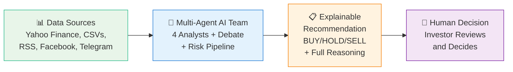

**Data needed:**
None.

**Priority:**
Must-have

**Notes:**
Emphasize "Human Decision" at the end — the system recommends, it does not execute.

---

# 2. Problem–Solution Mapping (Slides 6–9)

---

## Slide 6: Problem #1 — Information Overload → Multi-Agent Research Team

**Visual type:**
Mermaid diagram — parallel fan-out

**Exact visual needed:**
Show START splitting into 4 parallel analysts, each with its data source label, then converging at a sync barrier. Match the actual graph from `graph/setup.py:219-230`.

**Source / capture instructions:**
Based on `graph/setup.py:213-230` — `workflow.add_edge(START, current_analyst)` for each of 4 analysts.

**Mermaid code:**
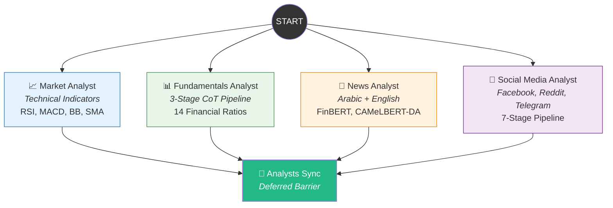

**Data needed:**
None.

**Priority:**
Must-have

**Notes:**
This is the "money diagram" — shows the core parallel architecture at a glance. Used again on Slides 19 and 30 with more detail.

---

## Slide 7: Problem #2 — Black-Box AI → Explainable Reasoning

**Visual type:**
Workflow diagram — debate waterfall

**Exact visual needed:**
Vertical waterfall showing the reasoning chain:
1. Analyst Reports (Technical + Fundamental + News + Social)
2. → Bull Researcher: "Builds bullish thesis with evidence"
3. → Bear Researcher: "Builds bearish counter-thesis"
4. → Research Manager: "Weighs both sides, commits to decision"
5. → Risk Manager: "Evaluates against 15-clause Constitution"
6. → Final Recommendation: "BUY/HOLD/SELL with full audit trail"

**Source / capture instructions:**
Based on `graph/setup.py:247-269` — linear chain: Bull → Bear → Research Manager → Trader → Risk Pipeline.

**Mermaid code:**
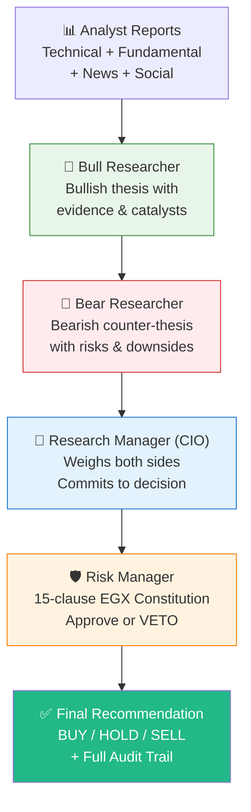

**Data needed:**
None.

**Priority:**
Must-have

**Notes:**
Emphasize that every step is visible and auditable. This is the "explainability" story.

---

## Slide 8: Problem #3 — Price Prediction Alone Is Not Enough → Position Sizing & Execution Planning

**Visual type:**
Table / annotated JSON snippet

**Exact visual needed:**
Show the execution plan JSON structure from `trader.py:274-325` as a clean formatted table:
| Field | Example Value |
|-------|---------------|
| Decision | BUY |
| Target Shares | 5,000 |
| Max Shares/Day | 1,200 |
| Execution Days | 5 |
| Order Type | limit |
| Entry Zone | 85.50 – 87.00 EGP |
| Take-Profit 1 | 92.00 EGP (40%) |
| Take-Profit 2 | 96.00 EGP (35%) |
| Take-Profit 3 | 102.00 EGP (25%) |
| Stop-Loss | 81.00 EGP |
| Time Stop | 6 weeks |

**Source / capture instructions:**
Structure from `trader.py:274-325`. Values are illustrative — mark as "representative example" on the slide.

**Mermaid code:**
Not needed.

**Data needed:**
Execution plan JSON schema from `trader.py:274-325`.

**Priority:**
Must-have

**Notes:**
Show this as a clean formatted table, not raw JSON. Use a "Before/After" split: left = "BUY signal only" (no context), right = full execution plan table.

---

## Slide 9: Problem #4 — Fragmented Analysis → Unified Agentic Workflow

**Visual type:**
Before/After comparison diagram

**Exact visual needed:**
Two columns:
- **Before**: 4 disconnected boxes — "Charting Website", "Financial News", "Facebook Groups", "Balance Sheets" — no connections between them
- **After**: Single connected pipeline — 4 analysts feeding into debate, execution, and risk, all connected by arrows, outputting one unified recommendation

**Source / capture instructions:**
Design in PowerPoint. The "After" side is a simplified version of the full graph from `graph/setup.py`.

**Mermaid code:**
Not needed. (Use PowerPoint shapes for the Before/After layout — Mermaid doesn't do side-by-side well.)

**Data needed:**
None.

**Priority:**
Nice-to-have

**Notes:**
Keep it simple. The "Before" side should look messy/disconnected. The "After" side should look clean/unified.

---

# 3. Solution Overview (Slides 10–12)

---

## Slide 10: Project Overview

**Visual type:**
Architecture diagram — six blocks

**Exact visual needed:**
Six major subsystem blocks arranged in 2 rows × 3 columns:
1. **Data Layer** — Yahoo Finance, CSVs, RSS, Apify, Reddit, Telegram
2. **Analysis Engine** — 4 Analysts + Hybrid CoT + Deterministic
3. **Decision Engine** — Bull/Bear Debate → Trader → Risk Pipeline
4. **Backend** — FastAPI REST + WebSocket + Redis
5. **Frontend** — React 19 + lightweight-charts + Tailwind
6. **Monitoring** — Prometheus + Grafana + Loki + Alerting

Arrows showing data flow: Data Layer → Analysis → Decision → Backend → Frontend, with Monitoring spanning the bottom.

**Source / capture instructions:**
Based on CLAUDE.md §2 (Architecture) and §3 (Directory map). Entry points: `main.py`, `server/api_server.py`, `dashboard/`.

**Mermaid code:**
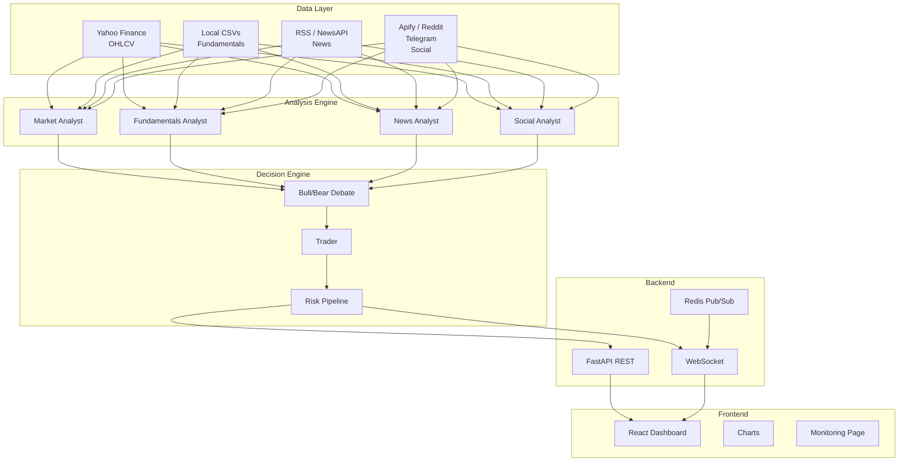

**Data needed:**
None.

**Priority:**
Must-have

**Notes:**
This is the "birds-eye" view. Keep labels short. Detail comes in Slides 24-28.

---

## Slide 11: Key Features

**Visual type:**
Icon grid — 2 columns × 5 rows

**Exact visual needed:**
Ten feature cards, each with an icon and one-line description:
1. 🤖 Multi-Agent AI — 4 parallel analysts
2. 🌐 Bilingual Arabic + English — FinBERT + CAMeLBERT-DA
3. 🔗 3-Stage CoT Fundamentals — deterministic → concept → thesis
4. ⚔️ Bull vs. Bear Debate — structured investment thesis
5. 📋 Execution Plans — position sizing + entry/exit
6. 🛡️ 3-Layer Risk Pipeline — scorer → debate → constitutional judge
7. 👤 Investor Profiling — Intraday / Swing / Position
8. 📊 Real-Time Dashboard — WebSocket event streaming
9. 🧪 Backtesting Engine — crash-hardened + resume
10. 📡 Full Observability — Prometheus + structured logs

**Source / capture instructions:**
All features verified in the codebase. Icons from Lucide or simple PowerPoint icons.

**Mermaid code:**
Not needed.

**Data needed:**
None.

**Priority:**
Must-have

**Notes:**
No more than one line per feature. This is a scan-able overview slide.

---

## Slide 12: User Journey and Workflow

**Visual type:**
Horizontal journey map / timeline

**Exact visual needed:**
6-step horizontal timeline:
1. **Profile** — "Set risk tolerance, horizon, capital" (icon: user form)
2. **Select Stock** — "Pick from 29 EGX tickers" (icon: list/dropdown)
3. **Pipeline Runs** — "4 analysts → debate → risk check" (icon: gears)
4. **Live Progress** — "WebSocket events in dashboard" (icon: streaming)
5. **Results** — "Recommendation + reports + execution plan" (icon: document)
6. **Decide** — "Human reviews and acts" (icon: person checkmark)

**Source / capture instructions:**
Based on the actual dashboard features: `dashboard/src/features/investor/` (profiles), `dashboard/src/features/home/` (stock selection), `dashboard/src/features/run/` (live analysis), `dashboard/src/features/prediction/` (results).

**Mermaid code:**
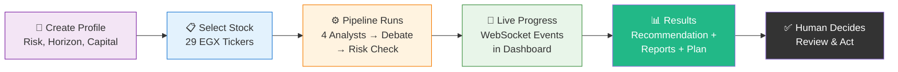

**Data needed:**
None.

**Priority:**
Must-have

**Notes:**
Timeline should flow left to right. Each step gets a small icon above it.

---

# 4. Prediction & Execution Intelligence (Slides 13–17)

---

## Slide 13: Stock Analysis Engine

**Visual type:**
Comparison diagram

**Exact visual needed:**
Two columns:
- **Traditional ML**: `Historical Data → Neural Network → Price Prediction` (single arrow, one box)
- **StockHive**: `Multiple Data Sources → 4 Analysts (parallel) → Structured Debate → Risk Review → Recommendation with Reasoning` (multi-step, multi-box)

**Source / capture instructions:**
PowerPoint layout. The StockHive side should look richer and more structured.

**Mermaid code:**
Not needed. (Side-by-side comparison works better in PowerPoint.)

**Data needed:**
None.

**Priority:**
Nice-to-have

**Notes:**
The key message is: "This is not a black-box ML model. It is a structured reasoning system."

---

## Slide 14: Analysis Inputs

**Visual type:**
Mermaid diagram — five input streams converging

**Exact visual needed:**
Five input data streams flowing into a central "Analysis Engine" node:
1. Market Data — yfinance OHLCV
2. Technical Indicators — RSI, MACD, BB, SMA (stockstats)
3. Fundamental Data — Local CSVs, 14 ratios
4. News Sentiment — Mubasher RSS, NewsAPI, FinBERT/CAMeLBERT
5. Social Sentiment — Facebook (Apify), Reddit, Telegram, 7-stage pipeline

**Source / capture instructions:**
Data sources from `default_config.py:48-53` and `CLAUDE.md §3`.

**Mermaid code:**
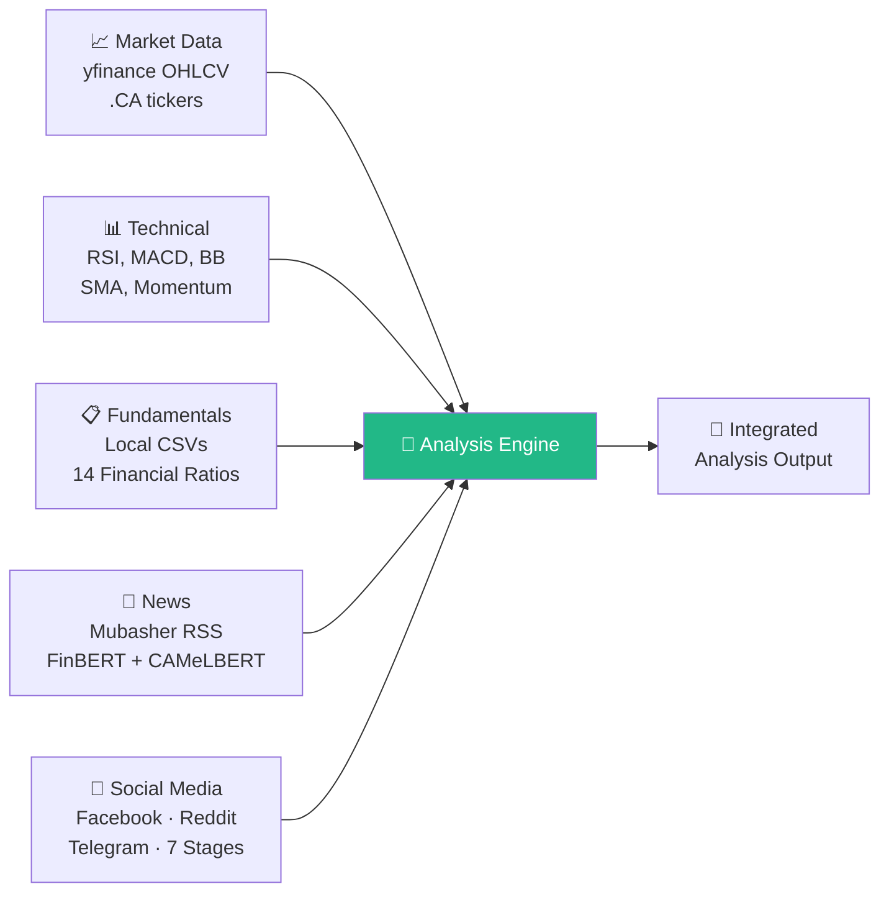

**Data needed:**
None.

**Priority:**
Must-have

**Notes:**
Label each stream with actual source names and processing methods.

---

## Slide 15: Why Execution Planning Matters

**Visual type:**
Icon layout — Before/After

**Exact visual needed:**
Two-column comparison:
- **Without Execution Plan**: "BUY" signal only → 🔴 Unknown position size, no stop-loss, no exit strategy, potential market impact
- **With Execution Plan**: Full plan → 🟢 Sized to ADV, limit orders, multi-target exits, stop-loss, time stop

**Source / capture instructions:**
Design in PowerPoint. Constraints from `risk_scorer.py:48-77`.

**Mermaid code:**
Not needed.

**Data needed:**
None.

**Priority:**
Nice-to-have

**Notes:**
Simple two-column slide. Use red/green contrast.

---

## Slide 16: Execution Plan Structure

**Visual type:**
Table — annotated execution plan

**Exact visual needed:**
Clean table showing the execution plan JSON structure:

| Component | Detail | Example |
|-----------|--------|---------|
| **Decision** | BUY / HOLD / SELL | BUY (moderate conviction) |
| **Position Sizing** | Max 10% ADV/day | 5,000 shares over 5 days |
| **Entry Logic** | Limit order in zone | 85.50 – 87.00 EGP |
| **Take-Profit 1** | 40% of position | 92.00 EGP |
| **Take-Profit 2** | 35% of position | 96.00 EGP |
| **Take-Profit 3** | 25% of position | 102.00 EGP |
| **Stop-Loss** | ATR-based or 5% fixed | 81.00 EGP (mental stop) |
| **Time Stop** | Exit if thesis invalid | 6 weeks |
| **Risk Controls** | Max 2% portfolio at risk | 20,000 EGP max loss |

**Source / capture instructions:**
Schema from `trader.py:274-325`. Example values are illustrative — label as "representative example."

**Mermaid code:**
Not needed.

**Data needed:**
Execution plan JSON schema from `trader.py:274-325`.

**Priority:**
Must-have

**Notes:**
This is the same content as Slide 8 but in more detail. Consider combining with Slide 8 if the presentation runs long.

---

## Slide 17: Sample Analysis Output

**Visual type:**
Screenshot — dashboard recommendation view

**Exact visual needed:**
Screenshot of the dashboard showing a completed COMI.CA analysis with:
- Final recommendation (BUY/HOLD/SELL) with confidence
- Agent cards showing analyst summaries
- Price chart if visible

**Source / capture instructions:**
1. Start the backend: `uvicorn server.api_server:app --reload --port 8000`
2. Start the dashboard: `cd dashboard && npm run dev`
3. Navigate to `http://localhost:5173/`
4. Run a prediction on COMI.CA via the dashboard
5. Screenshot the results page once complete

**Mermaid code:**
Not needed.

**Data needed:**
Live system run required. Alternatively, use API output from `POST /api/test/random-egx` with body `{"ticker": "COMI.CA"}`.

**Priority:**
Must-have

**Notes:**
TODO: Capture this screenshot before the presentation. If the dashboard is not running, use the API JSON output formatted as a clean table instead.

---

# 5. Agentic AI Design (Slides 18–23)

---

## Slide 18: Why Agentic AI?

**Visual type:**
Icon layout — comparison

**Exact visual needed:**
Two rows:
- **Single Model**: One box → one output. "Jack of all trades, master of none."
- **Multi-Agent Team**: Four specialized boxes → debate → decision → risk check. "Each agent is an expert in its domain."

Key advantages listed: Specialization, Parallel Processing, Structured Debate, Separation of Concerns, Extensibility.

**Source / capture instructions:**
PowerPoint layout with simple shapes.

**Mermaid code:**
Not needed.

**Data needed:**
None.

**Priority:**
Nice-to-have

**Notes:**
Keep it simple. The detailed agent ecosystem is on Slide 19.

---

## Slide 19: Multi-Agent Ecosystem Overview

**Visual type:**
Mermaid diagram — full 4-layer architecture

**Exact visual needed:**
The complete agent ecosystem organized in 4 layers, matching `graph/setup.py:170-269`:
- Layer 1: 4 Analysts (parallel)
- Layer 2: Bull → Bear → Research Manager (linear)
- Layer 3: Trader
- Layer 4: Risk Scorer → (VETO | Debate → Judge)

**Source / capture instructions:**
Direct mapping from `graph/setup.py:170-269`.

**Mermaid code:**
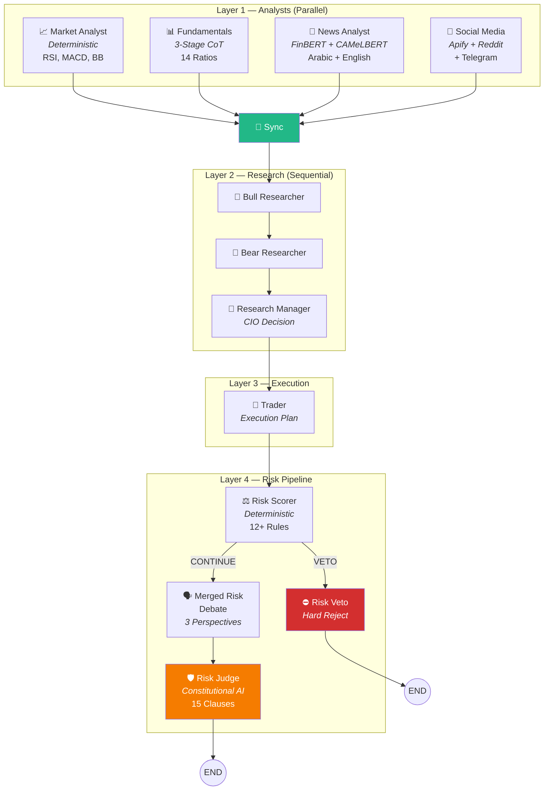

**Data needed:**
None.

**Priority:**
Must-have

**Notes:**
This is the most important technical diagram in the deck. Ensure it renders cleanly at slide size. Consider splitting into two slides if it's too dense.

---

## Slide 20: News & Sentiment Agent

**Visual type:**
Mermaid diagram — sentiment pipeline

**Exact visual needed:**
Flow: News Sources → Sentiment Engine Router → LLM Analysis → Blended Output
Show the model routing: English → FinBERT, Arabic → CAMeLBERT-DA, Mixed → XLM-R

**Source / capture instructions:**
Based on `utils/sentiment_engine.py` and `news_analyst.py:415-466` (65% transformer + 35% LLM blend).

**Mermaid code:**
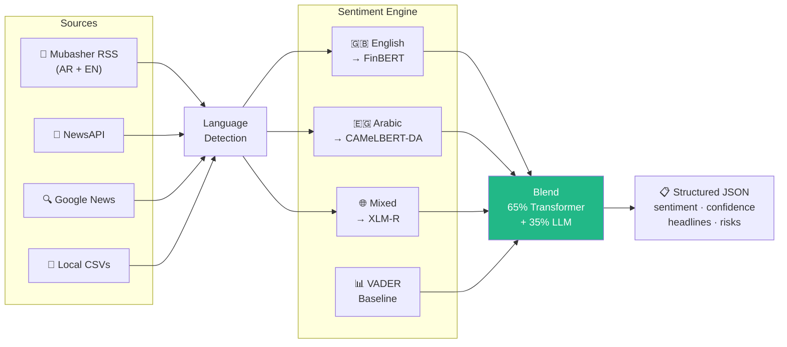

**Data needed:**
None.

**Priority:**
Must-have

**Notes:**
Highlight the bilingual capability — this is a key differentiator.

---

## Slide 21: Market Analysis Agent

**Visual type:**
Table — indicator list + deterministic badge

**Exact visual needed:**
Table showing the computed indicators:

| Indicator | Formula | Signal Logic |
|-----------|---------|-------------|
| RSI(14) | Relative Strength Index | ≤30 oversold, ≥70 overbought |
| MACD(12,26,9) | Moving Average Convergence | Crossover signals |
| Bollinger Bands(20,2) | Mean ± 2σ | Band breakout/squeeze |
| SMA(20/50/200) | Simple Moving Average | Trend direction |
| Momentum Label | Custom EGX metric | strong_up → strong_down |
| Relative Strength | vs EGX30 index | outperforming/underperforming |
| Volume Confirmation | Price move × volume | true/false |

Badge: "⚡ Deterministic — No LLM Call Required"

**Source / capture instructions:**
Indicators from `market_analyst.py:23` (`EGX_DAILY_INDICATORS`) and `market_analyst.py:475-712` (deterministic path).

**Mermaid code:**
Not needed.

**Data needed:**
None.

**Priority:**
Nice-to-have

**Notes:**
The key point is "deterministic for EGX" — no LLM waste on math.

---

## Slide 22: Fundamentals Analysis Agent

**Visual type:**
Mermaid diagram — 3-stage pipeline with degradation

**Exact visual needed:**
Three-stage pipeline with fallback branches:
- Stage 1 (Data CoT) — deterministic evidence pack
- Stage 2 (Concept CoT) — quick LLM interpretation
- Stage 3 (Thesis CoT) — deep LLM H&P thesis
With quality levels: `cot_full`, `cot_partial`, `deterministic_only`, `unavailable`

**Source / capture instructions:**
Based on `fundamentals/pipeline.py:1-21` (docstring describes the exact fallback chain).

**Mermaid code:**
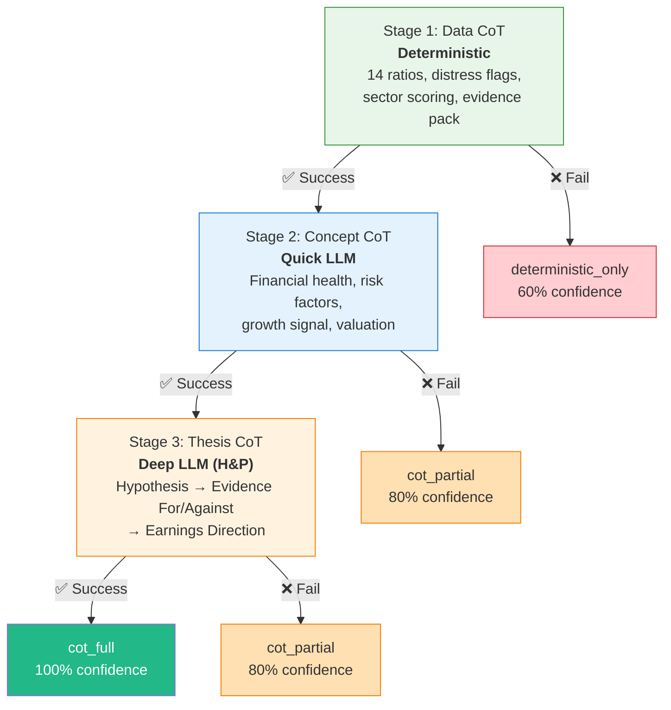

**Data needed:**
None.

**Priority:**
Must-have

**Notes:**
This is a critical diagram — shows graceful degradation. Label quality levels clearly: `full`, `partial`, `deterministic_only`.

---

## Slide 23: Social Media Analysis Agent

**Visual type:**
Mermaid diagram — 7-stage pipeline

**Exact visual needed:**
7-stage pipeline flow with source icons.

**Source / capture instructions:**
Based on `dataflows/social_v2/pipeline.py` stages.

**Mermaid code:**
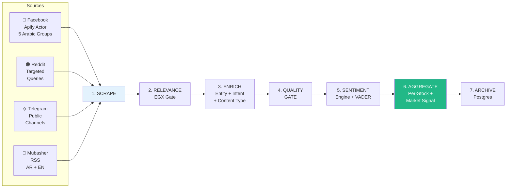

**Data needed:**
None.

**Priority:**
Must-have

**Notes:**
Mention: 84 issuers in entity registry, MIN_TOTAL_POSTS=50 threshold, NO_SIGNAL honest fallback.

---

# 6. System Architecture (Slides 24–28)

---

## Slide 24: High-Level Architecture Diagram

**Visual type:**
Architecture diagram — four columns

**Exact visual needed:**
Four vertical columns left to right:
1. **Data Sources** — Yahoo Finance, Local CSVs, RSS, Apify, Reddit, Telegram
2. **Core Engine** — LangGraph pipeline, 4 analysts, debate, risk
3. **Backend + Storage** — FastAPI, Redis, ChromaDB, PostgreSQL, diskcache
4. **Frontend + Monitoring** — React dashboard, Prometheus, Grafana, Loki

With arrows showing data flow direction.

**Source / capture instructions:**
Based on CLAUDE.md §2-§3. This is a polished version of Slide 10 with more detail.

**Mermaid code:**
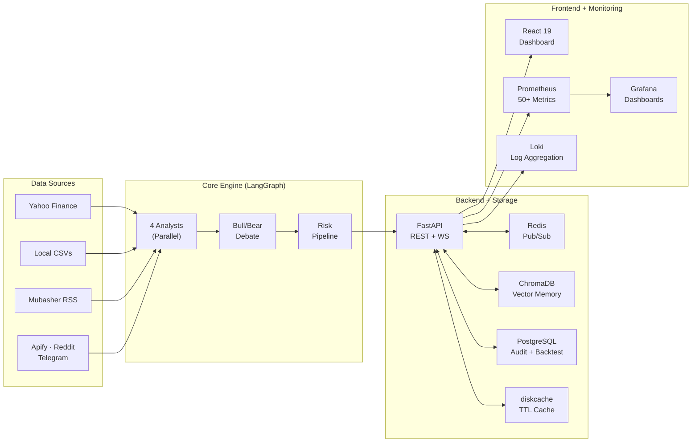

**Data needed:**
None.

**Priority:**
Must-have

**Notes:**
This should be the most polished diagram in the deck. Consider recreating in a proper diagramming tool (draw.io, Figma) rather than using Mermaid directly.

---

## Slide 25: Data Flow Architecture

**Visual type:**
Mermaid diagram — detailed pipeline flow

**Exact visual needed:**
The complete graph from `graph/setup.py:196-269` as a clean flow diagram. This is a more detailed version of the graph on Slide 30.

**Source / capture instructions:**
Direct mapping from `graph/setup.py:196-269`.

**Mermaid code:**
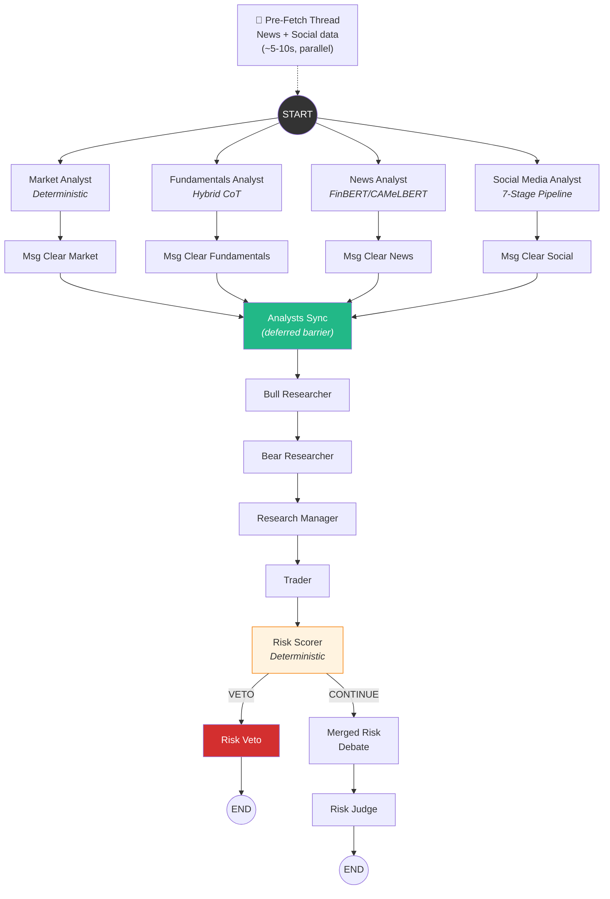

**Data needed:**
None.

**Priority:**
Must-have

**Notes:**
This is the definitive technical diagram. Include the pre-fetch thread as a dotted-line input. Show conditional routing at Risk Scorer.

---

## Slide 26: Backend Architecture

**Visual type:**
Table — API endpoint summary

**Exact visual needed:**
Grouped table of key API endpoints:

| Category | Endpoints | Purpose |
|----------|-----------|---------|
| Health | `/live`, `/ready`, `/api/health` | Liveness, readiness, full diagnostics |
| Analysis | `/api/analyze` (WS), `/api/analyze-full`, `/api/test/random-egx` | Full pipeline, quick prediction |
| Data | `/api/stock/{t}`, `/api/indicators/{t}`, `/api/fundamentals/{t}`, `/api/news/{t}` | Market data access |
| Metrics | `/metrics`, `/api/metrics-summary`, `/api/data-freshness` | Prometheus + summaries |
| Storage | `/api/memory/{agent}/search`, `/api/results`, `/api/sessions/{id}/trace` | Memory search, audit |
| Backtesting | `/api/backtests`, `/api/backtests/run`, `/api/backtests/compare/{t}` | Run + compare backtests |
| Profile | `/api/investor-profile`, `/api/profiles` | Investor profiling |
| Config | `/api/config` (GET/PUT) | Runtime configuration |

**Source / capture instructions:**
Extracted from `server/api_server.py` route definitions.

**Mermaid code:**
Not needed.

**Data needed:**
None.

**Priority:**
Nice-to-have

**Notes:**
Don't list every endpoint — group by category. The table should fit on one slide.

---

## Slide 27: Database Architecture

**Visual type:**
Mermaid diagram — storage architecture

**Exact visual needed:**
Four storage backends with their tables/collections:

**Source / capture instructions:**
Based on `db_schema.sql` (8 tables), `agents/utils/memory.py` (5 ChromaDB collections), `dataflows/cache_manager.py` (TTL cache).

**Mermaid code:**
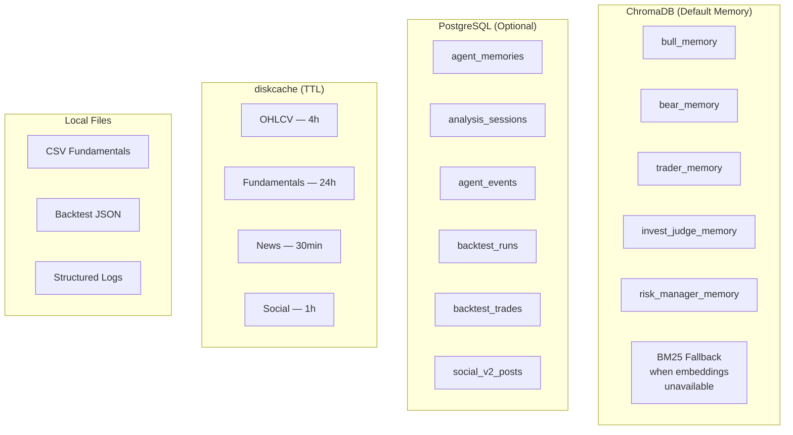

**Data needed:**
None.

**Priority:**
Must-have

**Notes:**
Emphasize that ChromaDB is the default and PostgreSQL is optional. Show the BM25 fallback path.

---

## Slide 28: Monitoring & Observability Architecture

**Visual type:**
Architecture diagram — monitoring stack

**Exact visual needed:**
Show the monitoring data flow:
- Application → Prometheus (scrapes `/metrics`) → Grafana (dashboards)
- Application → JSON Logs (`./logs/`) → Promtail → Loki → Grafana
- Application → Alerting Rules (`alerts.yml`) → Prometheus evaluates → (Phase 3: Alertmanager)

Plus a summary of key metric categories:
- LLM: calls, latency, tokens, cost, failover
- Pipeline: duration, signals, vetoes
- Data: freshness, staleness, stubs
- HTTP: requests, latency, status codes

**Source / capture instructions:**
Based on `observability/metrics.py` (50+ metrics), `monitoring/docker-compose.yml`, `monitoring/prometheus/alerts.yml`.

**Mermaid code:**
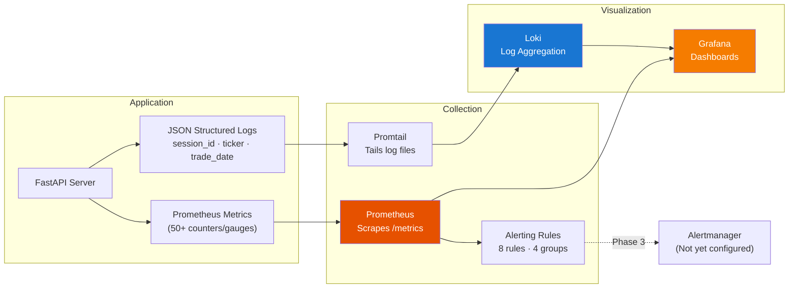

**Data needed:**
None.

**Priority:**
Must-have

**Notes:**
Also consider a small screenshot of the Monitoring page in the dashboard (`/monitoring` route) if available.

---

# 7. LangGraph Orchestration (Slides 29–31)

---

## Slide 29: Why LangGraph?

**Visual type:**
Icon layout — feature list

**Exact visual needed:**
Six feature cards:
1. **StateGraph** — typed shared state
2. **Parallel Execution** — same super-step
3. **Conditional Routing** — VETO vs. DEBATE
4. **Tool Integration** — ToolNode
5. **Deferred Nodes** — barrier sync
6. **Reproducibility** — deterministic structure

**Source / capture instructions:**
PowerPoint layout. Reference `langgraph>=0.4.8` from `pyproject.toml`.

**Mermaid code:**
Not needed.

**Data needed:**
None.

**Priority:**
Nice-to-have

**Notes:**
Simple icon grid. The real content is on Slide 30.

---

## Slide 30: Workflow Graph

**Visual type:**
Mermaid diagram — the definitive graph (same as Slide 25 but formatted for presentation)

**Exact visual needed:**
Same as Slide 25 data flow diagram but with color-coded layers. This is the slide the audience will study.

**Source / capture instructions:**
Same as Slide 25. Consider rendering at higher resolution.

**Mermaid code:**
(Reuse the Slide 25 Mermaid code, or simplify if needed for readability at presentation scale.)

**Data needed:**
None.

**Priority:**
Must-have

**Notes:**
If Slides 25 and 30 are too similar, simplify Slide 25 (data-focused labels) and keep Slide 30 as the detailed technical graph.

---

## Slide 31: Execution Flow

**Visual type:**
Gantt chart / timeline with timing

**Exact visual needed:**
Horizontal Gantt-style bar chart showing approximate execution phases and timings:

| Phase | Duration | Parallel? |
|-------|----------|-----------|
| Pre-fetch | ~5-10s | Background |
| 4 Analysts | ~30-90s | Parallel |
| Bull Researcher | ~10-20s | Sequential |
| Bear Researcher | ~10-20s | Sequential |
| Research Manager | ~10-20s | Sequential |
| Trader | ~15-30s | Sequential |
| Risk Scorer | <1s | Sequential |
| Risk Debate + Judge | ~20-40s | Sequential |
| **Total** | **~2-5 min** | |

**Source / capture instructions:**
Timing estimates from actual runs. Pre-fetch from `graph/prefetch.py`. Total from CLAUDE.md.

**Mermaid code:**
```mermaid
gantt
    title Pipeline Execution Timeline (~2-5 minutes)
    dateFormat X
    axisFormat %s

    section Pre-fetch
    News + Social data       :active, pf, 0, 10

    section Analysts (Parallel)
    Market Analyst           :active, ma, 5, 35
    Fundamentals Analyst     :active, fa, 5, 95
    News Analyst             :active, na, 5, 55
    Social Media Analyst     :active, sa, 5, 65

    section Debate (Sequential)
    Bull Researcher          :bull, 95, 115
    Bear Researcher          :bear, 115, 135
    Research Manager         :rm, 135, 155

    section Execution
    Trader                   :tr, 155, 185

    section Risk Pipeline
    Risk Scorer (det.)       :crit, rs, 185, 186
    Risk Debate + Judge      :rj, 186, 226
```

**Data needed:**
None (timings are approximate).

**Priority:**
Nice-to-have

**Notes:**
The Gantt chart shows why parallel analysts matter — they overlap. The sequential debate/risk phases dominate total time.

---

# 8. Technologies & Implementation (Slides 32–33)

---

## Slide 32: Technology Stack

**Visual type:**
Icon grid — technology logos organized by layer

**Exact visual needed:**
Technology stack organized in rows:
- **Backend**: Python, FastAPI, Uvicorn, LangGraph, LangChain
- **LLM**: DeepSeek Chat (temperature=0, seed=42)
- **NLP**: FinBERT, CAMeLBERT-DA, XLM-R, VADER
- **Embeddings**: Ollama + nomic-embed-text
- **Frontend**: React 19, Vite, TypeScript, Tailwind CSS, Zustand, lightweight-charts
- **Data**: yfinance, Apify, feedparser, stockstats
- **Storage**: ChromaDB, PostgreSQL, diskcache, Redis
- **Monitoring**: Prometheus, Grafana, Loki, Promtail
- **Testing**: pytest

Use official logos where available.

**Source / capture instructions:**
From `pyproject.toml` (Python deps) and `dashboard/package.json` (JS deps).

**Mermaid code:**
Not needed.

**Data needed:**
None.

**Priority:**
Must-have

**Notes:**
Use small technology logos arranged in a grid. Group by layer. This slide is expected by the committee.

---

## Slide 33: Implementation Highlights

**Visual type:**
Icon layout — 8 highlight cards

**Exact visual needed:**
Eight implementation decision cards:
1. ⚡ Deterministic where possible
2. 🔄 Graceful degradation chains
3. 🔌 Data vendor abstraction (DataGateway)
4. 🎯 Reproducibility (temp=0, seed=42)
5. 💪 Crash resilience (--resume)
6. 🧩 Modular agents (shared state only)
7. ⏱ Temporal memory safety
8. 📝 Structured JSON outputs

**Source / capture instructions:**
PowerPoint layout. Each card: icon + title + one-line description.

**Mermaid code:**
Not needed.

**Data needed:**
None.

**Priority:**
Nice-to-have

**Notes:**
This is a supporting slide. Keep it scannable.

---

# 9. Results & Evaluation (Slides 34–37)

---

## Slide 34: System Demonstration

**Visual type:**
Screenshot — dashboard live analysis

**Exact visual needed:**
Screenshot(s) of the dashboard during or after a live analysis:
1. **Home screen** with stock selection and market indices bar
2. **Analysis in progress** showing WebSocket events / agent timeline (if the RunPage shows this)
3. **Completed analysis** showing recommendation, agent cards, price chart

**Source / capture instructions:**
1. Start backend: `uvicorn server.api_server:app --reload --port 8000`
2. Start dashboard: `cd dashboard && npm run dev`
3. Navigate to `http://localhost:5173/`
4. Capture home screen with COMI.CA selected
5. Start analysis, capture progress state
6. Capture completed results

**Mermaid code:**
Not needed.

**Data needed:**
Live system screenshots. TODO: Capture before presentation.

**Priority:**
Must-have

**Notes:**
These screenshots are the most important visual assets in the deck. Capture at 1920×1080 or higher. Use dark mode (the dashboard defaults to dark).

---

## Slide 35: Case Study — COMI.CA Analysis

**Visual type:**
Screenshot + formatted output table

**Exact visual needed:**
Formatted table showing a real COMI.CA analysis output:
- Final recommendation
- Confidence score
- Technical summary (RSI, MACD, trend)
- Fundamental summary (financial health, earnings direction)
- News sentiment (direction, confidence)
- Key bull argument
- Key bear argument
- Execution plan summary

**Source / capture instructions:**
Option A: Screenshot from dashboard workspace view (`/workspace/COMI.CA` if it exists)
Option B: Run `python main.py` and format the output as a table
Option C: Use data from `backtest_results/report_COMI.CA_20260619_032611.json` — this has 11 trades and a complete audit log

**Mermaid code:**
Not needed.

**Data needed:**
Data from `backtest_results/report_COMI.CA_20260619_032611.json`:
- `metrics.Total Return`: -0.42%
- `metrics.Alpha`: -6.30%
- `metrics.Win Rate`: 50.00%
- `metrics.Sharpe Ratio`: -0.65
- `trades`: 11 entries with date, action, confidence, reasoning
- `audit_log`: per-date reasoning traces

**Priority:**
Must-have

**Notes:**
TODO: Run a fresh analysis on COMI.CA and capture the full output. The backtest data shows realistic (not cherry-picked) results.

---

## Slide 36: Performance Evaluation — Backtesting

**Visual type:**
Table + chart

**Exact visual needed:**
1. **Summary metrics table** for best available backtest runs:

| Ticker | Period | Trades | Return | Alpha vs EGX30 | Win Rate | Sharpe |
|--------|--------|--------|--------|-----------------|----------|--------|
| EAST.CA | Jul-Dec 2024 | 12 | +27.22% | +21.34% | 100% | 7.23 |
| COMI.CA | Jul-Dec 2024 | 11 | -0.42% | -6.30% | 50% | -0.65 |
| ADIB.CA | Jul-Dec 2024 | 11 | -3.35% | -9.23% | 50% | -2.13 |
| TMGH.CA | Jul-Dec 2024 | 6 | -2.98% | -8.86% | 33% | — |
| EFIH.CA | Jul-Dec 2024 | 4 | -1.85% | -7.73% | 50% | -4.24 |
| HRHO.CA | Jul-Dec 2024 | 4 | -1.66% | -7.53% | 50% | -7.93 |

2. **Equity curve chart** using `daily_portfolio` data from a selected backtest (COMI.CA or EAST.CA — 17 data points each).

**Source / capture instructions:**
Data from `backtest_results/report_*.json` files (2026-06-19 batch). Metrics are in the `metrics` field. Equity curve from `daily_portfolio` array. Benchmark from `benchmark_history` array.

Files:
- `backtest_results/report_EAST.CA_20260619_160348.json`
- `backtest_results/report_COMI.CA_20260619_032611.json`
- `backtest_results/report_ADIB.CA_20260619_151643.json`
- `backtest_results/report_TMGH.CA_20260619_142857.json`

**Mermaid code:**
Not needed. (Equity curve is a line chart — create in Excel or the dashboard backtest page.)

**Data needed:**
`daily_portfolio[].{date, portfolio_value}` and `benchmark_history[].{date, value}` arrays from the backtest JSON files listed above.

**Priority:**
Must-have

**Notes:**
Include a prominent disclaimer: "Past performance does not guarantee future results." Show both wins (EAST.CA) and losses (ADIB.CA) — do not cherry-pick. Wilson CI on win rate shows honest uncertainty.

---

## Slide 37: Business Impact & Value Proposition

**Visual type:**
Icon layout — 5 value propositions

**Exact visual needed:**
Five value cards:
1. ⏱ **Time Saved** — 2-5 min vs. hours of manual research
2. 🌐 **Coverage** — Technical + Fundamental + Arabic News + Social simultaneously
3. 🛡️ **Risk Discipline** — 15-clause Constitution + 12 deterministic rules
4. 📋 **Audit Trail** — Every decision fully explainable
5. 📈 **Scalability** — 29 tickers, consistent methodology

**Source / capture instructions:**
PowerPoint layout. Values grounded in actual system capabilities.

**Mermaid code:**
Not needed.

**Data needed:**
None.

**Priority:**
Nice-to-have

**Notes:**
Do not claim guaranteed profits. Focus on process improvement, not outcomes.

---

# 10. Challenges & Lessons Learned (Slides 38–40)

---

## Slide 38: Data Challenges

**Visual type:**
Table — challenge matrix

**Exact visual needed:**
Challenge matrix table:

| Challenge | Impact | Status | Evidence |
|-----------|--------|--------|----------|
| Sparse fundamentals | ESRS.CA excluded entirely | Mitigated | `default_config.py:12-15` |
| Arabic NLP complexity | Dialect ≠ MSA | Addressed | CAMeLBERT-DA in `sentiment_engine.py` |
| Social media noise | Most FB posts non-financial | Mitigated | 7-stage pipeline, MIN_POSTS=50 |
| News coverage gaps | Zero English news for mid-caps | Addressed | Arabic RSS primary source |
| Data freshness | Financials can be >90 days old | Monitored | `fundamentals_stale_tickers` metric |
| Look-ahead in backtests | 4 surfaces identified | Fixed | MEMORY.md §C — all resolved |

**Source / capture instructions:**
All items verified in codebase with file references.

**Mermaid code:**
Not needed.

**Data needed:**
None.

**Priority:**
Must-have

**Notes:**
Be honest — show both resolved and mitigated items.

---

## Slide 39: AI & Multi-Agent Challenges

**Visual type:**
Table — issue → root cause → fix

**Exact visual needed:**
Three key challenges in a structured table:

| Challenge | Root Cause | Fix Applied |
|-----------|-----------|-------------|
| **One-sided debates** | Race condition in Bull↔Bear cycle; `_keep_last` reducer dropped Bear's write | Linearized to Bull → Bear → RM (`setup.py:247-249`) |
| **HOLD bias** | Research Manager defaulted to HOLD on uncertainty | P7 rules: multi-signal alignment + self-consistency check |
| **`_rebuild_graph()` bug** | Forced deterministic fundamentals in backtests regardless of config | Fixed to respect `use_hybrid_fundamental_analyst` flag |

**Source / capture instructions:**
All from MEMORY.md §AA (debate fix), research_manager.py (P7 rules), graph/trading_graph.py (_rebuild_graph fix).

**Mermaid code:**
Not needed.

**Data needed:**
None.

**Priority:**
Must-have

**Notes:**
These are the stories the committee will want to hear — real bugs found and fixed, not theoretical risks.

---

## Slide 40: Solutions and Key Lessons Learned

**Visual type:**
Icon layout — 8 lesson cards

**Exact visual needed:**
Eight numbered lesson cards (2 columns × 4 rows):
1. ⚡ Deterministic > LLM when possible
2. 🔄 Graceful degradation is essential
3. 📋 Structured JSON outputs save debugging
4. 📝 Audit everything (prompt hashes, timing)
5. 🤝 Be honest about limitations
6. 🇪🇬 EGX-specific rules matter
7. 📡 Monitoring is not optional
8. 🧪 Test with real data early

**Source / capture instructions:**
PowerPoint layout. Each card: number + icon + title + one line.

**Mermaid code:**
Not needed.

**Data needed:**
None.

**Priority:**
Nice-to-have

**Notes:**
Keep it scannable. The speaker notes carry the detail.

---

# 11. Future Work & Conclusion (Slides 41–43)

---

## Slide 41: Future Enhancements

**Visual type:**
Roadmap timeline — three columns

**Exact visual needed:**
Three-column roadmap:
- **Short-term** (1-2 months): Authentication, Alertmanager notifications, Full health probes
- **Medium-term** (3-6 months): Portfolio optimization (multi-stock), Ticker universe expansion (29→100+), Entity registry broadening, Grafana pre-built dashboards
- **Long-term** (6-12 months): Live order execution (FRA compliance), OpenTelemetry distributed tracing, Redis Streams for durable events

**Source / capture instructions:**
Items from `agent_docs/observability_roadmap.md:126-141` (Phase 3) and CLAUDE.md §9 (production blockers).

**Mermaid code:**
Not needed. (Timeline layout works better in PowerPoint.)

**Data needed:**
None.

**Priority:**
Must-have

**Notes:**
Portfolio optimization is genuinely future work — no scipy/cvxpy code exists in the repo. Be explicit that this is planned, not implemented.

---

## Slide 42: Project Summary

**Visual type:**
Summary diagram — single visual combining key elements

**Exact visual needed:**
A simplified version of the Slide 10 overview diagram with 8 key achievements overlaid:
1. Multi-agent AI (4 parallel analysts)
2. Bilingual Arabic + English NLP
3. 3-stage CoT fundamentals
4. Structured debate
5. Constitutional risk management
6. Execution planning
7. Full observability
8. Honest backtesting

**Source / capture instructions:**
Combine the Slide 10 six-block diagram with the Slide 11 feature highlights. Keep it clean.

**Mermaid code:**
Not needed.

**Data needed:**
None.

**Priority:**
Must-have

**Notes:**
This is the "takeaway" slide. It should be memorable and clean. Don't overcrowd.

---

## Slide 43: Q&A

**Visual type:**
No visual needed

**Exact visual needed:**
Clean Q&A slide with:
- "Thank You" or "Questions?" in large text
- Team member names
- Optional: project repository URL or QR code
- Small StockHive brand mark

**Source / capture instructions:**
Design in PowerPoint. Brand color `#22B887`.

**Mermaid code:**
Not needed.

**Data needed:**
None.

**Priority:**
Must-have

**Notes:**
Keep it minimal. No diagrams or data.

---

# Visual Production Checklist

## 1. Screenshots to Capture

| Slide(s) | Asset Name | Priority | Source / Capture Instruction |
|----------|-----------|----------|------------------------------|
| 17, 34 | `screenshot_home_screen.png` | Must-have | Dashboard at `http://localhost:5173/` — home screen with COMI.CA selected, market indices bar visible. Start backend first: `uvicorn server.api_server:app --port 8000` then `cd dashboard && npm run dev` |
| 34 | `screenshot_analysis_progress.png` | Must-have | Dashboard during live analysis — navigate to analysis page, start COMI.CA analysis, capture while agents are running (shows WebSocket events / agent timeline) |
| 17, 34, 35 | `screenshot_results_page.png` | Must-have | Dashboard after analysis completes — recommendation card, agent summaries, confidence score visible |
| 28 | `screenshot_monitoring_page.png` | Must-have | Dashboard at `http://localhost:5173/monitoring` — shows health status, metrics tiles, LLM stats. Backend must be running. |
| 34 | `screenshot_investor_profile.png` | Nice-to-have | Dashboard at `http://localhost:5173/decisions` — investor profile form or recommendation page |
| 36 | `screenshot_backtest_page.png` | Nice-to-have | Dashboard at `http://localhost:5173/backtest` — backtest form or results view |

## 2. Mermaid Diagrams to Render

| Slide(s) | Asset Name | Priority | Description |
|----------|-----------|----------|-------------|
| 5 | `diagram_vision_flow.png` | Must-have | Data Sources → AI Team → Recommendation → Human Decision |
| 6 | `diagram_parallel_analysts.png` | Must-have | START → 4 analysts parallel → Sync barrier |
| 7 | `diagram_debate_waterfall.png` | Must-have | Analyst Reports → Bull → Bear → CIO → Risk → Recommendation |
| 12 | `diagram_user_journey.png` | Must-have | 6-step horizontal journey map |
| 14 | `diagram_analysis_inputs.png` | Must-have | 5 data streams converging |
| 19 | `diagram_agent_ecosystem.png` | Must-have | 4-layer agent architecture (the key technical diagram) |
| 20 | `diagram_sentiment_pipeline.png` | Must-have | News sources → language routing → blend → output |
| 22 | `diagram_fundamentals_cot.png` | Must-have | 3-stage CoT with fallback branches |
| 23 | `diagram_social_7stage.png` | Must-have | 7-stage social pipeline with sources |
| 24 | `diagram_high_level_arch.png` | Must-have | 4-column architecture (Data → Engine → Backend → Frontend) |
| 25, 30 | `diagram_data_flow.png` | Must-have | Complete LangGraph workflow with all nodes and edges |
| 27 | `diagram_database_arch.png` | Must-have | ChromaDB + PostgreSQL + diskcache + Local Files |
| 28 | `diagram_monitoring_arch.png` | Must-have | App → Prometheus/Loki → Grafana + Alerting |
| 31 | `diagram_execution_gantt.png` | Nice-to-have | Gantt chart showing parallel/sequential execution timing |

**Rendering instructions:** Paste Mermaid code into [mermaid.live](https://mermaid.live) or use VS Code Mermaid Preview extension. Export as SVG or high-res PNG (2x). Use light background for projection.

## 3. Charts/Tables to Generate from Backtest Outputs

| Slide(s) | Asset Name | Priority | Source / Data |
|----------|-----------|----------|---------------|
| 36 | `table_backtest_summary.png` | Must-have | Metrics from `backtest_results/report_*.json` (2026-06-19 batch): Total Return, Alpha, Win Rate, Sharpe for 6 tickers. Create in Excel or as a formatted PowerPoint table. |
| 36 | `chart_equity_curve.png` | Must-have | `daily_portfolio[].{date, portfolio_value}` from `report_EAST.CA_20260619_160348.json` (17 points, +27.22% return) overlaid with `benchmark_history[].{date, value}`. Create in Excel or Python matplotlib. |
| 35 | `table_case_study_output.png` | Must-have | Formatted analysis output for COMI.CA. TODO: Run fresh analysis or extract from `audit_log` field in backtest JSON. |

**Data extraction command:**
```bash
python3 -c "
import json
f = 'backtest_results/report_EAST.CA_20260619_160348.json'
d = json.load(open(f))
for p in d['daily_portfolio']:
    print(f\"{p['date']},{p['portfolio_value']:.2f}\")
print('---BENCHMARK---')
for b in d['benchmark_history']:
    print(f\"{b['date']},{b['value']:.2f}\")
"
```

## 4. Simple Icon/Infographic Slides

| Slide(s) | Asset Name | Priority | Description |
|----------|-----------|----------|-------------|
| 1 | Title card | Must-have | Brand colors, tech logos, team names |
| 2 | Investor pain split | Nice-to-have | Retail vs. institutional comparison |
| 3 | `infographic_4_challenges.png` | Must-have | 2×2 grid: Overload, Conflicts, Time, Risk |
| 4 | `infographic_egx_constraints.png` | Must-have | 6 constraint cards (long-only, ±10%, Arabic, etc.) |
| 8, 15 | Before/After execution plan | Must-have | "BUY" only vs. full plan table |
| 9 | Before/After fragmented → unified | Nice-to-have | Disconnected tools vs. connected pipeline |
| 11 | Feature icon grid | Must-have | 10 feature cards |
| 16 | Execution plan table | Must-have | 9-row table from trader.py schema |
| 18 | Single model vs. multi-agent | Nice-to-have | Simple comparison |
| 21 | Indicator table | Nice-to-have | 7-row technical indicator summary |
| 26 | API endpoint table | Nice-to-have | Grouped endpoint summary |
| 29 | LangGraph feature list | Nice-to-have | 6 feature cards |
| 32 | Tech stack logo grid | Must-have | Technology logos by layer |
| 33 | Implementation cards | Nice-to-have | 8 highlight cards |
| 37 | Value proposition cards | Nice-to-have | 5 value cards |
| 38 | Challenge matrix table | Must-have | 6-row data challenges |
| 39 | Issue/fix table | Must-have | 3-row AI challenges |
| 40 | Lessons learned cards | Nice-to-have | 8 lesson cards |
| 41 | Roadmap timeline | Must-have | 3-column short/medium/long term |
| 42 | Summary diagram | Must-have | Simplified architecture + 8 achievements |

## 5. Slides That Need No Custom Visual

| Slide | Reason |
|-------|--------|
| 43 (Q&A) | Text-only slide: "Questions?" + team names |

---

## Production Priority Summary

**Critical path (must complete before presentation):**
1. Render the 14 Mermaid diagrams (paste into mermaid.live → export PNG)
2. Capture 4 must-have dashboard screenshots (requires running backend + frontend)
3. Create the backtest summary table from JSON data (6 tickers)
4. Create the EAST.CA equity curve chart
5. Design the 4 infographic slides (challenges, constraints, features, tech stack)

**Secondary (nice-to-have):**
1. Capture 2 additional dashboard screenshots (investor profile, backtest page)
2. Render the Gantt chart (Slide 31)
3. Polish the Before/After comparison slides
4. Create remaining icon grid slides

**Estimated production time:**
- Mermaid rendering: ~30 minutes (paste + export)
- Screenshots: ~20 minutes (start servers, navigate, capture)
- Charts/tables from data: ~30 minutes (extract JSON, create in Excel)
- PowerPoint infographics: ~2-3 hours (design, layout, polish)
- **Total: ~4-5 hours of visual production work**
