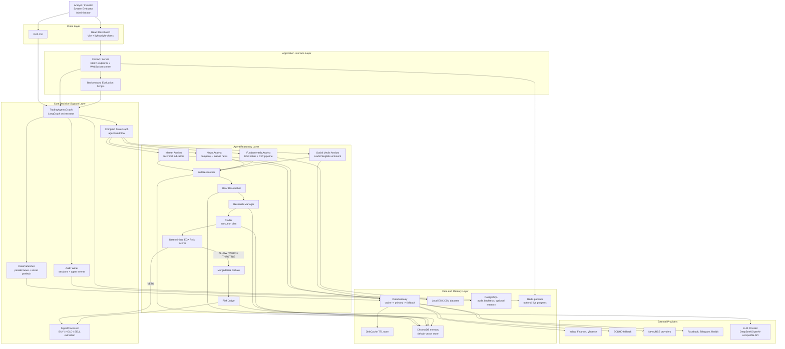
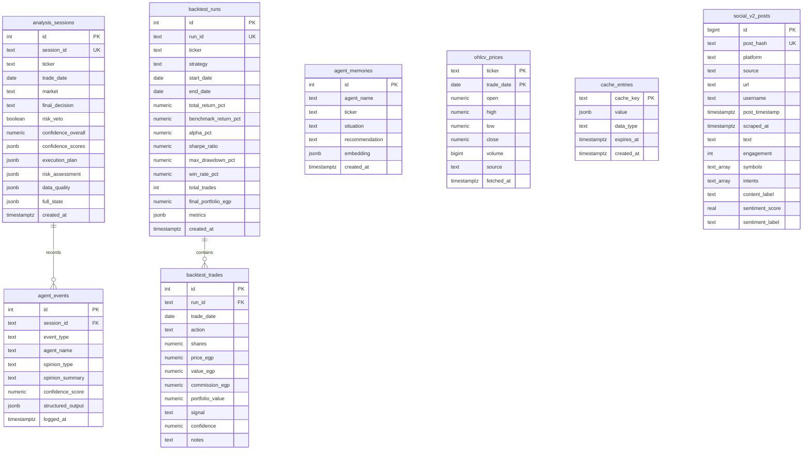
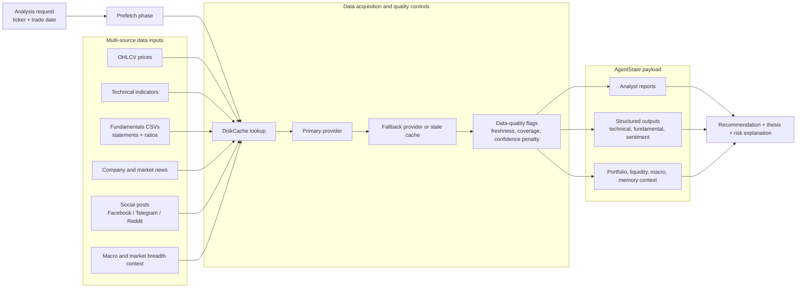
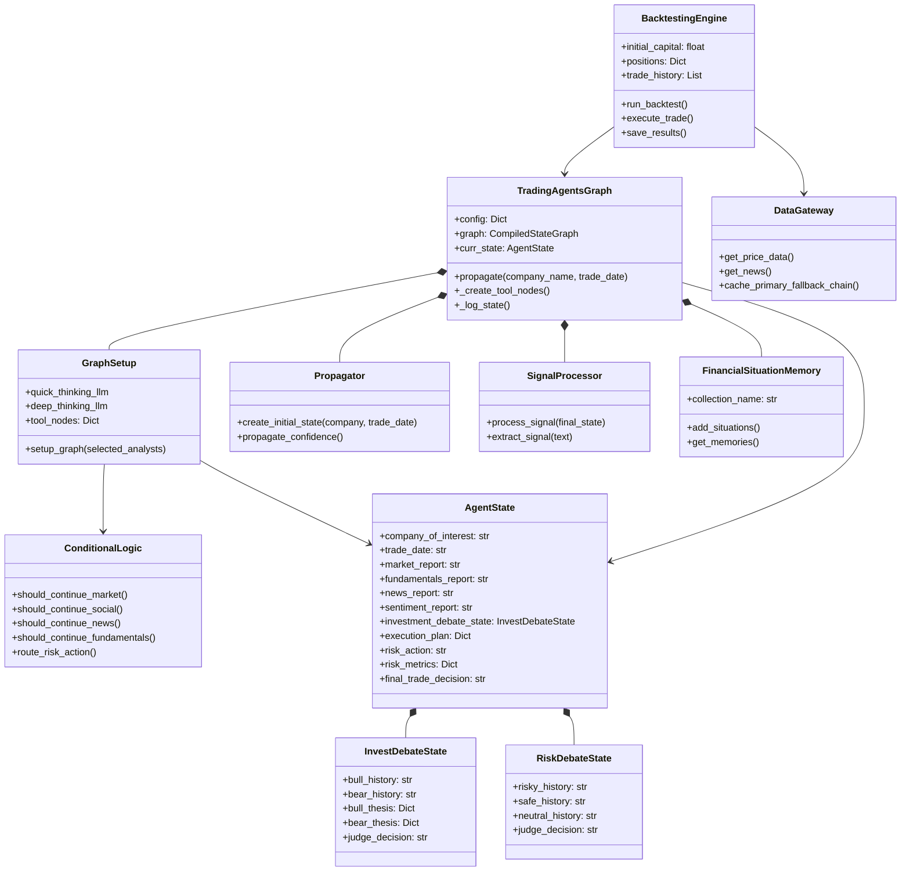
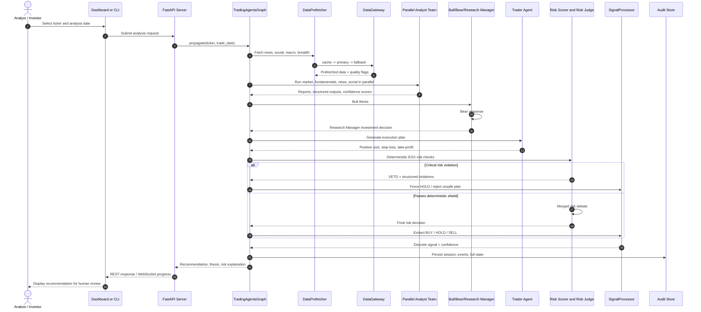
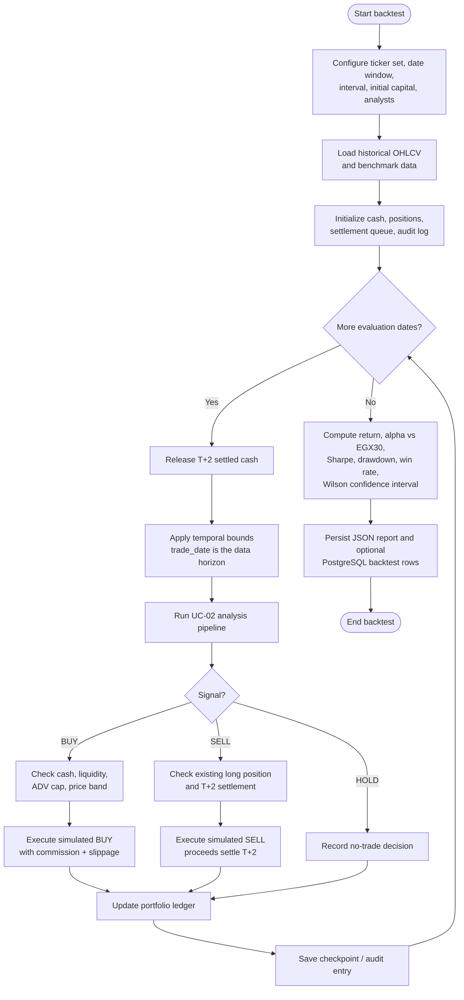
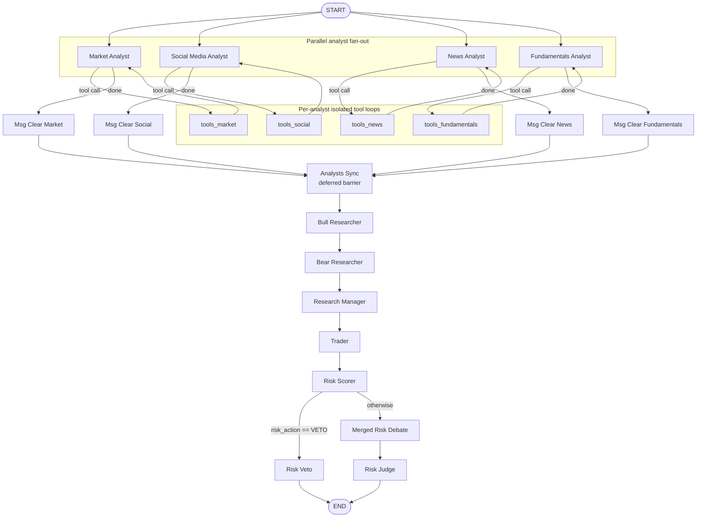

# Chapter 5 Diagrams - StockHive System Design

This draft contains thesis-ready Mermaid diagrams for Chapter 5. The diagrams are based on the current implementation rather than the older template placeholders:

- `tradingagents/graph/setup.py` for the LangGraph workflow.
- `tradingagents/agents/utils/agent_states.py` for state objects.
- `Graduation-Project/db_schema.sql` for the database model.
- `server/api_server.py` and `dashboard/src` for UI/API boundaries.
- `CLAUDE.md` and `agent_docs/db_infrastructure.md` for architecture framing.

Important correction: older notes show a Bull/Bear cycle. The current graph is a strict linear chain: Bull Researcher -> Bear Researcher -> Research Manager.

## 5.1 System Architecture Diagram

Figure 5.1: Layered system architecture for StockHive, showing client interfaces, the FastAPI boundary, the LangGraph orchestration core, specialized analysis agents, data providers, audit storage, and optional real-time streaming infrastructure.

## 5.2 Database Design

Figure 5.2: PostgreSQL database design for audit logging, backtest persistence, optional memory storage, OHLCV caching, and social-media archive replay.

## 5.3 Data Design: Runtime Data Flow

Figure 5.3: Runtime data design showing how StockHive combines price data, fundamentals, news, social sentiment, macro context, cache/fallback controls, and quality flags into the shared `AgentState`.

## 5.4.1 Class Diagram

Figure 5.4: Main class relationships for the StockHive orchestration, state, memory, data gateway, signal processing, and backtesting components.

## 5.4.2 Sequence Diagram: Single Analysis Run

Figure 5.5: Sequence diagram for a single StockHive analysis run from user request through parallel analysis, research debate, execution planning, EGX risk enforcement, signal extraction, and audit persistence.

## 5.4.3 Activity Diagram: Historical Evaluation / Backtest

Figure 5.6: Activity diagram for historical evaluation, including strict temporal bounds, EGX trading assumptions, T+2 settlement, checkpointing, and final performance metric computation.

## Optional Appendix Diagram: Agent Workflow Detail

Use this if Chapter 5 needs one deeper diagram after the high-level architecture.

Figure 5.7: Detailed LangGraph workflow showing parallel analyst branches, isolated per-analyst tool loops, the synchronization barrier, the linear research debate, and deterministic risk routing.
